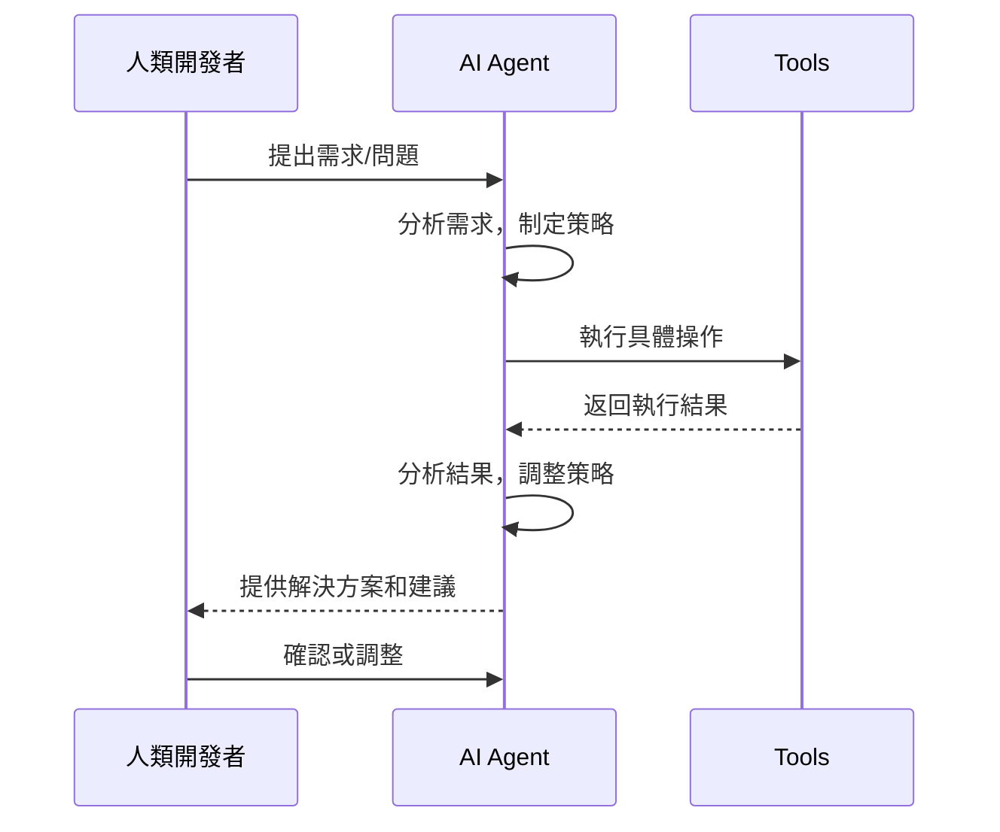
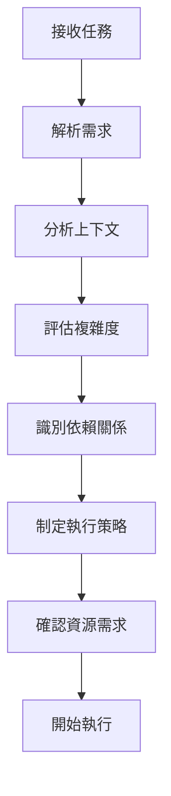
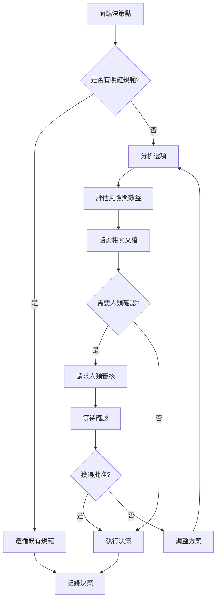
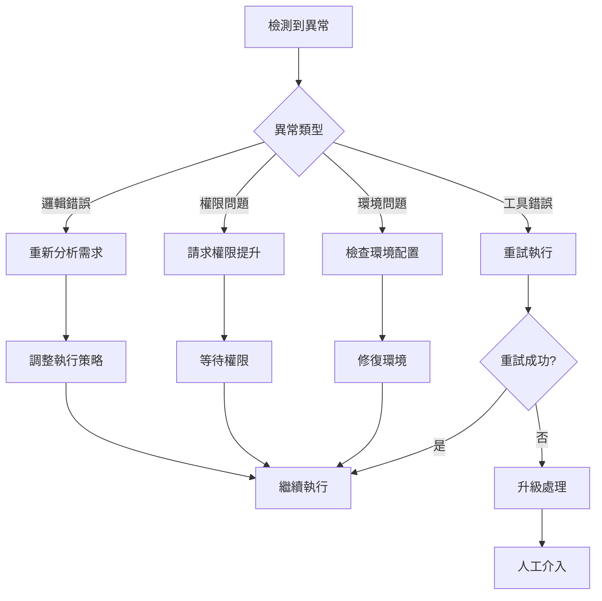
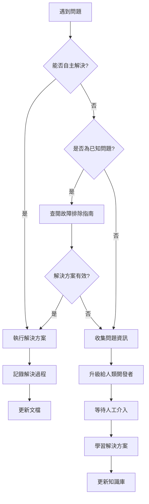

# AI 協作指南

> **文檔職責**：定義 AI 代理與人類開發者的協作規範、操作流程和品質標準

## 文檔定位

- **目標受眾**：AI 代理、協作開發者、AI 工程師
- **更新頻率**：每月
- **版本**：2.0.0
- **最後更新**：2025-08-17

## 文檔關係

```bash
README.md (專案入口) → AGENT.md (AI協作規範) → ARCHITECTURE.md (系統架構) → SPEC.md (技術規格) → TASKS.md (開發任務)
```

**閱讀路徑**：
- **前置閱讀**：[README.md - 專案概覽](README.md#專案概覽)
- **後續閱讀**：[ARCHITECTURE.md - 系統架構](ARCHITECTURE.md#系統架構設計)
- **相關參考**：[SPEC.md - 技術規格](SPEC.md#技術棧與依賴), [TASKS.md - 開發任務](TASKS.md#實作任務清單)

## AI 協作原則

### 黃金準則

1. **明確職責分工**：Agent決策 + Tool執行
   - **Agent (決策層)**：負責 WHY、WHAT、WHEN - 決策制定、工作流編排、策略規劃
   - **Tool (執行層)**：負責 HOW、WHERE、WITH - 具體執行、數據操作、系統互動

2. **結構化溝通**：使用標準化的請求和回應格式
   - 所有任務請求必須包含：目標、上下文、約束條件、成功標準
   - 所有回應必須包含：執行結果、決策推理、下一步建議、風險評估

3. **可追溯決策**：所有決策都有明確的推理過程
   - 記錄決策的原因和考量因素
   - 提供替代方案的比較分析
   - 明確指出約束條件和限制

4. **持續學習**：從每次協作中改進和優化
   - 收集協作過程中的回饋
   - 分析成功和失敗的案例
   - 持續優化協作模式和流程

### 協作模式

#### 決策協作模式


### Agent vs Tool 職責劃分

> **術語定義**：本文檔定義 AI 協作相關的核心術語與概念  
> **詳細架構說明**：參見 [ARCHITECTURE.md - Agent協作模式](ARCHITECTURE.md#agent-協作模式)

#### Agent 職責範圍
- **策略決策**：分析需求，制定實作策略
- **工作流編排**：協調多個工具的執行順序
- **品質控制**：確保輸出符合標準和要求
- **風險評估**：識別潛在問題並提出緩解措施
- **學習適應**：從經驗中學習並改進決策

#### Tool 職責範圍
- **具體執行**：執行明確定義的操作任務
- **數據處理**：處理和轉換數據
- **系統互動**：與外部系統和服務通訊
- **狀態報告**：回報執行結果和狀態
- **錯誤處理**：處理執行過程中的異常情況

### 結構化溝通格式

#### 任務請求格式
```yaml
Task_Request:
  objective: "明確的任務目標"
  context: "相關背景資訊和約束條件"
  success_criteria: "成功完成的標準"
  priority: "任務優先級 (P0-P3)"
  deadline: "預期完成時間"
  resources: "可用的工具和資源"
```

#### 回應格式
```yaml
Task_Response:
  status: "執行狀態 (completed/in_progress/failed)"
  result: "具體執行結果"
  reasoning: "決策推理過程"
  next_steps: "建議的後續行動"
  risks: "識別的風險和緩解措施"
  lessons_learned: "從此次執行中學到的經驗"
```

### 決策追溯機制

#### 決策記錄格式
```markdown
## 決策記錄 [YYYY-MM-DD]

**決策問題**：[需要決策的問題描述]

**考量因素**：
- 技術可行性：[評估]
- 資源需求：[評估]
- 風險評估：[評估]
- 時程影響：[評估]

**替代方案**：
1. 方案A：[描述、優缺點、風險]
2. 方案B：[描述、優缺點、風險]
3. 方案C：[描述、優缺點、風險]

**最終決策**：[選擇的方案及理由]

**實施計畫**：[具體執行步驟]

**驗證方法**：[如何驗證決策效果]
```

## 工作流程規範

### 1. 任務接收與分析流程

#### 任務接收檢查清單
- [ ] **需求理解**：確認任務目標和期望結果
- [ ] **上下文分析**：理解相關背景和約束條件
- [ ] **資源評估**：確認可用的工具和資源
- [ ] **風險識別**：識別潛在的風險和挑戰
- [ ] **時程規劃**：評估所需時間和里程碑

#### 任務分析步驟


#### 複雜度評估標準
| 複雜度 | 特徵 | 處理策略 |
|--------|------|----------|
| **簡單** | 單一工具、明確步驟、無依賴 | 直接執行 |
| **中等** | 多個工具、部分依賴、需要協調 | 分階段執行 |
| **複雜** | 多系統整合、複雜依賴、高風險 | 詳細規劃、分步驗證 |

### 2. 決策制定流程

#### 決策樹架構


#### 決策判斷標準

**自主決策範圍**：
- 標準化的開發流程操作
- 已有明確規範的技術選擇
- 低風險的配置調整
- 常規的測試和驗證操作

**需要確認的決策**：
- 架構層面的重大變更
- 影響多個模組的修改
- 新技術或工具的引入
- 可能影響系統穩定性的操作

**禁止自主決策**：
- 生產環境的直接修改
- 安全相關的配置變更
- 資料庫結構的重大調整
- 外部依賴的版本升級

### 3. 執行與監控標準

#### 執行階段檢查點
```yaml
Execution_Checkpoints:
  pre_execution:
    - "確認執行環境準備就緒"
    - "驗證所需工具和權限"
    - "建立執行日誌記錄"
  
  during_execution:
    - "監控執行進度和狀態"
    - "記錄中間結果和異常"
    - "適時調整執行策略"
  
  post_execution:
    - "驗證執行結果正確性"
    - "清理臨時資源"
    - "更新相關文檔和狀態"
```

#### 品質監控指標
- **執行成功率**：任務完成的成功比例
- **響應時間**：從接收任務到開始執行的時間
- **準確性**：執行結果符合預期的程度
- **效率**：資源使用的優化程度
- **可靠性**：重複執行的一致性

#### 異常處理流程


### 4. 結果交付檢查清單

#### 交付標準驗證
- [ ] **功能完整性**：所有要求的功能都已實現
- [ ] **品質標準**：符合代碼品質和文檔標準
- [ ] **測試覆蓋**：包含適當的測試和驗證
- [ ] **文檔同步**：相關文檔已更新
- [ ] **依賴處理**：所有依賴關係已正確處理

#### 交付物檢查清單
```yaml
Deliverable_Checklist:
  code_quality:
    - "代碼符合專案風格指南"
    - "包含適當的註解和文檔"
    - "通過所有自動化檢查"
    - "沒有明顯的安全漏洞"
  
  testing:
    - "單元測試覆蓋率達標"
    - "整合測試通過"
    - "手動測試驗證完成"
    - "性能測試符合要求"
  
  documentation:
    - "API 文檔已更新"
    - "使用指南已完善"
    - "變更日誌已記錄"
    - "相關文檔已同步"
  
  integration:
    - "與現有系統整合正常"
    - "不破壞現有功能"
    - "依賴關係正確配置"
    - "部署腳本已更新"
```

#### 驗收標準模板
```markdown
## 驗收標準 - [任務名稱]

### 功能驗收
- [ ] 功能A：[具體驗收標準]
- [ ] 功能B：[具體驗收標準]
- [ ] 功能C：[具體驗收標準]

### 品質驗收
- [ ] 代碼品質：通過所有靜態分析檢查
- [ ] 測試覆蓋：單元測試覆蓋率 > 90%
- [ ] 性能標準：響應時間 < [具體數值]
- [ ] 安全檢查：通過安全掃描

### 文檔驗收
- [ ] API 文檔：完整且準確
- [ ] 使用指南：清晰易懂
- [ ] 變更記錄：詳細記錄所有變更

### 整合驗收
- [ ] 系統整合：與現有系統正常整合
- [ ] 回歸測試：不影響現有功能
- [ ] 部署驗證：可以正常部署和運行
```

## 品質保證

### 程式碼品質標準

> 詳細標準：參見 [開發指導原則](ARCHITECTURE.md#開發指導原則)

#### 代碼品質檢查清單
- [ ] **類型安全**：Python 類型標註完整，Go 類型安全
- [ ] **代碼風格**：符合專案風格指南和 linting 規則
- [ ] **錯誤處理**：完善的錯誤處理和異常管理
- [ ] **日誌記錄**：結構化日誌，包含適當的上下文資訊
- [ ] **性能考量**：避免明顯的性能瓶頸和資源洩漏
- [ ] **安全實踐**：遵循安全編碼最佳實踐

#### 自動化檢查工具
```bash
# 🚀 主要開發命令（AI 協作者常用）
make validate-implementation   # 完整實作驗證 (推薦)
make setup-development         # 設置開發環境
make fix-common-issues         # 修復常見問題

# 📋 模組卡管理
make generate-module-card NAME=<name> ROLE=<role> CATEGORY=<category> DESC="<description>"
make fix-module-cards

# 🛠️ Proto 維護
make health-check-proto
make maintain-proto

# ✅ 完整驗證
make validate-with-versions
```

### AI 協作內容與執行標準

#### AI 友善的內容組織
```yaml
AI_Friendly_Standards:
  content_structure:
    - "使用問題-解決方案-實作的邏輯結構"
    - "提供明確的步驟和檢查清單"
    - "包含具體的範例和模板"

  decision_documentation:
    - "記錄決策的原因和考量"
    - "提供替代方案的比較"
    - "明確指出約束條件和限制"

  context_provision:
    - "提供充足的背景資訊"
    - "解釋專業術語和概念"
    - "建立概念間的關聯性"
```

#### AI 任務執行規範
```yaml
AI_Task_Execution_Standards:
  task_definition:
    - "明確的任務目標和成功標準"
    - "詳細的執行步驟和檢查點"
    - "清晰的輸入和輸出規格"

  error_handling:
    - "預期的錯誤情況和處理方式"
    - "故障排除指南和診斷步驟"
    - "升級和求助的程序"
```

### 文檔品質標準

#### 文檔撰寫檢查清單
- [ ] **結構清晰**：使用一致的標題層級和組織結構
- [ ] **內容準確**：技術資訊與實作同步，範例可執行
- [ ] **語言一致**：術語使用統一，中英文對照正確
- [ ] **交叉引用**：相關文檔間的連結正確且有效
- [ ] **版本資訊**：包含版本號和最後更新日期
- [ ] **受眾明確**：清楚定義目標讀者和使用場景

#### SSOT 契約優先原則

> 詳細契約管理：參見 [SPEC.md - 配置管理與模組規範](SPEC.md#配置管理與模組規範)

任何跨語言介面或配置變更**必須**優先在 `contracts/` 完成：
1. 更新 proto/schema/samples
2. 執行 `buf lint && buf generate` 
3. 同步到下游專案

### 測試標準

> 完整測試指南：參見 [測試指導原則](docs/development/TESTING_GUIDELINES.md)

#### 測試層級要求
- **單元測試**：覆蓋率 > 90%，測試所有公開介面
- **整合測試**：驗證跨模組通訊和依賴關係
- **端到端測試**：驗證完整的使用者工作流程
- **性能測試**：確保符合性能基準要求

#### 測試檢查清單
- [ ] **測試覆蓋**：所有新增功能都有對應測試
- [ ] **邊界測試**：包含邊界條件和異常情況測試
- [ ] **回歸測試**：確保不破壞現有功能
- [ ] **性能驗證**：關鍵路徑的性能測試
- [ ] **安全測試**：輸入驗證和安全漏洞檢查

## 故障排除

### 常見問題診斷

#### 快速診斷檢查清單
1. **gRPC 通訊失敗**
   - [ ] 檢查 ToolBridge 連接狀態
   - [ ] 驗證網路連接和防火牆設定
   - [ ] 確認服務端口和協議配置

2. **Proto 消息錯誤**
   - [ ] 驗證 contracts 同步狀態
   - [ ] 檢查 proto 版本相容性
   - [ ] 確認消息格式和欄位定義

3. **模組卡驗證失敗**
   - [ ] 使用自動修復工具 `make fix-module-cards`
   - [ ] 檢查模組卡格式和必要欄位
   - [ ] 驗證依賴關係和版本資訊

4. **測試失敗**
   - [ ] 檢查模組 llm.txt 指南
   - [ ] 驗證測試環境配置
   - [ ] 確認測試資料和依賴服務

### 升級程序

#### 問題升級標準


#### 升級觸發條件
- **技術問題**：超出當前知識範圍的技術難題
- **決策問題**：需要業務判斷或策略決策的情況
- **安全問題**：涉及安全風險的操作或配置
- **緊急問題**：影響生產環境或關鍵功能的問題

## 學習與改進

### 知識更新機制

#### 持續學習流程
```yaml
Learning_Process:
  knowledge_acquisition:
    - "從每次任務執行中提取經驗"
    - "分析成功和失敗的案例"
    - "收集人類開發者的回饋"
    - "學習新的工具和技術"
  
  knowledge_validation:
    - "驗證新知識的準確性"
    - "測試新方法的有效性"
    - "確認與現有知識的一致性"
    - "評估知識的適用範圍"
  
  knowledge_integration:
    - "將新知識整合到現有框架"
    - "更新相關的決策規則"
    - "調整工作流程和檢查清單"
    - "分享學習成果給團隊"
```

#### 學習資源指引
- **技術文檔**：[SPEC.md - 技術規格](SPEC.md#技術棧與依賴)
- **架構設計**：[ARCHITECTURE.md - 系統架構](ARCHITECTURE.md#系統架構設計)
- **開發任務**：[TASKS.md - 當前任務](TASKS.md#實作任務清單)
- **術語索引**：詳見各文檔中的術語定義節
- **模組指南**：各模組的 `llm.txt` 檔案
- **契約規範**：[SPEC.md - 配置管理與模組規範](SPEC.md#配置管理與模組規範)

### 效能評估

#### 協作效果指標
- **任務完成率**：成功完成任務的比例
- **品質分數**：交付物品質的評估分數
- **效率指標**：完成任務所需的時間和資源
- **學習速度**：適應新需求和技術的能力
- **協作滿意度**：人類開發者的回饋評分

#### 改進機制
```yaml
Improvement_Process:
  performance_monitoring:
    - "定期收集效能指標"
    - "分析效能趨勢和模式"
    - "識別改進機會"
  
  feedback_integration:
    - "收集使用者回饋"
    - "分析回饋內容和建議"
    - "制定改進計畫"
  
  process_optimization:
    - "優化工作流程"
    - "改進決策機制"
    - "更新品質標準"
  
  knowledge_sharing:
    - "分享最佳實踐"
    - "更新培訓材料"
    - "建立知識庫"
```

## 與人類開發者的協作

### 溝通模式

#### 有效溝通原則
- **清晰表達**：使用明確、具體的語言描述問題和解決方案
- **結構化資訊**：按照邏輯順序組織資訊，使用標準格式
- **上下文提供**：提供充足的背景資訊和相關連結
- **主動確認**：在關鍵決策點主動尋求確認和回饋

#### 協作期望設定
- **回應時間**：明確回應和完成任務的預期時間
- **品質標準**：清楚定義可接受的品質水準
- **溝通頻率**：建立定期更新和回報的機制
- **升級機制**：明確何時需要人工介入和支援

### 衝突解決

#### 衝突類型和處理
- **技術分歧**：通過技術論證和實驗驗證解決
- **優先級衝突**：根據業務價值和緊急程度排序
- **資源競爭**：協調資源分配和時程安排
- **標準差異**：參考 SSOT 文檔和既定規範

---

*最後更新：2025-08-17*  
*版本：2.0.0*  
*維護者：AI 協作專案團隊*

> 記住：本指南是 AI 協作的基石，任何疑問都要回到對應的 SSOT 文檔尋找答案！