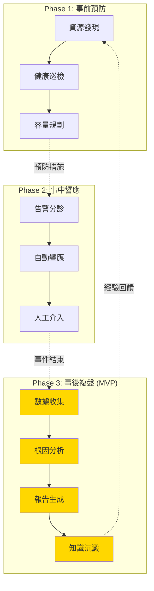
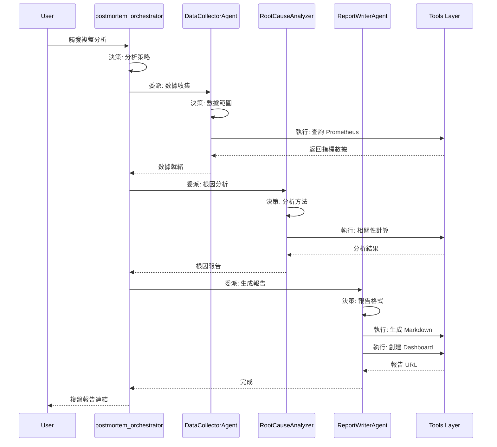
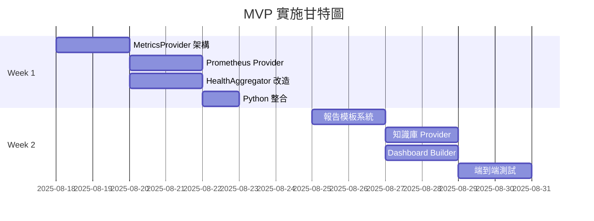

# 系統架構文檔

> **文檔職責**：定義 Detectviz Platform 的系統架構、設計決策、文檔規範和開發指導原則

## 文檔定位

- **目標受眾**：架構師、AI工程師、開發者、技術負責人
- **更新頻率**：季度評審，重大架構變更時更新
- **版本**：1.0.0
- **最後更新**：2025-08-17

## 文檔關係

```bash
README.md → AGENT.md → [ARCHITECTURE.md] → SPEC.md → TASKS.md
```

**閱讀路徑**：
- **前置閱讀**：[README.md - 專案概覽](README.md#專案概覽)
- **後續閱讀**：[SPEC.md - 技術實作規格](SPEC.md#技術棧與依賴)
- **相關參考**：[AGENT.md - AI協作指南](AGENT.md#ai協作原則)

## 系統架構設計

### 核心設計理念

#### Agent vs Tool 職責劃分

> **術語定義**：參見 [術語索引 - AI與協作術語](.kiro/specs/documentation-normalization/terminology-index.md#ai-與協作相關術語)

```
Agent (決策大腦)           Tool (執行手臂)
────────────────           ──────────────
WHY - 為什麼做             HOW - 如何做
WHAT - 做什麼             WHERE - 在哪做
WHEN - 何時做             WITH - 用什麼做
```

**黃金準則**：
- **Agent 負責決策**：分析情況、制定策略、協調資源
- **Tool 負責執行**：查詢數據、調用 API、生成報告
- **Agent 不直接碰數據**：所有數據操作必須通過 Tool
- **Tool 不做決策**：只提供能力，不判斷是否應該執行

### SRE 三階段生命週期設計



#### Phase 1: 事前預防 (Proactive)

> **使命**：防患於未然，主動識別並消除潛在風險

**核心組件**：
- **DeploymentStrategyAgent**: 部署策略制定
- **HealthCheckAgent**: 健康評估
- **CapacityPlannerAgent**: 容量決策

#### Phase 2: 事中響應 (Reactive)

> **使命**：快速響應，精準處理，最小化故障影響

**核心組件**：
- **AlertTriageAgent**: 告警分診
- **FirstResponderAgent**: 響應決策

#### Phase 3: 事後複盤 (MVP 重點)

> **使命**：深度分析，持續改進，知識沉澱

**核心組件**：
- **DataCollectorAgent**: 收集策略
- **RootCauseAnalyzer**: 分析決策
- **ReportWriterAgent**: 報告決策

### Agent 協作模式

#### 層級結構

```
Root Agent (總指揮)
├── Coordinator Agents (協調層)
│   ├── postmortem_orchestrator (MVP 核心)
│   └── IncidentCommanderAgent
└── Specialist Agents (專家層)
    ├── DataCollectorAgent
    ├── RootCauseAnalyzer
    ├── ReportWriterAgent
    └── HealthCheckAgent
```

#### MVP Agent 協作流程



### MetricsProvider 架構

#### 監控數據源架構

**當前架構（Prometheus + Grafana）**：
```yaml
生產環境:
  指標收集: Prometheus (短期存儲，保留 15-30 天)
  告警管理: Grafana Alerting
  視覺化: Grafana Dashboards
  
優勢: 
  - 雲原生標準配置
  - 統一的監控平台
  - 告警規則視覺化管理
  - 豐富的 Dashboard 模板
  
資料流程:
  Prometheus (指標收集) 
    ↓
  Grafana (查詢/告警/視覺化)
    ↓
  Detectviz Platform (Webhook 接收)
```

**未來架構（長期存儲規劃）**：
```yaml
規劃中 (暫不實作):
  長期存儲: Grafana Mimir
  
設計考量:
  - 水平擴展能力
  - 多租戶支援
  - 與 Prometheus 完全相容
  - 成本效益優化
  - 支援數年的歷史數據查詢
  
預期架構:
  Prometheus (即時查詢，1-30天)
    ↓ Remote Write
  Mimir (長期存儲，30天-3年)
    ↓
  Grafana (統一查詢介面)
```

#### MetricsProvider 介面設計

```go
// 統一的指標查詢介面
type MetricsProvider interface {
    // 基本查詢
    Query(ctx context.Context, query MetricQuery) (*QueryResult, error)
    
    // 批量查詢（並行優化）
    BatchQuery(ctx context.Context, queries []MetricQuery) ([]*QueryResult, error)
    
    // 聚合查詢
    GetAggregation(ctx context.Context, opts AggregationOptions) (*AggregationResult, error)
    
    // 健康檢查
    HealthCheck(ctx context.Context) error
}

// 未來支援 Mimir 的擴展介面
type LongTermMetricsProvider interface {
    MetricsProvider
    
    // 長期數據查詢（支援更大時間範圍）
    QueryHistorical(ctx context.Context, query HistoricalQuery) (*HistoricalResult, error)
    
    // 降採樣查詢（優化長期數據查詢性能）
    QueryDownsampled(ctx context.Context, query DownsampledQuery) (*QueryResult, error)
    
    // 多租戶查詢（Mimir 特性）
    QueryTenant(ctx context.Context, tenantID string, query MetricQuery) (*QueryResult, error)
}
```

### 決策框架與原則

#### Agent 決策類型分類

| 決策類型 | 描述 | 範例 | 相關 Agent |
|---------|------|------|-----------|
| **診斷型** | 識別問題本質 | 判斷是系統問題還是應用問題 | RootCauseAnalyzer |
| **策略型** | 制定行動計劃 | 決定數據收集範圍和粒度 | DataCollectorAgent |
| **優先級型** | 資源分配決策 | 確定分析深度和時間投入 | postmortem_orchestrator |
| **格式型** | 輸出形式決策 | 選擇報告格式和 Dashboard 類型 | ReportWriterAgent |
| **時序型** | 時間相關決策 | 確定分析時間窗口 | DataCollectorAgent |

#### 決策權重因子（MVP 簡化版）

```yaml
RootCauseAnalyzer:
  factors:
    metric_anomaly: 0.4      # 指標異常程度
    time_correlation: 0.3    # 時間相關性
    service_dependency: 0.2  # 服務依賴關係
    historical_pattern: 0.1  # 歷史模式匹配

DataCollectorAgent:
  factors:
    incident_severity: 0.4   # 事件嚴重性
    affected_services: 0.3   # 影響服務數量
    time_duration: 0.2       # 持續時間
    data_availability: 0.1   # 數據可用性
```

## 文檔規範與標準

### 命名規範

#### 文件命名標準
```yaml
File_Naming_Standards:
  core_documents:
    - README.md: "專案入口文檔（固定名稱）"
    - AGENT.md: "AI 協作指南（固定名稱）"
    - ARCHITECTURE.md: "系統架構文檔"
    - SPEC.md: "技術規格文檔"
    - TASKS.md: "任務進度文檔"
  
  naming_rules:
    - "核心文檔使用全大寫（除 README.md, AGENT.md）"
    - "使用底線分隔多個單詞"
    - "文件名直接反映內容性質"
    - "避免縮寫，使用完整單詞"
```

#### 章節命名規範
```yaml
Section_Naming_Standards:
  header_levels:
    h1: "# 文檔標題 - 簡短描述"
    h2: "## 主要章節名稱"
    h3: "### 子章節名稱"
    h4: "#### 具體功能或概念"
  
  ai_friendly_headers:
    - "使用動詞開頭（理解、執行、配置、測試）"
    - "包含關鍵詞（Agent、Tool、API、配置）"
    - "避免模糊詞彙（其他、雜項、備註）"
```

### 內容結構標準

#### 標準文檔結構
```yaml
Document_Structure_Standards:
  mandatory_sections:
    header:
      - "文檔標題與描述"
      - "文檔職責說明"
      - "目標受眾定義"
    
    navigation:
      - "文檔定位與關係"
      - "閱讀路徑指引"
      - "相關文檔連結"
    
    content:
      - "核心內容章節"
      - "實作指南或範例"
      - "故障排除（如適用）"
    
    footer:
      - "版本資訊"
      - "最後更新日期"
      - "維護者資訊"
```

#### 內容品質標準
```yaml
Content_Quality_Standards:
  writing_style:
    - "使用主動語態"
    - "簡潔明確的句子"
    - "避免行話和縮寫"
    - "提供具體範例"
  
  technical_accuracy:
    - "所有程式碼範例可執行"
    - "API 文檔與實作同步"
    - "版本資訊準確"
    - "連結有效且最新"
  
  ai_readability:
    - "邏輯結構清晰"
    - "使用標準化術語"
    - "提供上下文資訊"
    - "明確的因果關係"
```

### 格式規範

#### Markdown 格式標準
```yaml
Markdown_Standards:
  headers:
    - "使用 ATX 風格標題（# ## ###）"
    - "標題前後空一行"
    - "不跳級使用標題層級"
  
  lists:
    - "使用 - 作為無序列表標記"
    - "使用 1. 作為有序列表標記"
    - "列表項目間保持一致縮排"
  
  code_blocks:
    - "使用三個反引號包圍程式碼"
    - "指定程式語言以啟用語法高亮"
    - "提供程式碼說明和註解"
  
  links:
    - "使用相對路徑連結內部文檔"
    - "外部連結使用完整 URL"
    - "連結文字具有描述性"
```

#### 圖表規範
```yaml
Diagram_Standards:
  mermaid_diagrams:
    - "使用 Mermaid 語法繪製流程圖"
    - "保持圖表簡潔易讀"
    - "使用一致的顏色主題"
    - "提供圖表說明文字"
  
  image_guidelines:
    - "使用 PNG 或 SVG 格式"
    - "提供替代文字（alt text）"
    - "圖片大小適中（寬度 < 800px）"
    - "存放在 assets/ 目錄"
```

### 交叉引用規範

#### 引用格式標準
```yaml
Cross_Reference_Standards:
  internal_links:
    format: "[描述文字](文件名.md#章節錨點)"
    examples:
      - "[技術架構](ARCHITECTURE.md#系統架構設計)"
      - "[實作任務](TASKS.md#mvp核心交付目標)"
  
  reference_blocks:
    format: "> 詳細說明：參見 [文檔名稱](連結)"
    usage: "用於指向詳細資訊，避免內容重複"
  
  prerequisite_links:
    format: "**前置閱讀**：[文檔名稱](連結)"
    usage: "指明必須先閱讀的相關文檔"
```

### 版本控制規範

#### 版本號規則
```yaml
Version_Control_Standards:
  semantic_versioning:
    format: "MAJOR.MINOR.PATCH"
    rules:
      - "MAJOR: 架構重大變更"
      - "MINOR: 新增功能或章節"
      - "PATCH: 錯誤修正或小幅更新"
  
  version_tracking:
    - "每個文檔獨立版本號"
    - "在文檔底部標示版本"
    - "維護變更日誌"
```

## 開發指導原則

### Agent 開發檢查清單

開發新 Agent 時，請確保：

#### 設計階段
- [ ] 明確定義 Agent 的決策職責
- [ ] 識別需要的 Tool 能力
- [ ] 設計決策樹或決策矩陣
- [ ] 定義與其他 Agent 的協作介面

#### 實作階段
- [ ] Agent 只包含決策邏輯，不直接操作數據
- [ ] 所有數據操作通過 Tool 完成
- [ ] 使用 MetricsProvider 抽象層查詢指標
- [ ] 實現狀態管理（Session State）
- [ ] 添加決策日誌和可觀測性

#### 測試階段
- [ ] 單元測試覆蓋所有決策分支
- [ ] 使用 MemoryProvider 進行測試
- [ ] 模擬 Tool 失敗場景
- [ ] 驗證與其他 Agent 的協作

### 工具層規範

#### MetricsProvider 實作要求

```go
// 所有 Provider 必須實現的介面
type MetricsProvider interface {
    HealthCheck(ctx context.Context) error
}

// Provider 工廠模式
func NewMetricsProvider(config Config) (MetricsProvider, error) {
    switch config.Type {
    case "prometheus":
        return NewPrometheusProvider(config.Prometheus)
    case "mimir":
        // 未來實作
        return nil, fmt.Errorf("mimir provider not yet implemented")
    case "memory":
        return NewMemoryProvider()
    default:
        return nil, fmt.Errorf("unsupported provider type: %s", config.Type)
    }
}
```

#### Grafana 整合規範

所有與 Grafana 的整合必須：
1. 使用官方 API Client
2. 支援 API Key 認證
3. 實現重試機制
4. 記錄操作審計日誌

### AI 協作規範

> **職責分離**：本文件定義系統架構，而 AI 的具體協作行為、內容組織和任務執行標準由 [AI 協作指南 (AGENT.md)](AGENT.md#ai-協作原則) 定義。

### 更新流程標準化

#### 更新流程規範
```yaml
Update_Process_Standards:
  change_workflow:
    1. "識別需要更新的內容"
    2. "檢查影響的其他文檔"
    3. "同步更新相關引用"
    4. "執行品質檢查"
    5. "更新版本號和日期"
  
  review_requirements:
    - "技術內容需要技術審核"
    - "架構變更需要架構師審核"
    - "AI 協作規範需要 AI 工程師審核"
```

## 實施路線圖

### MVP 實施計畫（2週）



### 後續階段規劃

**Phase 1 (Q1 2025)**：
- AlertTriageAgent 實作
- 自動修復能力
- 預測性維護

**Phase 2 (Q2 2025)**：
- 容量規劃自動化
- 成本優化建議
- 多雲支援
- **Mimir 整合評估**（若數據量超過閾值）

**Phase 3 (Q3 2025)**：
- **Mimir 長期存儲實作**（如需要）
- 歷史數據分析強化
- ML 模型訓練（基於長期數據）
- 多租戶支援

## 持續改進機制

### 月度評審項目

- [ ] Agent 決策準確率分析
- [ ] Tool 執行效率評估
- [ ] 告警規則有效性檢查
- [ ] Dashboard 使用率統計

### 季度優化目標

- Q4 2024: MVP 交付，基礎功能驗證
- Q1 2025: 性能優化，擴展 Provider
- Q2 2025: 智能化提升，評估 Mimir 需求
- Q3 2025: 平台化，多租戶支援，Mimir 整合（如需要）
- Q4 2025: 長期數據分析，預測模型優化

## 核心價值

這份架構文檔確保了：

1. **職責清晰**：Agent 專注決策，Tool 專注執行
2. **架構統一**：Prometheus + Grafana 作為監控標準
3. **擴展性強**：MetricsProvider 支援多種數據源
4. **未來就緒**：預留 Mimir 長期存儲架構
5. **可維護性**：邏輯分離，易於調試和優化
6. **雲原生**：符合 CNCF 標準和最佳實踐
7. **文檔規範**：統一的文檔標準和開發指導原則

---

*本文檔是 Detectviz Platform 的架構基石，所有開發工作都應遵循此設計。*

*最後更新：2025-08-17*  
*版本：1.0.0*  
*維護者：架構團隊*