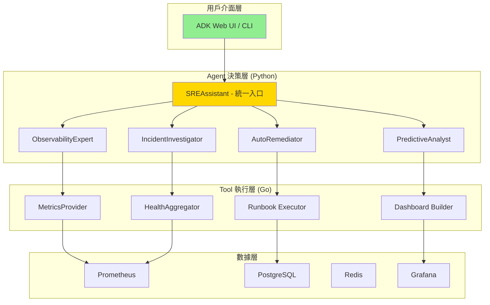
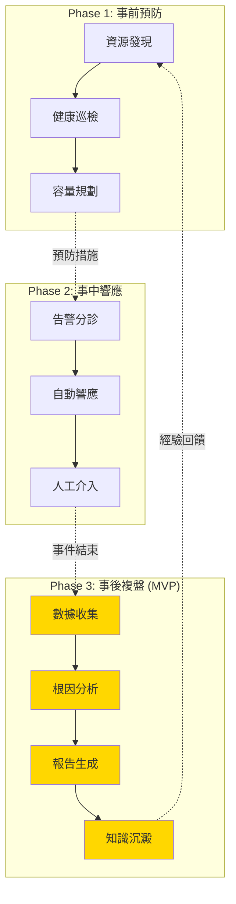

# 系統架構文檔

> **文檔職責**：定義 Detectviz Platform 的系統架構、設計決策、AI Agent 架構和開發指導原則
> **版本**：2.0.0 (根據 ROADMAP.md 更新)
> **最後更新**：2025-08-20

## 文檔定位

- **目標受眾**：架構師、AI工程師、開發者、技術負責人
- **更新頻率**：季度評審，重大架構變更時更新

## 文檔關係

```bash
README.md → AGENT.md → [ARCHITECTURE.md] → ROADMAP.md → SPEC.md → TASKS.md
```

**相關文檔**：
- **前置閱讀**：[README.md - 專案概覽](README.md#專案概覽)
- **實施藍圖**：[ROADMAP.md - AI Agent 開發藍圖](ROADMAP.md)
- **技術規格**：[SPEC.md - 技術實作規格](SPEC.md#技術棧與依賴)
- **協作指南**：[AGENT.md - AI協作指南](AGENT.md#ai協作原則)

---

## 系統架構設計

### 核心設計理念

#### Agent vs Tool 職責劃分

> **黃金準則**：Agent 負責智能決策，Tool 負責具體執行

```
Agent (決策大腦)           Tool (執行手臂)
────────────────           ──────────────
WHY - 為什麼做             HOW - 如何做
WHAT - 做什麼             WHERE - 在哪做
WHEN - 何時做             WITH - 用什麼做
```

**職責邊界**：
- **Agent 負責決策**：分析情況、制定策略、協調資源
- **Tool 負責執行**：查詢數據、調用 API、生成報告
- **Agent 不直接碰數據**：所有數據操作必須通過 Tool
- **Tool 不做決策**：只提供能力，不判斷是否應該執行

### AI Agent 分層架構



### Agent 架構模式

根據 [ROADMAP.md](ROADMAP.md#agent-架構模式決策矩陣) 定義的四種核心模式：

| 模式 | 適用場景 | 複雜度 | 範例 Agent |
|------|----------|--------|------------|
| **Simple Agent** | 單一功能、工具豐富 | 低 | ObservabilityExpert |
| **Coordinator Pattern** | 多專家協作 | 中 | SREAssistant |
| **Hierarchy Pattern** | 階段性流程 | 中 | IncidentInvestigator |
| **Workflow Pattern** | 迭代優化 | 高 | PredictiveAnalyst |

---

## SRE 生命週期架構

### 三階段生命週期設計



### Phase 實施計劃

根據 [ROADMAP.md](ROADMAP.md#實施計劃) 的階段規劃：

| 階段 | 時間 | 核心 Agent | 重點功能 |
|------|------|-----------|----------|
| **MVP** | 2週 | SREAssistant (改造自 PostmortemOrchestrator) | ADK Web UI + 基礎對話 |
| **Phase 1** | 2025 Q3 | ObservabilityExpert, IncidentInvestigator | 自然語言查詢 |
| **Phase 2** | 2025 Q4 | PredictiveAnalyst, ProactiveGuardian | 預測性維護 |
| **Phase 3** | 2026 Q1 | AutoRemediator, ConfigOptimizer | 自動化修復 |
| **Phase 4** | 2026 Q2 | KnowledgeCurator, LearningOptimizer | 知識管理 |

---

## 技術架構

### 技術棧

```yaml
UI 層:
  - MVP: ADK Web (內建)
  - 後續: 自定義 Web UI (可選)

AI/ML 框架:
  - LLM: ADK 原生支援 (Gemini/Claude/GPT)
  - 備選: Ollama + 開源模型
  - Agent Framework: Google ADK
  - 向量DB: pgvector

執行層:
  - 語言: Go
  - 框架: ToolBridge + Plugin Host
  - 通訊: gRPC + Protocol Buffers

數據層:
  - 時序數據: Prometheus
  - 關係數據: PostgreSQL
  - 狀態管理: Redis
  - 可視化: Grafana
```

### MetricsProvider 架構

統一的指標查詢抽象層，支援多種數據源：

```go
type MetricsProvider interface {
    Query(ctx context.Context, query Query) (Result, error)
    HealthCheck(ctx context.Context) error
}

// 工廠模式支援多種實現
func NewMetricsProvider(config Config) (MetricsProvider, error) {
    switch config.Type {
    case "prometheus":
        return NewPrometheusProvider(config.Prometheus)
    case "memory":
        return NewMemoryProvider()
    default:
        return nil, fmt.Errorf("unsupported provider type: %s", config.Type)
    }
}
```

---

## Agent 開發指導

### SREAssistant (核心入口 Agent)

基於 [ROADMAP.md](ROADMAP.md#phase-1-sre-assistant-核心-2025-q3) 的設計：

```python
class SREAssistant(adk.Agent):
    """
    統一的 SRE 交互入口
    架構模式：Coordinator Pattern
    部署方式：ADK Web UI (MVP)
    """
    
    def __init__(self):
        super().__init__(
            name="SRE Assistant",
            model="gemini-2.0-flash",
            description="您的 SRE 運維智能助理",
            instruction="""你是專業的 SRE 助理，能夠：
            1. 理解並回答運維相關問題
            2. 協助分析系統問題和故障
            3. 生成監控查詢和配置
            4. 提供最佳實踐建議
            """,
            sub_agents=[
                ObservabilityExpert(),
                IncidentInvestigator(),
                KnowledgeManager()
            ]
        )
```

### Agent 開發檢查清單

#### 設計階段
- [ ] 選擇合適的架構模式 (Simple/Coordinator/Hierarchy/Workflow)
- [ ] 明確定義 Agent 的決策職責
- [ ] 識別需要的 Tool 能力
- [ ] 設計與其他 Agent 的協作介面

#### 實作階段
- [ ] 繼承適當的 ADK 基類
- [ ] 實現決策邏輯（不直接操作數據）
- [ ] 通過 Tool 完成所有數據操作
- [ ] 添加決策日誌和可觀測性

#### 測試階段
- [ ] 利用 ADK Web UI 進行調試
- [ ] 驗證 Token 使用和成本
- [ ] 測試多輪對話能力
- [ ] 確認與其他 Agent 的協作

---

## 平台能力需求

### Tools 層

每個 Agent 需要的核心工具：

| Agent | 必需 Tools | RAG 需求 | Memory 需求 |
|-------|-----------|----------|-------------|
| SREAssistant | IntentRouter, TaskDelegation | SRE 術語庫 | 對話歷史 |
| ObservabilityExpert | PromQLTool, GrafanaTool | Dashboard 模板 | 查詢快取 |
| IncidentInvestigator | MetricsAnalyzer, LogAnalyzer | 歷史事件 | 分析狀態 |
| PredictiveAnalyst | TimeSeriesPredictor, AnomalyDetector | 模式庫 | 模型狀態 |
| AutoRemediator | RunbookExecutor, SafetyValidator | Runbook 庫 | 執行歷史 |

### RAG (檢索增強生成)

```yaml
知識庫組成:
  - SRE 最佳實踐
  - 系統架構文檔
  - 歷史事件報告
  - Runbook 模板
  - Dashboard 配置

向量化存儲:
  - 使用 pgvector (PostgreSQL 擴展)
  - 支援語義搜索
  - 自動知識更新
```

### Memory 管理

```yaml
會話記憶:
  - Redis 持久化
  - ADK SessionService
  - 跨對話狀態保持

長期記憶:
  - PostgreSQL 存儲
  - 事件歷史追蹤
  - 決策審計日誌
```

---

## 實施路線圖

### MVP 快速部署 (1-2週)

```bash
# Step 1: 啟動 ADK Web
adk web python-adk-runtime/web_server.py

# Step 2: 改造現有 Agent
# PostmortemOrchestrator → SREAssistant

# Step 3: 配置 LLM
# 使用 ADK 支援的模型 (Gemini/Claude/GPT)

# Step 4: 測試基礎功能
# 利用 ADK Web 的調試功能優化
```

### 後續發展計劃

參見 [ROADMAP.md - 實施計劃](ROADMAP.md#實施計劃) 的詳細時間表和里程碑。

---

## 持續改進機制

### 評估指標

```yaml
技術指標:
  - 查詢延遲: <3秒
  - 準確率: >85%
  - 可用性: 99.9%
  
業務指標:
  - MTTR 降低: 30%
  - 自動化率: 40%
  - 知識重用: 60%
```

### 反饋循環

1. **用戶反饋**：通過 ADK Web UI 收集
2. **性能監控**：Agent 決策質量追蹤
3. **知識更新**：每週優化 RAG 內容
4. **模型優化**：每月評估和調整

---

## 核心價值

這份架構文檔確保了：

1. **AI 優先**：以 Agent 為核心的智能化架構
2. **快速交付**：利用 ADK Web 實現 MVP 快速上線
3. **職責清晰**：Agent 決策、Tool 執行的明確分工
4. **漸進式發展**：從簡單對話到複雜自動化的演進路徑
5. **開放架構**：支援多種 LLM 和工具整合
6. **知識驅動**：強調 RAG 和持續學習能力

---

*本文檔是 Detectviz Platform 的架構基石，與 ROADMAP.md 保持同步更新。*