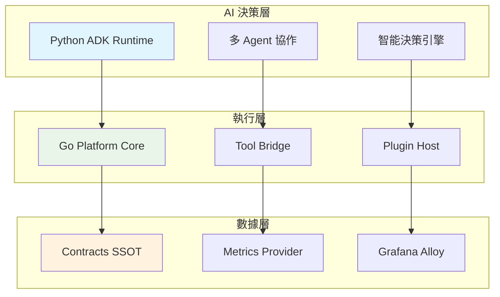

# Detectviz Platform

> **文檔職責**：作為專案入口與導航中心，提供專案概覽、快速開始指南和文檔導航地圖

## 文檔定位

- **目標受眾**：新使用者、評估者、貢獻者、所有專案參與者
- **更新頻率**：每個版本更新
- **版本**：1.0.0
- **最後更新**：2025-08-17

## 文檔關係

```bash
[README.md] (專案入口) → AGENT.md (AI協作規範) → ARCHITECTURE.md (系統架構) → SPEC.md (技術規格) → TASKS.md (開發任務)
```

**閱讀路徑**：
- **後續閱讀**：[AGENT.md - AI協作指南](AGENT.md#ai協作原則) - 了解AI協作規範
- **深入了解**：[ARCHITECTURE.md - 系統架構](ARCHITECTURE.md#系統架構設計) - 理解系統設計
- **技術實作**：[SPEC.md - 技術規格](SPEC.md#技術棧與依賴) - 獲取實作細節

---

> **智能化 SRE 平台**：基於 AI Agent 的全生命週期 SRE 解決方案

[](./ARCHITECTURE.md)
[](./contracts)
[](#)
[](#)
[](https://google.github.io/adk-docs/)
[](./LICENSE)

## 🚀 快速開始

### 30秒體驗
```bash
# 快速啟動完整平台
make quick-start
# 訪問 http://localhost:8080 查看監控面板
```

### 5分鐘入門
```bash
# 1. 克隆專案
git clone <repository-url>
cd detectviz-platform

# 2. 生成跨語言契約
cd contracts && make gen

# 3. 啟動開發環境
make dev-setup

# 4. 驗證安裝
make verify
```

## 📋 專案概覽

### 核心價值
- **🧠 智能決策**：AI Agent 自動分析系統狀態並制定 SRE 策略
- **🔄 全生命週期**：事前預防 → 事中響應 → 事後複盤的完整 SRE 流程
- **⚡ 混合架構**：Go 高性能執行引擎 + Python 智能決策大腦
- **🔍 統一可觀察性**：整合 Logs、Metrics、Traces、Profiles 的全方位監控

### 系統架構概覽



### 技術棧

| 層級 | 技術選型 | 版本要求 | 用途 |
|------|----------|----------|------|
| **AI 決策** | Python + Google ADK | Python 3.11+ | 智能代理與決策制定 |
| **執行引擎** | Go | Go 1.24+ | 高性能工具執行與橋接 |
| **通訊協議** | gRPC + Protocol Buffers | - | 跨語言服務通訊 |
| **可觀察性** | Prometheus + Grafana + Alloy | - | 統一監控與告警 |
| **容器化** | Docker + Docker Compose | - | 開發與部署環境 |

### 系統需求

#### 開發環境
- **作業系統**：Linux/macOS/Windows (WSL2)
- **記憶體**：最少 8GB，建議 16GB+
- **儲存空間**：最少 10GB 可用空間
- **網路**：需要網際網路連線以下載依賴

#### 生產環境
- **CPU**：4 核心以上
- **記憶體**：16GB 以上
- **儲存**：SSD，50GB+ 可用空間
- **網路**：穩定的內網連線

## 📚 文檔導航

### 核心文檔體系

| 文檔 | 描述 | 適合讀者 | AI 使用場景 | 更新頻率 |
|------|------|----------|-------------|----------|
| **[AI協作指南](AGENT.md)** | AI代理操作規範與協作流程 | AI工程師、協作開發者 | 🤖 **AI 必讀** - [協作規範與工作流程](AGENT.md#ai協作原則) | 每月 |
| **[系統架構](ARCHITECTURE.md)** | 系統架構與決策框架 | 架構師、技術負責人 | 🏗️ **理解系統設計** - [架構決策與職責劃分](ARCHITECTURE.md#系統架構設計) | 每季 |
| **[技術規格](SPEC.md)** | 詳細技術實作規範 | 開發者、實作者 | ⚙️ **實作參考依據** - [API規格與配置](SPEC.md#api-規格與介面定義) | 每週 |
| **[開發任務](TASKS.md)** | 當前開發進度與任務 | 開發團隊、專案管理 | 📋 **執行具體任務** - [任務清單與進度](TASKS.md#實作任務清單) | 每日 |

### 角色導向閱讀路徑

#### 🆕 新使用者入門路徑
```
README.md → 快速開始 → AGENT.md → ARCHITECTURE.md
```
**目標**：10分鐘內理解專案價值並完成基本設置

#### 👨‍💻 開發者工作路徑  
```
README.md → SPEC.md → TASKS.md → AGENT.md
```
**目標**：快速找到技術細節並開始開發工作

#### 🏗️ 架構師評估路徑
```
README.md → ARCHITECTURE.md → SPEC.md → docs/architecture/
```
**目標**：全面理解系統設計與技術選型

#### 🤖 AI 代理協作路徑
```
AGENT.md → ARCHITECTURE.md → SPEC.md → TASKS.md
```
**目標**：理解協作規範並執行開發任務

### 快速查找索引

#### 🔍 按主題查找
- **架構設計**：[ARCHITECTURE.md](ARCHITECTURE.md) → [系統架構設計](ARCHITECTURE.md#系統架構設計)
- **API 規格**：[SPEC.md](SPEC.md) → [API 規格與介面定義](SPEC.md#api-規格與介面定義)
- **開發環境**：[docs/guides/DEVELOPMENT_SETUP.md](docs/guides/DEVELOPMENT_SETUP.md)
- **部署指南**：[SPEC.md](SPEC.md) → [配置管理與模組規範](SPEC.md#配置管理與模組規範)
- **故障排除**：[SPEC.md](spec.md) → [故障排除與除錯指南](spec.md#故障排除與除錯指南)

#### 🎯 按任務類型查找
- **新功能開發**：[TASKS.md](TASKS.md) → [實作任務清單](TASKS.md#實作任務清單)
- **Bug 修復**：[TASKS.md](TASKS.md) → [問題追蹤與風險管理](TASKS.md#問題追蹤與風險管理)
- **性能優化**：[SPEC.md](SPEC.md) → [實作最佳實踐](SPEC.md#實作最佳實踐)
- **測試驗證**：[docs/development/TESTING_GUIDELINES.md](docs/development/TESTING_GUIDELINES.md)

###### 🔧 按組件查找
- **Go Platform**：[go-platform/README.md](go-platform/README.md)
- **Python ADK Runtime**：[python-adk-runtime/README.md](python-adk-runtime/README.md)
- **Contracts SSOT**：[contracts/README.md](contracts/README.md)
- **依賴服務總覽**：[depoly/](depoly/)

#### 📖 術語索引
- **完整術語對照表**：[術語統一系統](.kiro/specs/documentation-normalization/terminology-index.md)
- **AI協作術語**：[術語索引 - AI與協作](.kiro/specs/documentation-normalization/terminology-index.md#ai-與協作相關術語)
- **系統架構術語**：[術語索引 - 系統架構](.kiro/specs/documentation-normalization/terminology-index.md#系統架構相關術語)
- **技術實作術語**：[術語索引 - 技術實作](.kiro/specs/documentation-normalization/terminology-index.md#技術實作相關術語)

## 🛠️ 開發指南

### 環境設置
```bash
# 完整開發環境設置
make dev-setup

# 驗證環境配置
make verify

# 執行測試套件
make test
```

### 專案結構
```
detectviz-platform/
├── contracts/           # 📋 SSOT - 跨語言契約定義
│   ├── proto/          # Protocol Buffers 定義
│   ├── schemas/        # JSON Schema 規範
│   └── gen/            # 生成的程式碼
├── go-platform/        # ⚡ Go 平台核心
│   ├── cmd/            # 主程式入口
│   ├── internal/       # 內部套件
│   └── tools/          # 開發工具
├── python-adk-runtime/ # 🧠 Python ADK Runtime
│   ├── src/            # 核心程式碼
│   ├── agents/         # AI 代理實作
│   └── tools/          # 工具集合
├── depoly/             # 依賴服務總覽
├── docs/               # 📚 文檔體系
└── scripts/            # 🔧 自動化腳本
```

### 開發工作流程
1. **閱讀協作規範**：[AGENT.md](AGENT.md#ai協作原則) - 理解 AI 協作模式
2. **理解系統架構**：[ARCHITECTURE.md](ARCHITECTURE.md#系統架構設計) - 掌握設計決策
3. **查看技術規格**：[SPEC.md](SPEC.md#技術棧與依賴) - 獲取實作細節
4. **檢查開發任務**：[TASKS.md](TASKS.md#實作任務清單) - 選擇工作項目
5. **執行開發工作**：遵循 [開發指導原則](ARCHITECTURE.md#開發指導原則)

## 🤝 社群與貢獻

### 貢獻指南
- **程式碼貢獻**：參見 [CONTRIBUTING.md](CONTRIBUTING.md)
- **文檔改進**：參見 [docs/development/DOCUMENTATION_AUTOMATION.md](docs/development/DOCUMENTATION_AUTOMATION.md)
- **問題回報**：使用 [GitHub Issues](../../issues)
- **功能建議**：使用 [GitHub Discussions](../../discussions)

### 社群資源
- **技術討論**：[GitHub Discussions](../../discussions)
- **開發文檔**：[docs/](docs/) 目錄
- **API 文檔**：[contracts/](contracts/) 目錄
- **範例程式碼**：各組件的 `examples/` 目錄

## 📈 專案狀態

- **當前版本**：v0.1.0-MVP
- **開發階段**：Phase 3 - 事後複盤系統
- **完成進度**：參見 [專案狀態](docs/status/PROJECT_STATUS.md)
- **下一里程碑**：完整 SRE 生命週期整合

### 最新更新
- ✅ **Phase 1**：事前預防系統 - 已完成
- ✅ **Phase 2**：事中響應系統 - 已完成  
- 🔄 **Phase 3**：事後複盤系統 - 進行中
- 📋 **Phase 4**：系統整合與優化 - 規劃中

## 🎯 核心設計原則

- **🔗 SSOT 契約優先**：所有跨語言介面變更必須先更新 contracts/
- **⚖️ 職責分離**：Agent 負責智能決策，Tool 負責具體執行
- **👁️ 可觀察性優先**：統一收集 Logs/Traces/Metrics/Profiles
- **🧩 模組化設計**：以模組卡規範管理組件分類與依賴關係
- **🤖 AI 友善**：文檔結構化，支援 AI 代理自動化協作

## 📄 授權條款

MIT License - 詳見 [LICENSE](./LICENSE) 檔案

---

*最後更新：2025-08-17*  
*版本：1.0.0*  
*維護者：Detectviz Platform 開發團隊*