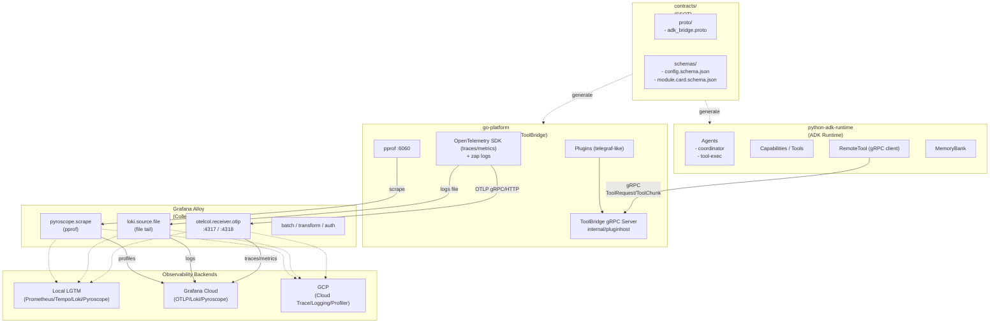

# Detectviz Platform

[](./spec.md)
[](./contracts)
[](#)
[](#)
[](https://google.github.io/adk-docs/)
[](#)
[](./grafana-alloy/config.alloy)
[](./LICENSE)

以 **Google Agent Development Kit (ADK)** 為核心，結合 Go 與 Python 的混合式可觀察性與智能代理平台。此倉庫聚焦最小可運行與可擴展：以 `contracts/` 作為單一事實來源（SSOT），Go 作為平台層與 ToolBridge，Python 則承載 ADK Runtime 與多代理協作。觀測以 Grafana Alloy 為收集/轉送層，支援本地 LGTM、Grafana Cloud 與 GCP。

> 詳細規範、術語與流程請以 [`spec.md`](./spec.md) 為準。

---

## 核心概念
- **SSOT（contracts）**：所有跨語言契約、設定與分類皆以 Proto/Schema 為唯一真相，下游程式碼不得手改生成檔。
- **解耦**：Go 與 Python 僅透過 gRPC/HTTP 溝通；平台層最小化、業務邏輯下沉到 ADK Runtime。
- **可擴展**：以「模組卡（Module Card）」規範 Agent/Tool/Capability/Plugin 的 `role`/`category` 與依賴；提供樣板與驗證工具。
- **可觀測性優先**：統一 Logs/Traces/Metrics/Profiles；應用側只暴露 `pprof`，由 Alloy 以 `pyroscope.scrape` 上送。

---

## 目錄導覽
- `contracts/`：SSOT 契約與樣本
  - `proto/`：gRPC 介面（`adk_bridge.proto`）
  - `schemas/`：`config.schema.json`、`module.card.schema.json`
  - `samples/`：組態樣本（可複製到 go-platform 啟動）
  - `tools/`：合規檢查與卡片驗證
- `go-platform/`：平台核心（CLI、ToolBridge、插件、觀測初始化）
  - `cmd/detectviz/`：CLI 入口
  - `internal/configx/`：設定載入與 Schema 驗證
  - `internal/pluginhost/`：Registry 與插件目錄（telegraf-like）
  - `internal/observability/`：zap 與 OTEL 初始化（含 `pprof`）
  - `configs/`：預設 `config.yaml`
- `python-adk-runtime/`：ADK Runtime 與 RemoteTool
  - `src/detectviz_adk/`：runtime/memory/tools/capabilities（含 `remote_tool.py`）
  - `agents/`、`templates/`：範例與樣板
- `grafana-alloy/`：Alloy 管線設定（本地或雲端）

---

## 快速開始（概覽）
1. 讀取與校對規格：`spec.md`、`contracts/README.md`、`go-platform/README.md`、`python-adk-runtime/README.md`
2. 套用範例設定：
   ```bash
   cp contracts/samples/config.yaml go-platform/configs/config.yaml
   ```
3. 啟動 Alloy（請先設定 `.env` 中的雲端變數或使用本地 LGTM）：
   ```bash
   ./grafana-alloy/alloy run ./grafana-alloy/config.alloy
   ```
4. 啟動平台層與示範 HTTP（產生 traces/metrics/logs）：
   ```bash
   go run ./go-platform/cmd/detectviz plugin serve \
     --config ./go-platform/configs/config.yaml \
     --http-demo --http-demo-listen :7777
   curl -sS http://127.0.0.1:7777/hello
   ```
5. 於 Grafana 檢視：Logs/Traces/Profiles 可進行 Drilldown；Profiles 由 Alloy `pyroscope.scrape` 擷取 `pprof`。

---

## 開發流程（摘要）
- **契約先行**：任何跨語言變更請先更新 `contracts/`（proto/schema/samples），再生成並同步下游。
- **生成碼**：在 `contracts/` 執行 `buf lint && buf generate`，禁止手動編輯 `*.pb.go` 等生成檔。
- **插件/Agent 擴增**：依樣板撰寫並附 `module.card.json`，以驗證工具檢查分類與依賴。
- **觀測一致**：Go 端以 OTLP 輸出；Profiles 僅以 `pprof` 暴露，由 Alloy 上送。

---

## 參考
- [`spec.md`](./spec.md)
- [`contracts/README.md`](./contracts/README.md)
- [`go-platform/README.md`](./go-platform/README.md)
- [`python-adk-runtime/README.md`](./python-adk-runtime/README.md)
- [`grafana-alloy/config.alloy`](./grafana-alloy/config.alloy)


---

## 架構圖


