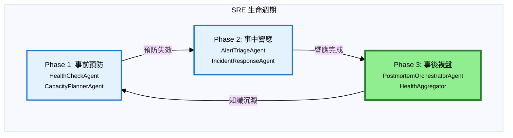
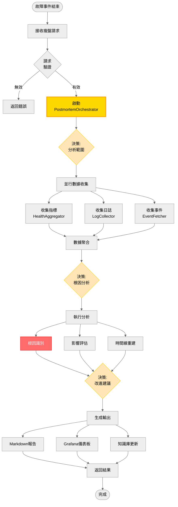
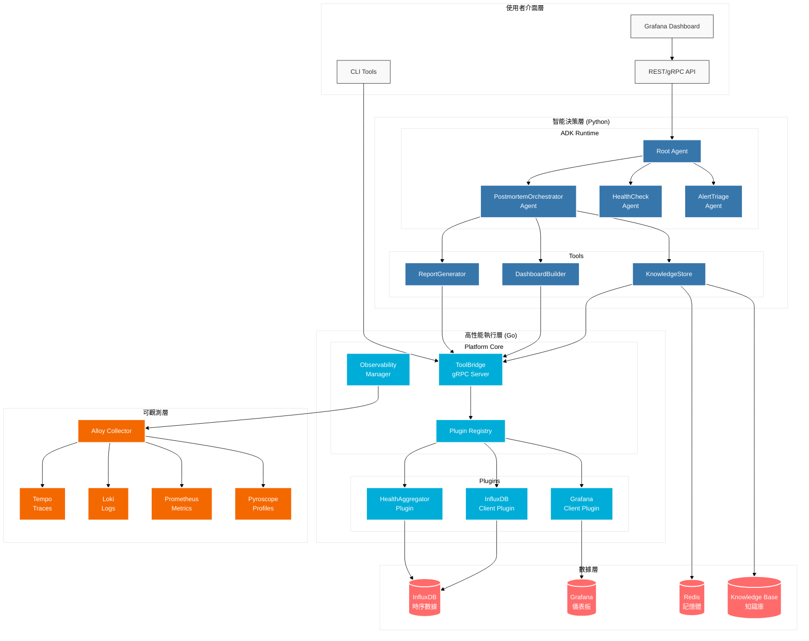
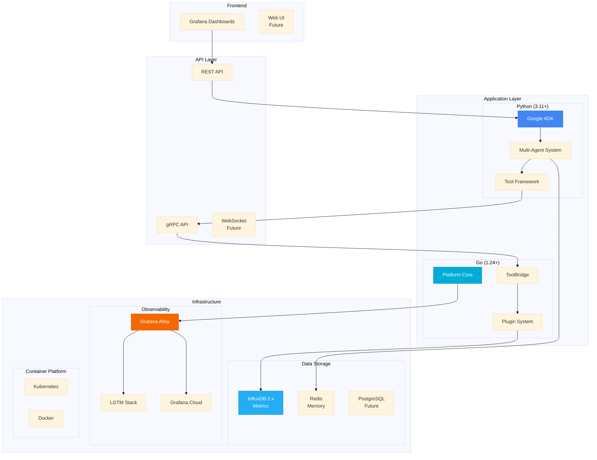

# Detectviz Platform

[](./docs/mvp-implementation-spec.md)
[](./docs/sre-services-map.md)
[](#mvp-milestone)
[](./contracts)
[](#)
[](#)
[](https://google.github.io/adk-docs/)
[](#)
[](./grafana-alloy/config.alloy)
[](./LICENSE)

以 **Google Agent Development Kit (ADK)** 為核心，結合 Go 與 Python 的混合式可觀察性與智能代理平台。此倉庫聚焦最小可運行與可擴展：以 `contracts/` 作為單一事實來源（SSOT），Go 作為平台層與 ToolBridge，Python 承載 ADK Runtime 與多代理協作。觀測以 Grafana Alloy 為收集/轉送層，支援本地 LGTM、Grafana Cloud 與 GCP。

## 專案願景：SRE 三階段生命週期

本平台基於 **SRE 運維三階段生命週期**設計，構建完整的智能化可靠性工程體系：



### 當前 MVP 聚焦：Phase 3（事後複盤）

**為什麼選擇事後複盤作為 MVP？**

1. **業務價值立竿見影**：
   - 減少重複故障 40%+
   - 縮短 MTTR 30%+
   - 知識沉澱自動化

2. **技術風險最低**：
   - 無實時處理壓力
   - 無自動修復風險
   - 數據分析為主

3. **為後續階段奠基**：
   - 建立數據查詢層（HealthAggregator）
   - 建立報告生成層（ReportGenerator）
   - 建立知識庫架構（ResponseHistoryStore）

**8 週 MVP 交付目標**：
- 自動事故複盤分析
- 結構化報告生成
- 知識庫累積檢索
- 為 Phase 1/2 提供基礎設施

### MVP 工作流程圖



> 詳細架構設計請參考 [`docs/sre-services-map.md`](./docs/sre-services-map.md)  
> 技術實現規範請參考 [`spec.md`](./spec.md)

---

## 核心概念
- **SSOT（contracts）**：所有跨語言契約、設定與分類皆以 Proto/Schema 為唯一真相，下游程式碼不得手改生成檔。
- **解耦**：Go 與 Python 僅透過 gRPC/HTTP 溝通；平台層最小化、業務邏輯下沉到 ADK Runtime。
- **可擴展**：以「模組卡（Module Card）」規範 Agent/Tool/Capability/Plugin 的 `role`/`category` 與依賴；提供樣板與驗證工具。
- **可觀測性優先**：統一 Logs/Traces/Metrics/Profiles；應用側只暴露 `pprof`，由 Alloy 以 `pyroscope.scrape` 上送。

---

## 整體架構圖



### 架構說明
- **Contracts**: SSOT 契約層，包含 JSON Schemas 配置驗證和 Proto APIs 定義，透過 buf 工具生成跨語言類型安全的程式碼
- **Go Platform**: 基礎設施層，核心組件為 ToolBridge (gRPC 服務器) 和 Plugins (插件系統)，處理高效能平台服務
- **Python ADK**: 業務邏輯層，由 Agents (AI 代理) 和 RemoteTool (遠端工具客戶端) 組成，實現智能代理功能
- **Alloy**: 觀測收集層，統一收集 logs/traces/metrics/profiles 並處理資料轉換與路由
- **Backends**: 資料儲存層，支援本地 LGTM、Grafana Cloud、GCP 等多種觀測性後端

---

## 目錄導覽
- `contracts/`：SSOT 契約與樣本
  - `proto/`：gRPC 介面（`adk_bridge.proto`）
  - `schemas/`：`config.schema.json`、`module.card.schema.json`、`plugin.schema.json`
  - `samples/`：組態樣本（建議複製到專案根 `./config.yaml`）
  - `tools/`：合規檢查與卡片驗證
  - `gen/`：生成的 Go 與 Python 程式碼
  - `specs/`：技術規格文檔
- `go-platform/`：平台核心（CLI、ToolBridge、插件、觀測初始化）
  - `cmd/detectviz/`：CLI 入口（已優化：模組化啟動流程、結構化錯誤處理、優雅關機）
  - `internal/configx/`：設定載入與 Schema 驗證
  - `internal/contracts/`：契約版本檢查
  - `internal/pluginhost/`：Registry、插件目錄、資源監控、安全邊界
  - `internal/observability/`：zap 與 OpenTelemetry 初始化（含 `pprof`）
  - `internal/health/`：`/livez`、`/readyz` 健康服務
  - `internal/pluginnew/`：插件腳手架生成工具
- `python-adk-runtime/`：ADK Runtime 與 RemoteTool
  - `src/detectviz_adk/`：runtime/memory/tools/capabilities（含 `remote_tool.py`）
  - `templates/`：Agent、Tool、Capability 樣板
- `grafana-alloy/`：Alloy 管線設定（本地或雲端）
- `.github/workflows/`：CI/CD 流程（契約驗證、安全掃描）

---

## 快速開始（MVP 專用）

### 環境準備
1. **閱讀核心文檔**：
   - [`docs/sre-services-map.md`](./docs/sre-services-map.md) - 理解 SRE 三階段架構
   - [`spec.md`](./spec.md) - 技術實現規範
   - [`docs/mvp-implementation-spec.md`](./docs/mvp-implementation-spec.md) - MVP 詳細計畫

2. **設置環境變數**：
   ```bash
   # 複製 MVP 配置樣板
   cp contracts/samples/config.yaml ./config.yaml
   
   # 設置必要環境變數（事後複盤數據源）
   export INFLUXDB_URL="http://localhost:8086"
   export INFLUXDB_ORG="detectviz"
   export INFLUXDB_BUCKET="metrics"
   export INFLUXDB_TOKEN="your-influxdb-token"
   export GRAFANA_URL="http://localhost:3000"
   export GRAFANA_API_KEY="your-grafana-api-key"
   ```

### 啟動 MVP 系統

3. **啟動可觀測性收集層**：
   ```bash
   # 啟動 Grafana Alloy（支援本地 LGTM 或 Grafana Cloud）
   ./grafana-alloy/alloy run ./grafana-alloy/config.alloy
   ```

4. **啟動 Go 平台層**（ToolBridge + HealthAggregator）：
   ```bash
   # MVP 專用啟動：包含事後複盤插件
   go run ./go-platform/cmd/detectviz plugin serve --config ./config.yaml \
     --http-demo --http-demo-listen :7777
   
   # 等待系統就緒
   curl -sS http://127.0.0.1:8081/readyz
   echo "✅ Go Platform Ready"
   ```

5. **啟動 Python ADK Runtime**（PostmortemOrchestratorAgent）：
   ```bash
   cd python-adk-runtime
   
   # 設置 ToolBridge 連接
   export DETECTVIZ_TOOLBRIDGE_ADDR="127.0.0.1:5002"
   export DETECTVIZ_TOOLBRIDGE_INSECURE="true"
   
   # 啟動事後複盤 Agent
   python -m detectviz_adk.agents.post_mortem.postmortem_orchestrator_agent
   echo "✅ PostmortemOrchestratorAgent Ready"
   ```

### 驗證 MVP 功能

6. **測試事後複盤流程**：
   ```bash
   # 模擬事故複盤請求
   curl -X POST http://127.0.0.1:8080/api/v1/postmortem \
     -H "Content-Type: application/json" \
     -d '{
       "incident_id": "INC-2024-001",
       "time_range": {
         "start": "2024-01-15T10:00:00Z",
         "end": "2024-01-15T12:00:00Z"
       },
       "affected_services": ["web-frontend", "api-gateway"],
       "severity": "HIGH"
     }'
   ```

7. **檢查輸出結果**：
   ```bash
   # 查看生成的複盤報告
   ls ./reports/postmortem-INC-2024-001-*.md
   
   # 檢查知識庫更新
   ls ./data/knowledge.db
   
   # 查看系統日誌
   tail -f ./var/log/detectviz/detectviz.log
   ```

### 監控與觀測

8. **在 Grafana 中查看**：
   - **Logs**: 搜索 `service="detectviz"` 查看 Agent 運行日誌
   - **Traces**: 追蹤 `postmortem_analysis` span 查看完整流程
   - **Metrics**: 監控 `postmortem_duration`、`health_query_time` 等指標
   - **Profiles**: 查看 Go 插件的性能表現

### MVP 成功標準
- ✅ 可以接收事後複盤請求
- ✅ 自動從 InfluxDB 查詢健康數據
- ✅ 生成結構化 Markdown 報告
- ✅ 將知識存儲到歷史庫
- ✅ 整個流程 < 30 秒完成

---

## MVP 里程碑 {#mvp-milestone}

### 8 週開發計畫

| 週次 | 里程碑 | 主要交付物 | 驗收標準 |
|------|--------|------------|----------|
| W1-2 | 基礎架構搭建 | Agent 骨架、插件框架、基本測試 | ✅ 可啟動空 Agent<br/>✅ 插件註冊成功<br/>✅ gRPC 通訊正常 |
| W3-4 | 核心功能實現 | PostmortemOrchestratorAgent、HealthAggregator | ✅ 基本複盤流程可運行<br/>✅ 數據查詢功能完整<br/>✅ 報告生成基本功能 |
| W5-6 | 功能完善 | ReportGenerator、知識存儲、錯誤處理 | ✅ 完整的 MVP 功能<br/>✅ 知識庫存儲檢索<br/>✅ 容錯機制完善 |
| W7-8 | 優化與交付 | 性能優化、文檔完善、部署指南 | ✅ 生產就緒的 MVP<br/>✅ 完整文檔<br/>✅ 部署自動化 |

### 交付清單

**核心功能**：
- [x] PostmortemOrchestratorAgent（事後複盤協調器）
- [x] HealthAggregator（健康數據聚合器）
- [x] ReportGenerator（報告生成器）
- [x] ResponseHistoryStore（知識存儲）

**技術基礎**：
- [x] gRPC ToolBridge（跨語言通訊）
- [x] Contract-driven Development（契約驅動）
- [x] OpenTelemetry 完整觀測
- [x] Grafana Alloy 數據收集

**文檔交付**：
- [x] SRE Services MAP（架構憲法）
- [x] MVP Implementation Spec（實施規格）
- [x] 更新所有 README 文檔
- [x] API 參考文檔

---

## 設定搜尋優先序與環境覆蓋
**搜尋順序（高 → 低）**：
1. 旗標：`--config /path/to/config.yaml`
2. 環境：`DETECTVIZ_CONFIG_FILE=/path/to/config.yaml`
3. 目前目錄：`./config.yaml`
4. 合約覆蓋：`./contracts/config.yaml`
5. 樣本兜底：`./contracts/samples/config.yaml`

**環境變數覆蓋（節選）**：
- `DETECTVIZ_ENV` → `env`
- `DETECTVIZ__GRPC__{LISTEN,MAX_RECV_BYTES,MAX_SEND_BYTES}`
- `DETECTVIZ__OBSERVABILITY__MODE`
- `DETECTVIZ__OBSERVABILITY__OTLP__{PROTOCOL,ENDPOINT,INSECURE,HEADERS}`
- `DETECTVIZ__OBSERVABILITY__LOGS__FILE__{PATH,MAX_SIZE_MB,MAX_BACKUPS,MAX_AGE_DAYS,COMPRESS}`
- `DETECTVIZ__OBSERVABILITY__PROFILING__{ENABLED,PPROF_ADDRESS,APPLICATION_NAME,TAGS}`
- `DETECTVIZ__OBSERVABILITY__RESOURCE__{SERVICE_NAME,SERVICE_VERSION,ENVIRONMENT}`
- `DETECTVIZ__OBSERVABILITY__SAMPLING__RATIO`
- `DETECTVIZ__PLUGIN__{PATHS,REGISTRY}`
- `DETECTVIZ__MEMORY__{BACKEND,DSN,DEFAULT_TTL_SECONDS}`

> Python 端主要傳遞 OTel Trace Context；Logs/Metrics/Profiles 由 Go 端與 Alloy 匯聚上送。

---

## 技術棧架構



---

## 開發流程（摘要）
- **契約先行**：任何跨語言變更請先更新 `contracts/`（proto/schema/samples），再生成並同步下游。
- **生成碼**：在 `contracts/` 執行 `buf lint && buf generate`，禁止手動編輯 `*.pb.go` 等生成檔。
- **插件/Agent 擴增**：依樣板撰寫並附 `module.card.json`，以驗證工具檢查分類與依賴。
- **觀測一致**：Go 端以 OTLP 輸出；Profiles 僅以 `pprof` 暴露，由 Alloy 上送。

---

## 參考文檔

### 核心規範
- [`spec.md`](./spec.md) - 平台技術規格（完整架構定義）
- [`CLAUDE.md`](./CLAUDE.md) - AI 開發守則（協作規範）

### 組件文檔
- [`contracts/README.md`](./contracts/README.md) - SSOT 契約管理
- [`go-platform/README.md`](./go-platform/README.md) - Go 平台核心
- [`python-adk-runtime/README.md`](./python-adk-runtime/README.md) - Python ADK 運行時

### 開發指南
- [`docs/ai-collaboration-guide.md`](./docs/ai-collaboration-guide.md) - AI 協作開發指南
- [`docs/quick-reference.md`](./docs/quick-reference.md) - 快速參考
- [`docs/agent-development-guide.md`](./docs/agent-development-guide.md) - Agent 開發指南

### 配置參考
- [`grafana-alloy/config.alloy`](./grafana-alloy/config.alloy) - 可觀測性配置