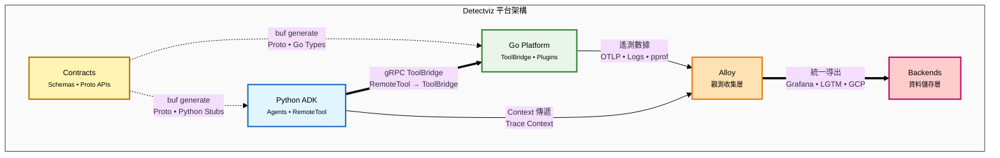

# Detectviz Platform

[](./spec.md)
[](./contracts)
[](#)
[](#)
[](https://google.github.io/adk-docs/)
[](#)
[](./grafana-alloy/config.alloy)
[](./LICENSE)

以 **Google Agent Development Kit (ADK)** 為核心，結合 Go 與 Python 的混合式可觀察性與智能代理平台。此倉庫聚焦最小可運行與可擴展：以 `contracts/` 作為單一事實來源（SSOT），Go 作為平台層與 ToolBridge，Python 承載 ADK Runtime 與多代理協作。觀測以 Grafana Alloy 為收集/轉送層，支援本地 LGTM、Grafana Cloud 與 GCP。

> 詳細規範、術語與流程請以 [`spec.md`](./spec.md) 為準。

---

## 核心概念
- **SSOT（contracts）**：所有跨語言契約、設定與分類皆以 Proto/Schema 為唯一真相，下游程式碼不得手改生成檔。
- **解耦**：Go 與 Python 僅透過 gRPC/HTTP 溝通；平台層最小化、業務邏輯下沉到 ADK Runtime。
- **可擴展**：以「模組卡（Module Card）」規範 Agent/Tool/Capability/Plugin 的 `role`/`category` 與依賴；提供樣板與驗證工具。
- **可觀測性優先**：統一 Logs/Traces/Metrics/Profiles；應用側只暴露 `pprof`，由 Alloy 以 `pyroscope.scrape` 上送。

---

## 架構圖


### 架構說明
- **Contracts**: SSOT 契約層，包含 JSON Schemas 配置驗證和 Proto APIs 定義，透過 buf 工具生成跨語言類型安全的程式碼
- **Go Platform**: 基礎設施層，核心組件為 ToolBridge (gRPC 服務器) 和 Plugins (插件系統)，處理高效能平台服務
- **Python ADK**: 業務邏輯層，由 Agents (AI 代理) 和 RemoteTool (遠端工具客戶端) 組成，實現智能代理功能
- **Alloy**: 觀測收集層，統一收集 logs/traces/metrics/profiles 並處理資料轉換與路由
- **Backends**: 資料儲存層，支援本地 LGTM、Grafana Cloud、GCP 等多種觀測性後端

---

## 目錄導覽
- `contracts/`：SSOT 契約與樣本
  - `proto/`：gRPC 介面（`adk_bridge.proto`）
  - `schemas/`：`config.schema.json`、`module.card.schema.json`、`plugin.schema.json`
  - `samples/`：組態樣本（建議複製到專案根 `./config.yaml`）
  - `tools/`：合規檢查與卡片驗證
  - `gen/`：生成的 Go 與 Python 程式碼
  - `specs/`：技術規格文檔
- `go-platform/`：平台核心（CLI、ToolBridge、插件、觀測初始化）
  - `cmd/detectviz/`：CLI 入口
  - `internal/configx/`：設定載入與 Schema 驗證
  - `internal/contracts/`：契約版本檢查
  - `internal/pluginhost/`：Registry、插件目錄、資源監控、安全邊界
  - `internal/observability/`：zap 與 OpenTelemetry 初始化（含 `pprof`）
  - `internal/health/`：`/livez`、`/readyz` 健康服務
  - `internal/pluginnew/`：插件腳手架生成工具
- `python-adk-runtime/`：ADK Runtime 與 RemoteTool
  - `src/detectviz_adk/`：runtime/memory/tools/capabilities（含 `remote_tool.py`）
  - `templates/`：Agent、Tool、Capability 樣板
- `grafana-alloy/`：Alloy 管線設定（本地或雲端）
- `.github/workflows/`：CI/CD 流程（契約驗證、安全掃描）

---

## 快速開始（概覽）
1. 讀取與校對規格：`spec.md`、`contracts/README.md`、`go-platform/README.md`、`python-adk-runtime/README.md`
2. 套用範例設定（以根目錄 `./config.yaml` 為生效檔）：
   ```bash
   cp contracts/samples/config.yaml ./config.yaml
   ```
3. 啟動 Alloy（請先設定 `.env` 中的雲端變數或使用本地 LGTM）：
   ```bash
   ./grafana-alloy/alloy run ./grafana-alloy/config.alloy
   ```
4. 啟動平台層與示範 HTTP（產生 traces/metrics/logs）：
   ```bash
   go run ./go-platform/cmd/detectviz plugin serve --config ./config.yaml \
     --http-demo --http-demo-listen :7777
   curl -sS http://127.0.0.1:7777/hello
   ```
5. 於 Grafana 檢視：Logs/Traces/Profiles 可進行 Drilldown；Profiles 由 Alloy `pyroscope.scrape` 擷取 `pprof`。

---

## 設定搜尋優先序與環境覆蓋
**搜尋順序（高 → 低）**：
1. 旗標：`--config /path/to/config.yaml`
2. 環境：`DETECTVIZ_CONFIG_FILE=/path/to/config.yaml`
3. 目前目錄：`./config.yaml`
4. 合約覆蓋：`./contracts/config.yaml`
5. 樣本兜底：`./contracts/samples/config.yaml`

**環境變數覆蓋（節選）**：
- `DETECTVIZ_ENV` → `env`
- `DETECTVIZ__GRPC__{LISTEN,MAX_RECV_BYTES,MAX_SEND_BYTES}`
- `DETECTVIZ__OBSERVABILITY__MODE`
- `DETECTVIZ__OBSERVABILITY__OTLP__{PROTOCOL,ENDPOINT,INSECURE,HEADERS}`
- `DETECTVIZ__OBSERVABILITY__LOGS__FILE__{PATH,MAX_SIZE_MB,MAX_BACKUPS,MAX_AGE_DAYS,COMPRESS}`
- `DETECTVIZ__OBSERVABILITY__PROFILING__{ENABLED,PPROF_ADDRESS,APPLICATION_NAME,TAGS}`
- `DETECTVIZ__OBSERVABILITY__RESOURCE__{SERVICE_NAME,SERVICE_VERSION,ENVIRONMENT}`
- `DETECTVIZ__OBSERVABILITY__SAMPLING__RATIO`
- `DETECTVIZ__PLUGIN__{PATHS,REGISTRY}`
- `DETECTVIZ__MEMORY__{BACKEND,DSN,DEFAULT_TTL_SECONDS}`

> Python 端主要傳遞 OTel Trace Context；Logs/Metrics/Profiles 由 Go 端與 Alloy 匯聚上送。

---

## 開發流程（摘要）
- **契約先行**：任何跨語言變更請先更新 `contracts/`（proto/schema/samples），再生成並同步下游。
- **生成碼**：在 `contracts/` 執行 `buf lint && buf generate`，禁止手動編輯 `*.pb.go` 等生成檔。
- **插件/Agent 擴增**：依樣板撰寫並附 `module.card.json`，以驗證工具檢查分類與依賴。
- **觀測一致**：Go 端以 OTLP 輸出；Profiles 僅以 `pprof` 暴露，由 Alloy 上送。

---

## 參考
- [`spec.md`](./spec.md)
- [`contracts/README.md`](./contracts/README.md)
- [`go-platform/README.md`](./go-platform/README.md)
- [`python-adk-runtime/README.md`](./python-adk-runtime/README.md)
- [`grafana-alloy/config.alloy`](./grafana-alloy/config.alloy)