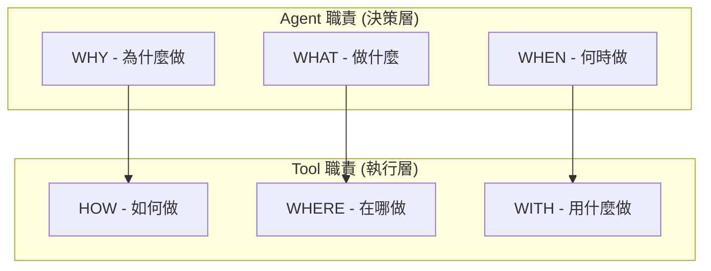

# AI Agent 開發藍圖

> **文檔職責**：定義 Detectviz Platform AI Agent 的完整開發藍圖，提供從現有 MVP 到完整 SRE 智能平台的技術實現路徑
> **最後更新**：2025-08-20
> **版本**：1.0.0

## 📊 專案現況總覽

### ✅ 已完成組件 (95% MVP)
```yaml
基礎設施:
  - Go Platform Core (ToolBridge, Plugin Host) ✅
  - Python ADK Runtime (Google ADK v1.11.0) ✅  
  - Contracts SSOT (Proto/gRPC) ✅
  - Observability (Prometheus + Grafana) ✅

已實作 Agents:
  - PostmortemOrchestrator (事後複盤協調器) ✅
  - DataCollectorAgent (數據收集) ✅
  - RootCauseAnalyzer (根因分析) ✅
  - ReportWriter (報告生成) ✅

核心 Tools:
  - MetricsProvider (Prometheus抽象層) ✅
  - HealthAggregator (健康聚合) ✅
  - KnowledgeProvider (PostgreSQL) ✅
  - StateManager (Redis) ✅

UI 方案:
  - ADK Web UI (內建，立即可用) ✅
  - 支援 Token 監控、會話管理、調試追蹤 ✅
```

---

## 🎯 Agent 開發架構總覽

### 核心設計原則



### Agent 架構模式決策矩陣

| 需求特徵 | 推薦模式 | 複雜度 | 適用場景 |
|---------|---------|--------|----------|
| 單一功能 + 工具豐富 | **Simple Agent** | 低 | 監控查詢、報告生成 |
| 多專家協作 | **Coordinator Pattern** | 中 | 事故分析、複盤流程 |
| 階段性流程 | **Hierarchy Pattern** | 中 | 部署流程、變更管理 |
| 迭代優化 | **Workflow Pattern** | 高 | 性能調優、容量規劃 |

---

## 📋 Phase 1: SRE Assistant 核心 (2025 Q3)
> **目標**：建立自然語言交互的 SRE 智能助理基礎

### 1.1 SREAssistant (統一入口 Agent)

```python
class SREAssistant(adk.Agent):
    """
    職責：作為 SRE 團隊與平台的統一交互介面
    模式：Coordinator Pattern
    部署：使用 ADK Web UI 作為 MVP 介面
    """
    
    def __init__(self):
        super().__init__(
            name="SRE Assistant",
            model="gemini-2.0-flash",  # 或其他支援的模型
            description="您的 SRE 運維智能助理",
            instruction="""你是一位專業的 SRE 助理，能夠：
            1. 理解並回答運維相關問題
            2. 協助分析系統問題和故障
            3. 生成監控查詢和配置
            4. 提供最佳實踐建議
            """,
            tools=[],  # 初期使用現有 tools
            sub_agents=[
                ObservabilityExpert(),
                IncidentInvestigator(),  # 改造自現有 PostmortemOrchestrator
                KnowledgeManager()
            ]
        )
    
    capabilities:
      - 自然語言理解與意圖識別
      - 任務分派與協調
      - 多輪對話狀態管理
      - 結果轉譯與呈現
    
    required_tools:
      - IntentRouter (意圖路由)
      - TaskDelegationTool (任務委派)
      - ChatHistoryMemory (對話記憶)
      - NLPTranslator (自然語言處理)
```

**實作流程（MVP 快速路徑）**：
1. 使用 `adk web` 內建 UI 作為初始介面
2. 配置 ADK 支援的 LLM (Gemini/Claude/GPT)
3. 利用 ADK Web 的內建 HITL 和會話管理
4. 後續再考慮自定義 UI 擴展

**平台能力需求**：
- **Tools**: NLP 處理、意圖分類、對話管理
- **RAG**: SRE 術語庫、操作手冊、歷史對話
- **Memory**: Redis 會話狀態、對話歷史

### 1.2 ObservabilityExpert (可觀測性專家)

```python
class ObservabilityExpert(Agent):
    """
    職責：處理所有監控配置與可觀測性相關任務
    模式：Simple Agent Pattern
    """
    
    capabilities:
      - PromQL/LogQL 查詢生成
      - Dashboard 自動創建
      - Alert 規則配置
      - 指標相關性分析
    
    required_tools:
      - PromQLTool (查詢生成器)
      - GrafanaTool (Dashboard API)
      - PrometheusConfigTool (配置管理)
      - MetricsCorrelator (相關性分析)
```

**實作流程**：
1. 開發 PromQL 查詢生成器（基於模板和 LLM）
2. 實現 Grafana API 整合層
3. 建立指標相關性分析引擎
4. 創建 Dashboard 模板庫

### 1.3 IncidentInvestigator (事件調查專家)

```python
class IncidentInvestigator(Agent):
    """
    職責：深度分析事件，提供根因分析
    模式：Hierarchy Pattern (多階段分析)
    改造現有 PostmortemOrchestrator
    """
    
    capabilities:
      - 多信號源關聯分析
      - 根因推理與假設驗證
      - 變更影響評估
      - 修復建議生成
    
    sub_agents:
      - MetricsAnalyzer (指標分析)
      - LogAnalyzer (日誌分析)  
      - TraceAnalyzer (追蹤分析)
      - ChangeAnalyzer (變更分析)
```

---

## 📋 Phase 2: 預測性維護 (2025 Q4)
> **目標**：實現主動式監控和預測性分析

### 2.1 PredictiveAnalyst (預測分析師)

```python
class PredictiveAnalyst(Agent):
    """
    職責：基於歷史數據預測未來趨勢
    模式：Workflow Pattern (迭代預測)
    """
    
    capabilities:
      - 時間序列預測
      - 異常模式學習
      - 容量規劃建議
      - 成本優化分析
    
    required_tools:
      - TimeSeriesPredictor (Prophet/ARIMA)
      - AnomalyDetector (Isolation Forest)
      - CapacityPlanner (資源預測)
      - CostAnalyzer (成本分析)
```

**平台能力需求**：
- **Tools**: ML 模型訓練/推理框架
- **RAG**: 歷史事件模式庫
- **Memory**: 模型狀態持久化

### 2.2 ProactiveGuardian (主動防護者)

```python
class ProactiveGuardian(Agent):
    """
    職責：主動發現並預防潛在問題
    模式：Simple Agent + 持續監控
    """
    
    capabilities:
      - 配置漂移檢測
      - 安全風險評估
      - 性能退化預警
      - 依賴健康檢查
```

---

## 📋 Phase 3: 自動化運維 (2026 Q1)
> **目標**：實現自動化修復和自適應運維

### 3.1 AutoRemediator (自動修復專家)

```python
class AutoRemediator(Agent):
    """
    職責：執行自動化修復流程
    模式：Coordinator Pattern + 安全控制
    """
    
    capabilities:
      - Runbook 自動執行
      - 安全修復策略
      - 回滾機制
      - 修復效果驗證
    
    required_tools:
      - RunbookExecutor (腳本執行)
      - SafetyValidator (安全檢查)
      - RollbackManager (回滾控制)
      - VerificationTool (效果驗證)
```

### 3.2 ConfigOptimizer (配置優化師)

```python
class ConfigOptimizer(Agent):
    """
    職責：持續優化系統配置
    模式：Workflow Pattern (迭代優化)
    """
    
    capabilities:
      - 配置推薦生成
      - A/B 測試管理
      - 性能基準對比
      - 配置版本管理
```

---

## 📋 Phase 4: 知識管理與學習 (2026 Q2)
> **目標**：建立自學習的知識管理系統

### 4.1 KnowledgeCurator (知識管理員)

```python
class KnowledgeCurator(Agent):
    """
    職責：管理和優化知識庫
    模式：Simple Agent + RAG 整合
    """
    
    capabilities:
      - 知識提取與分類
      - 經驗模式識別
      - 最佳實踐生成
      - 知識圖譜構建
```

### 4.2 LearningOptimizer (學習優化器)

```python
class LearningOptimizer(Agent):
    """
    職責：持續改進 Agent 性能
    模式：Meta-learning Pattern
    """
    
    capabilities:
      - Agent 性能評估
      - 策略優化建議
      - 反饋循環管理
      - 模型再訓練協調
```

---

## 🚀 實施計劃

### ADK Web MVP 快速部署指南

```bash
# Step 1: 準備 ADK 環境
pip install google-adk

# Step 2: 改造現有 Agent
# 將 python-adk-runtime/web_server.py 改為：
from detectviz_adk.agents.sre_assistant import SREAssistant
agent = SREAssistant()  # 取代原本的 postmortem_orchestrator

# Step 3: 啟動 ADK Web
adk web python-adk-runtime/web_server.py

# Step 4: 訪問 UI
# 打開瀏覽器訪問 http://localhost:8000
```

### 技術棧選擇

```yaml
AI/ML 框架:
  - LLM: ADK 原生支援 (Gemini/Claude/GPT)
  - 備選: Ollama + 開源模型 (Phase 2)
  - NLP: ADK 內建 + LangChain (擴展用)
  - ML: scikit-learn, Prophet
  - 向量DB: pgvector (PostgreSQL 擴展)

開發工具:
  - Agent Framework: Google ADK
  - UI: ADK Web (MVP) → 自定義 UI (後續)
  - 工作流: ADK 內建 Agent 協作
  - 監控: 現有 Prometheus/Grafana + ADK Web 調試
  - 測試: pytest + ADK 測試工具
```

### 里程碑時間表

| 階段 | 時間 | 核心交付物 | 成功指標 |
|------|------|-----------|----------|
| **MVP** | 2週 | ADK Web 基礎部署 | 基本對話功能可用 |
| **Phase 1** | 2025 Q3 | SRE Assistant 核心 | NLP 查詢準確率 >85% |
| **Phase 2** | 2025 Q4 | 預測性維護系統 | 預測準確率 >80% |
| **Phase 3** | 2026 Q1 | 自動化修復框架 | 自動修復成功率 >75% |
| **Phase 4** | 2026 Q2 | 知識管理系統 | 知識利用率 >70% |

### 開發優先級

```python
PRIORITY_MATRIX = {
    "P0 - 立即開始 (Week 1)": [
        "部署 ADK Web UI",
        "改造 PostmortemOrchestrator 為 SREAssistant",
        "配置 ADK 支援的 LLM",
        "測試基本對話功能"
    ],
    "P1 - MVP 完善 (Week 2)": [
        "整合現有 Tools 到 ADK",
        "優化 Agent 提示詞",
        "添加 SRE 專業知識",
        "建立基礎 RAG"
    ],
    "P2 - 功能擴展 (Month 1)": [
        "開發 PromQLTool",
        "實現 Dashboard 生成",
        "增強查詢能力",
        "性能優化"
    ],
    "P3 - 後續規劃": [
        "自定義 UI 開發",
        "預測性分析",
        "自動修復機制",
        "ML 模型訓練"
    ]
}
```

---

## 📊 成功指標

### 技術指標
- **查詢延遲**: <3秒 (NLP 處理 + 執行)
- **準確率**: >85% (意圖識別準確率)
- **可用性**: 99.9% (Assistant 服務 SLA)
- **並發支援**: 100+ 同時用戶

### 業務指標
- **MTTR 降低**: 30% (平均修復時間)
- **人工介入減少**: 40% (自動化處理)
- **知識重用率**: 60% (歷史經驗利用)
- **用戶滿意度**: >4.5/5

---

## 🔄 持續演進策略

### 反饋循環機制
1. **用戶反饋收集**: 每次交互評分
2. **性能監控**: Agent 決策質量追蹤
3. **知識更新**: 每週知識庫優化
4. **模型優化**: 每月模型重訓練

### 社群貢獻
- 開源 Agent 模板和工具
- 發布 SRE 知識庫數據集
- 貢獻 Prometheus/Grafana 整合
- 分享最佳實踐和案例研究

---

## 🎯 下一步行動

### 立即行動 - MVP 部署 (Day 1-3)
1. [ ] 啟動 ADK Web (`adk web python-adk-runtime/web_server.py`)
2. [ ] 改造 PostmortemOrchestrator 為 SREAssistant
3. [ ] 配置 LLM API (Gemini/Claude/GPT)
4. [ ] 測試基本 SRE 對話場景

### MVP 完善 (Week 1-2)
1. [ ] 優化 Agent 指令和提示詞
2. [ ] 整合現有 Tools (MetricsProvider, HealthAggregator)
3. [ ] 添加 SRE 領域知識和術語
4. [ ] 利用 ADK Web 的調試功能優化對話流程

### 短期目標 (Month 1)
1. [ ] 開發 PromQLTool 並整合到 ADK
2. [ ] 實現基礎 Dashboard 生成功能
3. [ ] 建立 SRE 知識庫 RAG
4. [ ] 收集用戶反饋並迭代

### 中期目標 (Quarter 1)
1. [ ] 完成 Phase 1 所有 Agent
2. [ ] 評估是否需要自定義 UI
3. [ ] 整合更多監控工具
4. [ ] 發布穩定版本

---

*本藍圖基於現有 95% 完成的 MVP，採用漸進式開發策略，確保每個階段都能為用戶帶來實際價值。*