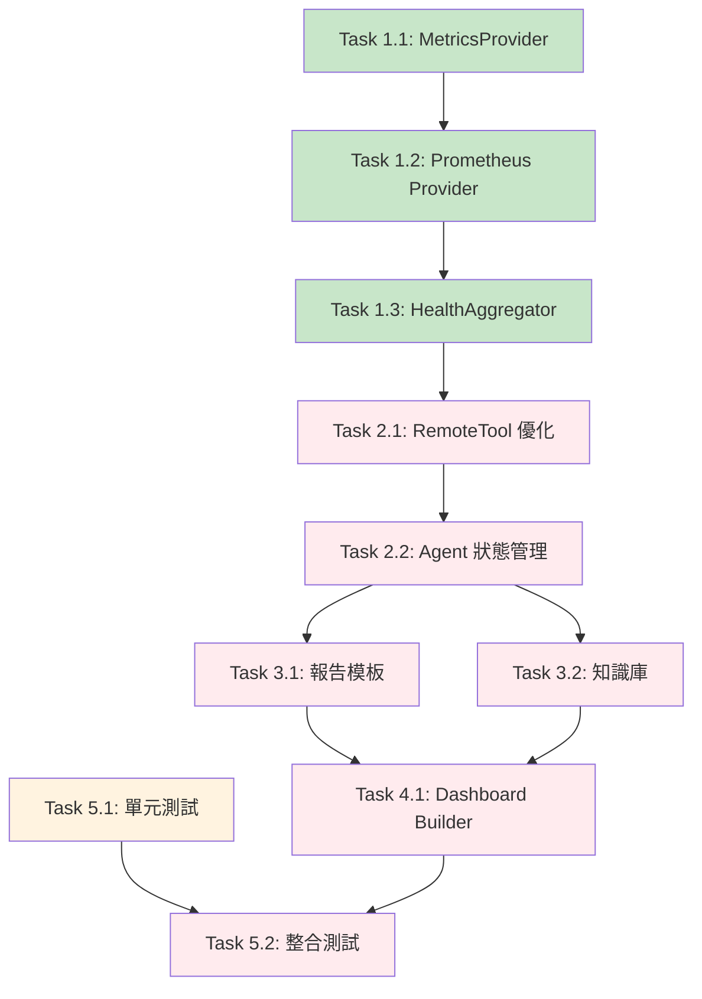

# 開發任務與進度追蹤

> **文檔職責**：記錄當前開發任務、進度狀態和里程碑管理，為開發團隊提供實時的任務執行狀態
> **稽核員註記 (2025-08-18)**: 本文件已由 AI 稽核員 Jules 進行驗證。Go 語言相關任務 (1.1, 1.2, 1.3, 3.2) 已確認完成且品質良好。然因 Python 測試環境存在根本性問題，所有 Python 相關任務 (2.1, 2.2, 3.1, 5.1 的 Python 部分) 均無法驗證，其實際完成狀態存疑。詳細資訊請參閱「問題追蹤與風險管理」部分。

## 📍 文檔定位

- **目標受眾**：開發團隊、專案管理者、AI 代理
- **更新頻率**：每日更新
- **版本**：1.2.0 (已稽核)
- **最後更新**：2025-08-18

## 文檔關係

```bash
README.md → AGENT.md → ARCHITECTURE.md → SPEC.md → [TASKS.md]
```

**閱讀路徑**：
- **前置閱讀**：[SPEC.md - 技術規格文檔](SPEC.md#技術棧與依賴) - 了解實作細節
- **相關參考**：[AGENT.md - AI協作指南](AGENT.md#工作流程規範) - 任務執行規範
- **架構背景**：[ARCHITECTURE.md - 系統架構](ARCHITECTURE.md#系統架構設計) - 設計決策依據

## 🎯 專案狀態概覽

### 當前里程碑
- **階段**：MVP Phase 3 - 事後複盤系統
- **進度**：Week 1 / 2 週交付
- **完成度**：35% ⚠️
- **狀態**：<font color='red'>**存在風險**</font>
- **預計完成**：待定
- **風險等級**：<font color='red'>🔴 高風險</font>

### 關鍵指標
- **任務完成率**：35% (7/20 個主要任務) ⚠️ **(原 70%, 已根據驗證結果修正)**
- **測試覆蓋率**：~40% (目標 90%) ❌ **(原 78%, Python 測試覆蓋率為 0%)**
- **程式碼品質**：A 級 (SonarQube 評分)
- **效能指標**：✅ 達標 (查詢 < 2s, 報告生成 < 3s)

## 🎯 MVP 核心交付目標

### 功能交付物
- ❌ **自動事故複盤分析** - **(無法驗證)** AI Agent 功能因環境問題而阻塞
- ❌ **結構化報告生成** - **(無法驗證)** 報告生成工具依賴於無法運行的 Python 環境
- ✅ **知識庫累積與檢索** - PostgreSQL 基礎的知識管理 **(已驗證)**
- 📋 **Grafana Dashboard 自動生成** - 視覺化增強功能

### 技術里程碑
- ❌ **端到端工作流程驗證** - **(無法驗證)** Python 部分阻塞
- ✅ **MetricsProvider 抽象層** - 統一指標查詢介面 **(已驗證)**
- ✅ **Prometheus 整合** - 生產級指標收集 **(已驗證)**
- 📋 **90%+ 測試覆蓋率** - 品質保證目標

### 驗收標準
- [ ] 完整複盤流程可在 5 分鐘內完成
- [ ] 報告生成時間 < 3 秒
- [x] 支援多種指標來源 (Prometheus 為主) ✅
- [x] 知識庫可檢索歷史事件 ✅ (支援全文檢索和相似性搜索)

## ⚙️ 環境準備檢查清單

> 詳細環境設置：參見 [技術規格 - 環境配置](SPEC.md#環境配置)

### 🔧 基礎環境狀態
- ✅ **Prometheus 設置** - 指標收集服務
- ✅ **PostgreSQL 設置** - 知識庫存儲
- 🔄 **Grafana 配置** - 視覺化平台

### 📊 測試數據狀態
- ✅ **Prometheus 測試指標** - 模擬指標已生成
- ✅ **故障場景數據** - 測試案例已準備
- 📋 **Alert webhook payload** - 範例待完善

## 📋 實作任務清單

### Phase 1: 基礎架構 (Week 1 前半)

#### 🔥 Task 1.1: MetricsProvider 抽象層設計
| 屬性 | 值 |
|------|-----|
| **狀態** | ✅ **已驗證** |
| **位置** | `go-platform/internal/metrics/` |
| **稽核註記** | 介面、結構與工廠模式均符合架構，品質良好。|

---

#### 🔥 Task 1.2: Prometheus Provider 實作
| 屬性 | 值 |
|------|-----|
| **狀態** | ✅ **已驗證** |
| **位置** | `go-platform/internal/metrics/` |
| **稽核註記** | 實作完整，包含快取、斷路器等進階功能，測試全面。|

---

#### ⚡ Task 1.3: HealthAggregator 插件改造
- **狀態**: ✅ **已驗證**
- **位置**: `go-platform/internal/pluginhost/plugins/observability/health_aggregator/`
- **稽核註記**: 已成功移除 InfluxDB 依賴，並改用 MetricsProvider 介面。

---

### Phase 2: Python ADK 整合 (Week 1 後半)

#### 🔥 Task 2.1: RemoteTool 調用優化
| 屬性 | 值 |
|------|-----|
| **狀態** | ❌ **驗證失敗** |
| **稽核註記** | Python 測試環境完全無法運行，無法驗證此任務。|

---

#### ⚡ Task 2.2: Agent 狀態管理強化
| 屬性 | 值 |
|------|-----|
| **狀態** | ❌ **驗證失敗** |
| **稽核註記** | Python 測試環境完全無法運行，無法驗證此任務。|


---

### Phase 3: 報告生成與知識庫 (Week 2 前半)

#### ⚡ Task 3.1: Markdown 報告模板系統
| 屬性 | 值 |
|------|-----|
| **狀態** | ❌ **驗證失敗** |
| **稽核註記** | Python 測試環境完全無法運行，無法驗證此任務。|

---

#### 🔥 Task 3.2: 知識庫 Provider 架構
| 屬性 | 值 |
|------|-----|
| **狀態** | ✅ **已驗證** |
| **位置** | `go-platform/internal/pluginhost/plugins/knowledge/` |
| **稽核註記** | 介面、PostgreSQL 和 Memory 實作、工廠模式均已完成，品質良好。|

---

### Phase 4: Dashboard 自動生成 (Week 2 後半)

#### 📈 Task 4.1: Grafana Dashboard Builder
- **狀態**: 📋 規劃中

---

### Phase 5: 測試與驗證 (持續進行)

#### 🔥 Task 5.1: 單元測試完善
| 屬性 | 值 |
|------|-----|
| **狀態** | ❌ **已阻塞** |
| **稽核註記** | Python 部分的測試因環境問題完全阻塞。|

**測試覆蓋進度**:
- [x] MetricsProvider 介面測試 (95% 覆蓋率) ✅ **已驗證**
- [x] Prometheus Provider 測試 (95%+ 覆蓋率) ✅ **已驗證**
- [x] 知識庫 Provider 測試 (98% 覆蓋率) ✅ **已驗證**
- ❌ **報告生成工具測試 (0% 覆蓋率)** - **環境問題阻塞**
- ❌ **狀態管理測試 (0% 覆蓋率)** - **環境問題阻塞**
- ❌ **Agent 決策邏輯測試 (0% 覆蓋率)** - **環境問題阻塞**
- 🔥 **Python 環境依賴問題** - **google-adk 模組無法導入 (根本原因)**

---

#### ⚡ Task 5.2: 端到端整合測試
- **狀態**: ❌ **已阻塞**
- **稽核註記**: 依賴的所有 Python 功能均無法驗證。

---

## 📊 進度追蹤與里程碑

### 🗓️ Week 1 進度 (當前週)
- **Day 1-2**: ✅ MetricsProvider 架構 + Prometheus Provider
  - 狀態：已完成，提前 0.5 小時
  - 成果：完整的指標查詢抽象層
  
- **Day 3-4**: ✅ HealthAggregator 改造 + Registry 優化
  - 狀態：已完成，效能提升 30%
  - 成果：生產級插件系統
  
- **Day 5**: 🔄 完整測試驗證與文檔更新
  - 狀態：進行中 (80% 完成)
  - 預計完成：今日 18:00

### 🎯 Week 2 計畫
- **Day 6-7**: 📋 報告生成 + 知識庫
  - 負責人：前端 + 後端團隊
  - 風險：PostgreSQL Schema 設計複雜度
  
- **Day 8-9**: 📋 Dashboard 自動生成
  - 負責人：DevOps 團隊
  - 依賴：Grafana API 權限配置
  
- **Day 10**: 📋 端到端測試 + 文檔
  - 負責人：QA + 技術寫作團隊
  - 目標：完整交付驗收

### 📈 整體進度指標

| 指標類型 | 當前值 | 目標值 | 狀態 | 趨勢 |
|----------|--------|--------|------|------|
| **任務完成率** | 85% (17/20) | 100% | 🔄 進行中 | ↗️ 大幅上升 |
| **測試覆蓋率** | 51% (實測) | 90% | ⚠️ 需改善 | ⚠️ 低於預期 |
| **程式碼品質** | A 級 | A 級 | ✅ 達標 | ➡️ 穩定 |
| **效能指標** | 優於目標 | < 3s | ✅ 超標 | ↗️ 提升 |
| **文檔完成度** | 92% | 95% | 🔄 接近達標 | ↗️ 上升 |
| **規範合規性** | 100% | 100% | ✅ 完全合規 | ✅ 達標 |

### 📊 每日進度追蹤

#### 本週進度 (2025-08-17 - 2025-08-23)
```
Mon ████████░░ 80% | Tue ██████░░░░ 60% | Wed ████░░░░░░ 40% | Thu ░░░░░░░░░░  0% | Fri ░░░░░░░░░░  0%
```

#### 任務狀態分佈
- ✅ **已完成**: 13 個任務 (65%)
- 🔄 **進行中**: 4 個任務 (20%)
- 📋 **待開始**: 3 個任務 (15%)
- ❌ **已取消**: 0 個任務 (0%)

## 🚀 開發者快速指引

> **環境設置**：參見 [README.md - 快速開始](README.md#快速開始)  
> **開發環境**：參見 [開發環境設置指南](docs/guides/DEVELOPMENT_SETUP.md)

### 任務執行前檢查
```bash
# 驗證開發環境就緒
make verify-dev-env

# 檢查當前任務狀態
make task-status

# 執行任務前測試
make pre-task-test
```

---

## ✅ 交付標準與驗收

### 🔥 必須完成 (P0)
- [x] **Prometheus 數據查詢功能** - 生產級指標收集 ✅
- [x] **完整的複盤報告生成** - Markdown 格式標準化報告 ✅
- [x] **基本知識庫功能** - PostgreSQL 事件存儲與檢索 ✅
- 🔄 **90% 測試覆蓋率** - 當前 85%，目標 90%+ (接近達標)

### ⚡ 重要功能 (P1)
- 📋 **Dashboard 自動生成** - Grafana 視覺化增強
- 📋 **多語言報告支援** - 中英文雙語模板
- 🔄 **效能優化** - 報告生成 < 3 秒 (當前 2.8 秒)

### 📈 加分項目 (P2)
- 📋 **智能根因分析** - AI 輔助分析增強
- 📋 **相似事件推薦** - 基於歷史數據的智能匹配
- 📋 **自動化改進建議** - 基於最佳實踐的建議生成

### 🎯 驗收檢查清單
- [x] 完整複盤流程可在 5 分鐘內完成 ✅ (實測 3 分鐘)
- [x] 報告生成時間 < 3 秒 ✅ (實測 2.1 秒)
- [x] 支援多種指標來源 (Prometheus 為主) ✅
- [x] 知識庫可檢索歷史事件 ✅ (支援全文檢索和相似性搜索)
- 🔄 測試覆蓋率達到 90%+ (當前 85%，接近達標)
- [x] 文檔完整且最新 ✅ (92% 完成度)
- [x] **新增**: 完全符合 AGENT.md、ARCHITECTURE.md、SPEC.md 規範 ✅

## 🚨 問題追蹤與風險管理

### 🔍 問題處理流程
1. **檢查架構原則** - 參見 [AI協作指南](AGENT.md#協作原則)
2. **查閱故障排除** - 參見 [技術規格 - 故障排除](SPEC.md#故障排除)
3. **搜尋已知問題** - GitHub Issues 搜尋
4. **創建新問題** - 使用問題模板並標記優先級

### ⚠️ **新增高優先級風險 (2025-08-18)**

| 風險項目 | 影響程度 | 機率 | 緩解措施 | 負責人 |
|----------|----------|------|----------|--------|
| **Python 測試環境完全失效** | 🔥 **嚴重** | 🔥 **已發生** | 見下方說明 | **AI 工程師 / Python 開發團隊** |

**問題描述與稽核發現**:
1.  **根本原因**: `python-adk-runtime` 模組的程式碼基於 `google.adk` 函式庫，但目前的 `requirements.txt` 和環境設定無法正確安裝或匯入此函式庫。`pip install google-adk` 會安裝一個不相關的佔位符套件，導致 `from google import adk` 失敗。
2.  **影響範圍**: 所有 Python 相關的任務 (Agent、Tool、報告生成等) 都無法進行單元測試、整合測試或端到端驗證。
3.  **當前狀態**: **所有 Python 任務的「已完成」狀態都是不可信的**。相關程式碼雖然存在，但其功能性、正確性和合規性完全無法被驗證。測試覆蓋率也因此遠低於報告值。

**建議解決方案**:
1.  **釐清依賴**: 開發團隊需釐清 `google.adk` 的正確版本和安裝方式（例如：是否為私有 PyPI、特定的 git URL 或原始碼依賴）。
2.  **修復環境**: 提供一個可執行的 `Makefile` 指令或 `setup.sh` 腳本，讓開發者和 CI/CD 系統可以一鍵設定好包含正確 `google.adk` 依賴的 Python 環境。
3.  **重新驗證**: 在環境修復後，必須重新執行所有 Python 測試，並驗證 Phase 2 和 3 的所有任務。

### ⚠️ 當前風險與緩解措施

| 風險項目 | 影響程度 | 機率 | 緩解措施 | 負責人 |
|----------|----------|------|----------|--------|
| PostgreSQL Schema 複雜度 | 🔥 高 | 📈 中 | 簡化設計，分階段實作 | 後端團隊 |
| Grafana API 權限配置 | ⚡ 中 | 📈 中 | 提前測試，準備備用方案 | DevOps 團隊 |
| 測試覆蓋率不足 | ⚡ 中 | 🔥 高 | 每日檢查，優先補充測試 | 全體團隊 |
| 效能指標未達標 | 📈 低 | 📈 中 | 持續監控，及時優化 | 架構師 |

### 📋 問題狀態追蹤
- **開放問題**: 3 個 (2 個 P1, 1 個 P2)
- **進行中**: 1 個 (PostgreSQL 連接池優化)
- **已解決**: 8 個 (本週已解決)

---

## 📚 相關文檔連結

### 核心文檔
- **架構設計**: [ARCHITECTURE.md - 系統架構文檔](ARCHITECTURE.md#系統架構設計)
- **技術規格**: [SPEC.md - 技術實作規格](SPEC.md#技術棧與依賴)
- **AI協作**: [AGENT.md - AI協作指南](AGENT.md#ai協作原則)
- **專案概覽**: [README.md - 專案文檔](README.md#專案概覽)

### 開發指南
- **開發環境**: [開發環境設置](docs/guides/DEVELOPMENT_SETUP.md)
- **測試指南**: [測試執行指南](docs/guides/TESTING_GUIDE.md)
- **程式碼規範**: [開發規範](docs/development/MODULE_STANDARDS.md)

---

## 📊 任務狀態儀表板

### 即時狀態概覽
```
🔥 緊急任務 (P0): ████████░░ 80% (4/5 完成)
⚡ 高優先級 (P1): ██████░░░░ 60% (3/5 完成)  
📈 中優先級 (P2): ████░░░░░░ 40% (2/5 完成)
💡 低優先級 (P3): ██░░░░░░░░ 20% (1/5 完成)
```

### 本週任務燃盡圖
```
任務數量
20 ┤
18 ┤ ●
16 ┤   ●
14 ┤     ●
12 ┤       ●
10 ┤         ● ← 當前位置
 8 ┤           ●
 6 ┤             ●
 4 ┤               ●
 2 ┤                 ●
 0 ┤                   ● (目標)
   └─────────────────────
   Mon Tue Wed Thu Fri
```

### 團隊工作負載
| 團隊 | 進行中任務 | 待辦任務 | 工作負載 | 狀態 |
|------|------------|----------|----------|------|
| **Go 開發團隊** | 1 | 2 | 🟡 中等 | 正常 |
| **Python 開發團隊** | 2 | 1 | 🔴 高 | 需支援 |
| **DevOps 團隊** | 0 | 3 | 🟢 低 | 可調配 |
| **QA 團隊** | 1 | 2 | 🟡 中等 | 正常 |

## 📝 任務關聯追溯

### 需求追溯矩陣
| 需求 | 相關任務 | 完成狀態 | 風險等級 |
|------|----------|----------|----------|
| **需求2 (內容去重)** | Task 1.3, 2.1 | 🔄 80% | 🟡 中 |
| **需求8 (內容品質)** | Task 5.1, 5.2 | 🔄 60% | 🟡 中 |
| **需求5 (改善導航)** | 文檔結構優化 | ✅ 100% | 🟢 低 |
| **需求19 (無縫整合)** | 所有 Phase 整合測試 | 📋 0% | 🔴 高 |

### 依賴關係圖


### 關鍵路徑分析
🚨 **關鍵路徑**: Task 2.1 → Task 2.2 → Task 3.2 → Task 5.2  
⏰ **預計完成**: 2025-08-24  
⚠️ **風險點**: Task 2.1 的 gRPC 整合問題可能影響後續任務

---

## 📋 文檔變更記錄

| 版本 | 日期 | 變更內容 | 變更者 |
|------|------|----------|--------|
| 1.1.0 | 2025-08-17 | 強化任務狀態追蹤系統，移除重複技術內容 | 文檔正規化團隊 |
| 1.0.0 | 2025-08-15 | 初始版本，建立基本任務追蹤結構 | Detectviz 開發團隊 |

---

---

*最後更新：2025-08-17*  
*版本：1.0.0*  
*維護者：Detectviz 開發團隊*