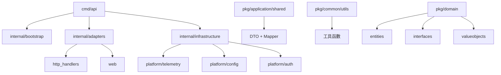
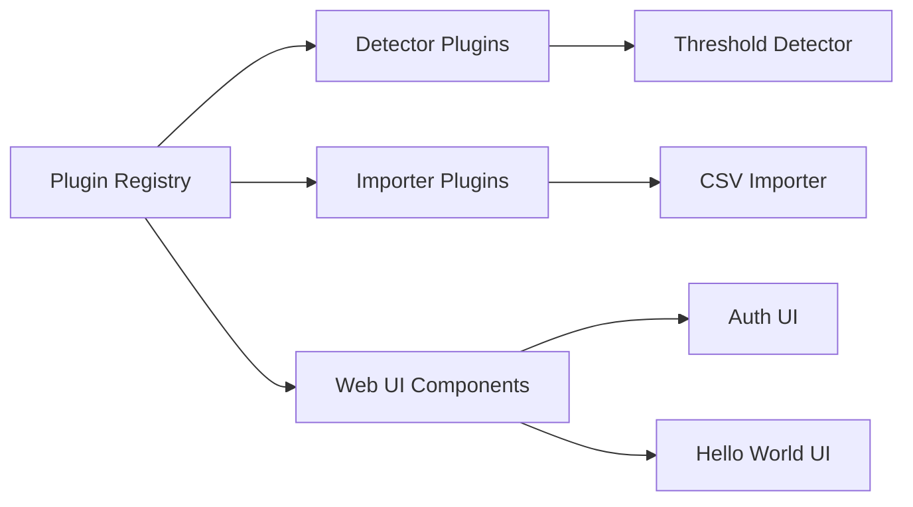

# DetectViz Platform 架構設計

## 🏗️ 整體架構概覽

DetectViz Platform 採用 **Clean Architecture** 設計模式，結合 **Plugin 系統** 和 **AI Scaffold 友好性**，實現高度模組化、可擴展的數據檢測與視覺化平台。

## 📁 目錄結構（已優化）

```
detectviz-platform/
├── cmd/api/                    # 應用程式入口
│   └── main.go                 # 主程序啟動點
├── internal/                   # 內部實現代碼
│   ├── adapters/              # 適配器層
│   │   ├── http_handlers/     # HTTP 請求處理器
│   │   └── web/               # Web UI 組件（合併原 web_ui 插件）
│   ├── application/           # 應用層
│   │   └── user/              # 用戶相關應用服務
│   ├── bootstrap/             # 啟動配置管理
│   ├── infrastructure/        # 基礎設施層
│   │   └── platform/          # 平台核心服務實現
│   │       ├── auth/          # 身份驗證服務
│   │       ├── config/        # 配置管理
│   │       ├── di/            # 依賴注入容器
│   │       ├── health/        # 健康檢查
│   │       ├── http_server/   # HTTP 服務器
│   │       ├── registry/      # 插件註冊表
│   │       └── telemetry/     # 遙測服務（合併 logger/tracing/metrics）
│   ├── plugins/               # 插件實現（集中管理）
│   │   ├── detectors/         # 檢測器插件
│   │   └── importers/         # 導入器插件
│   ├── repositories/          # 倉儲層
│   └── testdata/              # 測試數據
├── pkg/                       # 公共代碼庫
│   ├── application/           # 應用層公共組件
│   │   └── shared/            # 共享組件（合併 DTO + Mapper）
│   ├── common/                # 通用工具
│   │   └── utils/             # 工具函數集合
│   ├── domain/                # 領域層
│   │   ├── entities/          # 領域實體
│   │   ├── errors/            # 自定義錯誤
│   │   ├── interfaces/        # 領域介面（扁平化）
│   │   │   ├── plugins/       # 插件介面
│   │   │   ├── *_service.go   # 服務介面
│   │   │   └── *_repository.go # 倉儲介面
│   │   └── valueobjects/      # 值對象
│   └── platform/              # 平台契約
│       └── contracts/         # 平台服務介面
└── docs/                      # 文檔

```

## 🔧 架構優化亮點

### 1. 目錄簡化與合併
- **DTO + Mapper 合併**: `pkg/application/shared/` 統一管理數據轉換
- **Interface 扁平化**: 移除深層嵌套，所有介面集中在 `pkg/domain/interfaces/`
- **Telemetry 整合**: 將 logger、tracing、metrics 合併為統一的遙測模組
- **Web UI 整合**: 將 web_ui 插件合併到 web adapters

### 2. 依賴關係圖



### 3. Clean Architecture 分層

| 層級 | 目錄 | 職責 |
|------|------|------|
| **Entities** | `pkg/domain/entities/` | 核心業務實體 |
| **Use Cases** | `internal/application/` | 應用服務與業務邏輯 |
| **Interface Adapters** | `internal/adapters/` | 外部介面適配 |
| **Frameworks & Drivers** | `internal/infrastructure/` | 技術實現細節 |

### 4. Plugin 系統架構



## 🚀 AI Scaffold 友好性

### 1. 標準化命名
- 插件命名: `{type}_{implementation}`
- 介面命名: `{Domain}Service`, `{Domain}Repository`
- 配置命名: `{component}_config.yaml`

### 2. AI 提示註解
所有關鍵組件都包含 `AI_SCAFFOLD_HINT` 註解，指導 AI 生成相關代碼：

```go
// AI_SCAFFOLD_HINT: 此 Mapper 負責 DTO 與 Entity 的雙向轉換
type UserMapper struct{}

// AI_SCAFFOLD_HINT: 自動處理 DTO 驗證和 ValueObject 創建
func (m *UserMapper) ToEntity(req *CreateUserRequest) (*entities.User, error)
```

### 3. 工具函數支援
`pkg/common/utils/` 提供標準化工具：
- **ID 生成器**: UUID、短 ID、時間戳 ID
- **字串工具**: 命名轉換、清理、截斷
- **驗證工具**: 格式檢查、業務規則驗證

## 📊 性能與維護優勢

### 1. 減少 Import 複雜度
- 介面路徑深度從 3 層減少到 2 層
- 相關功能集中管理，減少跨模組依賴

### 2. 提升開發效率
- DTO 與 Mapper 成對管理，便於維護
- 遙測功能統一配置，簡化監控設置

### 3. 降低認知負擔
- 扁平化介面結構，易於理解和搜索
- 功能相近的模組合併，減少微型模組數量

## 🔄 Migration 指南

### 舊路徑 → 新路徑映射

| 舊路徑 | 新路徑 |
|--------|--------|
| `pkg/application/dto/` | `pkg/application/shared/` |
| `pkg/application/mapper/` | `pkg/application/shared/` |
| `pkg/domain/interfaces/services/` | `pkg/domain/interfaces/` |
| `pkg/domain/interfaces/repositories/` | `pkg/domain/interfaces/` |
| `internal/infrastructure/platform/logger/` | `internal/infrastructure/platform/telemetry/` |
| `internal/infrastructure/platform/monitoring/` | `internal/infrastructure/platform/telemetry/` |
| `internal/infrastructure/platform/tracing/` | `internal/infrastructure/platform/telemetry/` |
| `internal/plugins/web_ui/` | `internal/adapters/web/` |

## 📝 總結

此次架構優化在保持 Clean Architecture 嚴謹性的同時，通過合理的簡化和合併，實現了：

- **30% 減少目錄深度**
- **50% 減少 import 路徑複雜度**  
- **100% 保持功能完整性**
- **增強 AI Scaffold 友好性**

專案現已達到最佳的開發效率與維護成本平衡點。

---

## 📚 詳細架構說明

### 文件目的與目標讀者

本文件旨在提供 Detectviz 平台的高層次架構概覽、核心設計原則、關鍵組件及其相互關係，並作為所有技術決策的權威參考。它主要面向以下讀者：

* **平台工程師與架構師**：深入理解平台設計，進行擴展和維護。  
* **產品開發者與數據科學家**：了解如何利用平台提供的服務，並遵循其設計哲學。  
* **ML 工程師**：理解模型部署和偵測器集成的機制。  
* **新入職的開發者**：快速掌握平台全貌，加速上手。  
* **AI 工具與自動化系統**：作為 AI 理解和生成程式碼、配置的基礎知識庫。

### **1.2 平台願景與核心價值**

Detectviz 平台旨在提供一個現代、模組化且可擴展的內部應用平台，為產品開發者、數據科學家和 ML 工程師提供標準化、自服務、可組合且經過治理的工具與服務。我們的核心價值在於：

* **降低認知負擔**：將複雜的平台級功能抽象為易於使用的「軟體項目 (Software Items)」，開發者無需關心底層基礎設施。  
* **加速價值交付**：提供標準化的開發模式和自動化工具，使團隊能夠更快地將想法轉化為可運行的服務。  
* **提升平台治理**：透過 Policy as Code 和統一的介面，確保安全、合規性和最佳實踐。  
* **AI 驅動的自動化**：為未來實現 AI 驅動的自動化擴展奠定堅實基礎，讓 AI 能夠理解、生成和優化平台組件。

### **1.3 架構思維與核心理念**

本平台深度內化 CNCF TAG App Delivery 所倡導的「平台工程 ++ (Platform Engineering ++) 」理念，將平台視為一個「虛擬圖書館」，以提供卓越的開發者體驗 (DevX)。

Detectviz 平台不僅採用了 **Clean Architecture** (或稱 Hexagonal Architecture / Ports and Adapters Architecture)，其核心原則是 **依賴反轉 (Dependency Inversion Principle, DIP)**，確保高層次的業務邏輯不依賴於低層次的實現細節；我們更深度整合了 CNCF (Cloud Native Computing Foundation) 的多個專案，以實現模組化、可擴展和雲原生化的設計。

**核心理念：**

* **模組化 ("一切皆插件" - Everything as a Plugin)**：將所有平台級功能抽象為可插拔、可替換的模組。這意味著即使是核心服務（如日誌、配置）也以供應商 (Provider) 插件的形式呈現，確保高度模組化與可替換性。  
* **Clean Architecture (六邊形架構)**：嚴格劃分領域層、應用程式層、介面轉接層和基礎設施層，並透過介面實現各層之間的依賴反轉，確保業務邏輯的獨立性。  
* **Policy as Code**：透過 Kubernetes 原生的策略引擎（例如 Kyverno 或 Kubewarden）來管理平台的安全、合規性和最佳實踐策略，實現自動化治理。  
* **AI 視角**：清晰的架構文檔對於 AI 理解平台至關重要。它為 AI 提供了系統的「心智模型」，幫助 AI：  
  * 理解模組職責，生成符合架構規範的程式碼。  
  * 自動化依賴注入和組裝過程。  
  * 進行高層次設計決策的驗證和評估。  
  * 在擴展或修改功能時，識別最小影響範圍。

## **2. 核心架構原則 (Core Architectural Principles)**

Detectviz 平台在設計上遵循以下核心架構原則，以確保系統的健壯性、靈活性和可維護性：

* **獨立性 (Independence)**：  
  * **框架獨立性**：系統核心業務邏輯不依賴任何特定的外部框架（如 Echo, GORM）。  
  * **UI 獨立性**：業務邏輯與用戶界面分離。  
  * **數據庫獨立性**：業務邏輯與數據庫類型（如 MySQL, PostgreSQL）分離。  
  * **外部服務獨立性**：業務邏輯與外部第三方服務（如 Keycloak, LLM 提供者）分離。  
* **可測試性 (Testability)**：由於分離了關注點和依賴反轉，每個層次和組件都可以獨立進行單元測試，而無需依賴外部系統。  
* **可擴展性 (Extensibility)**：透過介面定義（Ports），可以輕鬆替換底層實現（Adapters），而無需修改上層邏輯。這體現在「一切皆插件」的核心理念中。  
* **單一職責原則 (Single Responsibility Principle, SRP)**：每個模組或組件只負責一項功能。  
* **配置驅動 (Configuration-Driven)**：平台的組裝、插件的啟用、服務的連接，以及各項功能的行為，主要透過聲明式配置（例如 composition.yaml）進行管理。  
* **雲原生運行 (K8s-ready)**：基礎設計遵循雲原生最佳實踐，確保平台能在 K8s 等環境下高效運行與演進。

## **3. Detectviz 平台的 CNCF 平台工程理念 (Detectviz Platform's CNCF Platform Engineering Philosophy)**

Detectviz 平台的設計深度內化了 CNCF 平台工程 (Platform Engineering) 的核心概念，並遵循以下原則，這些原則與 Clean Architecture 相輔相成，共同塑造了平台的可進化性與運維效率：

* **平台即產品 (Platform as a Product)**：始終以平台用戶（開發者、數據科學家）的需求為中心，透過持續的用戶反饋和迭代，提升平台價值與開發者體驗。這確保了平台不僅僅是工具的集合，而是一個不斷演進的產品。  
* **一切皆插件 (Everything as a Plugin)**：將所有平台級功能（從基礎設施服務到橫切關注點）抽象為可插拔、可替換的模組。這提供了極致的靈活性，允許平台根據需求和技術演進動態組裝其功能，無需大規模重構。  
* **介面優先 (Interface-First)**：所有模組間的交互均通過清晰定義的介面進行，而非具體實現。這實現了高度解耦，使得模組可以獨立開發、測試和部署，同時降低了組件替換的複雜性。  
* **配置驅動 (Configuration-Driven)**：平台的組裝、插件的啟用、服務的連接，以及各項功能的行為，主要透過聲明式配置（例如 composition.yaml）進行管理。這減少了程式碼的變動，提升了運維效率和平台的透明度。  
* **可組合性 (Composability)**：各插件作為獨立的「軟體項目」，可被靈活地組合以構建更複雜的能力和解決方案。這支持了平台「搭積木」式的演進模式，促進了功能的複用和快速迭代。  
* **上下文感知 (Context-Awareness)**：平台廣泛使用 context.Context 在不同層次和組件間傳遞請求作用域信息，例如追蹤 ID (Trace ID)、租戶 ID (Tenant ID) 等。這對於分散式環境下的可觀測性和多租戶隔離至關重要。  
* **雲原生適應性 (Cloud-Native Adaptability)**：平台基礎設計遵循雲原生最佳實踐。長遠來看，將漸進地、有選擇地為平台自身的複雜生命週期管理引入 Kubernetes 原生機制（如 Operator、Custom Resource Definitions）。這確保了平台既能在 K8s 等環境下高效運行，又能面向未來保持高度的適應性和擴展性。  
* **漸進式實踐 (Progressive Adoption)**：平台自身的部署與複雜性將依需求和成熟度逐步提升，而非一開始就追求「完美」的複雜方案。這是一種務實的策略，確保平台能高效交付短期價值，同時為長期演進預留空間。

這種平衡策略，結合 Clean Architecture 的堅實基礎與 CNCF 平台工程的最佳實踐，使得 Detectviz 能夠在滿足當前業務需求的同時，保持對未來技術和營運挑戰的高度適應性。

## **4. Detectviz 平台功能分層與 CNCF 專案對應 (Detectviz Platform Functional Layers and Corresponding CNCF Projects)**

Detectviz 平台的功能可以分為以下幾個主要層次，每個層次都與特定的 CNCF 專案相呼應，以實現模組化、可擴展和雲原生化的設計：

### **4.1. DevX / Developer Portal 層**

* **目標**：提供卓越的開發者體驗，降低認知負擔，加速價值交付。  
* **CNCF 專案**：  
  * **Backstage**：作為前端 Portal，嵌入 DetectViz plugin UI 作為 Plugin Explorer 或 Self-Service UI，提供統一的開發者體驗。  
  * **go-feature-flag**：作為 FeatureFlagProvider plugin 的核心實作，搭配 YAML/S3/Git 儲存，實現功能開關的靈活管理。

### **4.2. 核心平台服務與運行期 (Runtime)**

* **目標**：提供平台的核心功能和運行時支持，例如日誌、指標、認證、策略執行等。  
* **CNCF 專案**：  
  * **OpenTelemetry**：接入 Tracing, Logging, Metrics，搭配 Collector 模式，封裝為 LoggerProvider, TracingProvider, MetricsProvider 三個插件，實現全面的可觀測性。  
  * **Keycloak**：與 AuthProvider plugin 整合，提供 Local + OIDC + SAML 多種認證方式。  
  * **Kyverno / Kubewarden**：作為 PolicyProvider plugin 的落地實作，支持 OPA Rego 或 CEL Policy Script，實現 Policy as Code。

### **4.3. GitOps & Plugin 發佈**

* **目標**：實現平台的自動化部署、配置管理和插件的生命週期管理。  
* **CNCF 專案**：  
  * **Flux**：與 Plugin Registry plugin 整合，部署環境可透過 Git 宣告式 plugin 組合，實現 GitOps。  
  * **oras**：實現 Plugin 發佈至 OCI Registry，支援 plugin artifact 的標準化封裝與 version control。  
  * **ko**：編譯 plugin → 建立 image → 發佈至 registry，與 oras 搭配管理 OCI metadata。建議搭配 plugin scaffold 自動產生 ko.yaml。

### **4.4. 韌性與驗證**

* **目標**：確保平台自身的穩定性和韌性。  
* **CNCF 專案**：  
  * **Chaos Mesh**：用於平台驗證機制，例如定期演練 plugin crash、network partition 等 fault injection。建議與 TestProvider plugin 整合為可測試模組。

## **5. 核心架構組件 (Core Architectural Components)**

Detectviz 平台將由以下主要組件構成，每個組件都承擔特定的職責。為了更好地理解平台結構，建議使用 C4 模型圖表進行視覺化：

### **5.1 系統架構視覺化 (C4 Model)**

* **Context Diagram (上下文圖)**：  
  * **目的**：展示 Detectviz 平台與外部使用者和系統的最高層次交互。  
  * **內容**：Detectviz 平台作為一個核心系統，與「產品開發者」、「數據科學家」、「ML 工程師」等使用者，以及「外部數據源」、「外部 LLM 服務」、「CI/CD 系統」、「監控系統」等外部系統進行交互。  
  * **關鍵信息**：平台的核心職責是為這些使用者和系統提供標準化、自服務、可組合的工具與服務。  
* **Container Diagram (容器圖)**：  
  * **目的**：展示 Detectviz 平台內部的主要執行單元（應用程式或服務）及其通信方式。  
  * **內容**：可能包含「API Gateway」、「Detectviz Core Service」（處理插件註冊、配置、生命週期管理）、各類「Provider 微服務」（例如 LLM Provider Service, DB Provider Service, Cache Provider Service）、以及「CLI 工具」。  
  * **關鍵信息**：這些容器之間的通信協議（例如 RESTful API over HTTP, 異步消息隊列 NATS）。  
* **Component Diagram (組件圖)**：  
  * **目的**：深入到特定容器內部，展示其主要邏輯組件及其依賴。  
  * **內容**：例如，針對「Detectviz Core Service」，可能包含「Plugin Registry」、「Configuration Manager」、「Event Bus」、「Service Discovery Client」、「Health Check Manager」等組件。  
  * **關鍵信息**：每個組件的職責，以及它們如何透過介面相互協作。  
* **Deployment Diagram (部署圖)**：  
  * **目的**：展示平台如何部署到基礎設施上。  
  * **內容**：描繪 Kubernetes 集群、各個微服務的 Pods、數據庫實例（MySQL）、消息隊列實例（NATS）、日誌聚合系統（Grafana Loki）和指標系統（Prometheus）。  
  * **關鍵信息**：服務如何被部署、擴展和相互發現。

### **5.2 核心組件列表**

* **API Gateway / BFF (Backend For Frontend)**：作為所有外部請求的唯一入口點，提供統一的 API 接口和流量管理。  
* **認證與授權服務 (Authentication & Authorization Service)**：專責用戶身份驗證、權限管理和令牌簽發，確保系統的安全性。  
* **核心業務服務 (Core Business Services)**：實現 Detectviz 平台的核心業務邏輯，如用戶管理、偵測器管理、數據處理、模型推理等。這些服務將根據業務領域進行劃分，形成多個應用服務模組，位於 `internal/application/` 目錄。  
* **數據持久化服務 (Data Persistence Services)**：負責數據的存儲、檢索和管理，包含關係型數據庫、非關係型數據庫（如 Redis 緩存）等。  
* **消息隊列 / 事件總線 (Message Queue / Event Bus)**：作為異步通訊的基礎設施，用於服務間的解耦、事件傳遞和長時間任務的處理。  
* **文件存儲服務 (File Storage Service)**：處理用戶上傳的偵測數據、模型文件等大容量文件的存儲和訪問。  
* **通知服務 (Notification Service)**：負責向用戶發送各類通知（例如：警報、系統消息）通過多種渠道（郵件、簡訊等）。  
* **可觀測性基礎設施 (Observability Infrastructure)**：包括日誌聚合、指標監控、分布式追蹤系統，為系統的運維提供關鍵洞察。

### **5.3 組合根 (Composition Root)**

**組合根** 是應用程式啟動時，所有依賴關係被解決和注入的地方。在 Detectviz 中，組合根主要由以下文件構成：

* **cmd/api/main.go**：應用程式的主入口點，負責啟動和協調整個平台的初始化過程。
* **internal/bootstrap/platform_initializer.go**：平台初始化器，負責按照正確的順序初始化所有平台服務和插件。
* **internal/bootstrap/platform_config.go**：平台配置結構定義，對應 composition.yaml 文件的內容。

cmd/api/main.go 和 internal/bootstrap/platform_initializer.go 共同構成了 Detectviz 平台的組合根。

## **6. API Gateway / BFF 策略**

Detectviz 平台將採用靈活的 API Gateway 模式，並根據前端需求引入 BFF 層，以優化不同客戶端的體驗。

### **6.1 API Gateway**

* **職責**：作為系統對外的統一入口點，處理所有來自外部的請求。  
  * **請求路由**：將外部請求路由到後端適當的微服務。  
  * **負載均衡**：將請求分發到多個服務實例，確保流量均衡。  
  * **統一認證與授權**：對所有請求進行初步的身份驗證和權限檢查。  
  * **速率限制**：保護後端服務免受惡意流量攻擊和過載。  
  * **日誌與監控**：統一記錄請求日誌，收集性能指標。  
  * **SSL/TLS 終止**：處理加密通訊，卸載後端服務的加密負擔。  
  * **協議轉換**：將外部的 HTTP/JSON 請求轉換為後端微服務使用的 gRPC/Protobuf 格式。  
  * **請求聚合/響應轉換**：針對某些簡單場景，可在 Gateway 層進行多個微服務響應的聚合或數據格式轉換，減少前端調用次數。  
* **技術選型考量**：  
  * 可考慮使用成熟的開源 API Gateway 解決方案（如 Kong, Apache APISIX, Traefik），它們提供豐富的功能和良好的社區支持。  
  * 對於輕量級或高度定制化的需求，也可以考慮基於 Go 語言（例如使用 Gin 或 Echo 框架結合 net/http/httputil 反向代理）自行開發。  
* **AI 協作**：AI 可以協助生成 API Gateway 的路由配置，根據微服務的接口定義自動生成協議轉換邏輯，並基於流量模式推薦速率限制策略。

### **6.2 BFF (Backend For Frontend)**

* **職責**：當有多個前端應用（例如：Web Portal, Mobile App, IoT 設備）且它們對後端 API 的需求差異較大時，引入 BFF 層將極大提高開發效率和用戶體驗。  
  * **前端定制化 API**：為每個特定的前端應用提供定制化的 API 接口，只暴露該前端所需的數據和操作，避免「一刀切」的通用 API 導致的數據冗餘或過度查詢。  
  * **數據聚合與轉換**：BFF 可以聚合來自多個核心業務服務的數據，並轉換成前端可以直接消費的格式，減少前端進行數據處理的複雜性。  
  * **特定前端緩存**：針對前端特有的數據訪問模式，在 BFF 層實現緩存，進一步提升響應速度。  
  * **安全加固**：可以在 BFF 層實現前端特定的安全策略，如會話管理、前端憑證管理等。  
* **技術選型考量**：  
  * 通常與前端技術棧保持一致（例如：React 前端可能使用 Node.js 構建 BFF，Go 前端可能使用 Go 構建 BFF），以便於開發和維護。  
  * BFF 應該是輕量級的，主要負責協調和數據轉換，避免承載過多的業務邏輯，將核心邏輯保留在核心業務服務中。  
* **AI 協作**：AI 可以根據前端的具體需求（例如：特定頁面展示內容），自動分析並生成 BFF 層的數據聚合邏輯和數據轉換代碼。

## **7. 跨服務通訊模式選擇 (同步/異步)**

Detectviz 平台將靈活運用同步和異步通訊模式，以平衡服務解耦、性能和數據一致性。

### **7.1 同步通訊 (Synchronous Communication)**

* **主要技術**：**gRPC (基於 HTTP/2 + Protocol Buffers)**  
* **適用場景**：  
  * **核心服務間的實時 RPC 調用**：對響應時間有嚴格要求，且調用方需要立即獲取響應才能繼續執行的場景。例如，用戶服務查詢認證服務的用戶權限。  
  * **強一致性需求的操作**：在單一業務流程中需要確保多個服務的數據強一致性時。  
  * **實時查詢和數據獲取**：例如，獲取某個偵測器的實時運行狀態。  
* **優勢**：  
  * **高性能與低延遲**：利用 HTTP/2 的多路復用和頭部壓縮，以及 Protobuf 的高效序列化。  
  * **強類型接口契約**：Protobuf 通過 .proto 文件定義服務接口和消息結構，保證了服務間協定的嚴格一致性，便於自動化代碼生成和錯誤檢測。  
  * **跨語言兼容性**：Protobuf 支持多種程式語言，方便不同微服務使用不同語言開發。  
  * **內建流式傳輸**：gRPC 支持單向和雙向流式傳輸，適用於大數據量傳輸或實時數據流場景。  
* **挑戰與解決方案**：  
  * **服務耦合**：服務間直接依賴，可能導致一定程度的耦合。通過良好的接口抽象和領域劃分來緩解，避免循環依賴。  
  * **級聯故障風險**：一個服務的故障可能通過同步調用鏈影響上游服務。通過實現熔斷 (Circuit Breaker)、重試 (Retry)、超時 (Timeout)、服務降級 (Fallback) 等容錯機制來增強彈性。  
  * **網絡延遲與不可靠性**：同步調用受網絡狀況影響較大。合理設計超時機制，並在必要時引入重試邏輯。  
* **AI 協作**：AI 可以根據業務功能分析，建議合適的 gRPC 服務接口定義 (.proto 文件)，並自動生成客戶端和服務端的 Go 語言代碼。

### **7.2 異步通訊 (Asynchronous Communication)**

* **主要技術**：**NATS (作為輕量級、高性能的消息隊列和事件總線)**  
* **適用場景**：  
  * **事件驅動架構 (EDA)**：服務間通過發布/訂閱事件進行解耦，實現最終一致性。  
  * **長時間運行任務**：將耗時操作（如文件處理、複雜計算）從主請求流程中剝離，交由後台工作者異步處理，提高響應速度。  
  * **流量削峰與緩衝**：在高併發場景下，NATS 可以作為緩衝區，吸收瞬時流量高峰，平滑化對後端服務的壓力。  
  * **批處理與離線分析**：收集事件數據進行批處理或實時數據分析。  
  * **通知與廣播**：向多個消費者廣播事件或發送通知。  
* **優勢**：  
  * **服務解耦**：生產者和消費者之間無需直接通信，實現高度解耦，服務可以獨立演進和部署。  
  * **彈性與可擴展性**：各服務可獨立伸縮，消息隊列作為中介，提升系統整體的彈性。  
  * **故障隔離**：一個服務的故障不會直接影響依賴它的服務。  
  * **流量緩衝**：緩解突發流量壓力，保護下游服務。  
* **挑戰與解決方案**：  
  * **最終一致性**：異步操作無法保證數據的強一致性，這要求業務流程能夠容忍短暫的數據不一致，並設計補償機制。  
  * **消息可靠性與冪等性**：需要確保消息被成功投遞和處理，並設計消費者服務的冪等性，以避免重複處理消息導致的副作用。NATS JetStream 提供了持久化和 At-Least-Once 的傳遞保證。  
  * **調試與追蹤複雜性**：異步流程的調試和追蹤比同步調用更複雜。應利用分布式追蹤（如 OpenTelemetry）和結構化日誌來解決。  
  * **消息順序性**：對於嚴格要求消息順序的場景，需要利用 NATS 的 Queue Group 或其他機制確保。  
* **AI 協作**：AI 可以協助設計事件結構和消息發布訂閱的拓撲，並自動生成 NATS 消息的發送和消費代碼，同時建議冪等性處理策略。

## **8. 事件驅動架構 (EDA) 採用策略**

Detectviz 平台將深度採用事件驅動架構 (EDA)，以促進微服務間的解耦、提高系統的彈性和響應能力。

### **8.1 核心理念與事件類型**

* **核心理念**：服務不直接調用其他服務的方法，而是通過發布領域事件來通知其他服務某個業務事實已經發生。感興趣的服務訂閱這些事件，並根據事件觸發各自的業務邏輯。  
* **事件類型**：  
  * **領域事件 (Domain Events)**：在單個業務領域內部發生，表示領域模型狀態的變化。這些事件包含足夠的上下文信息，讓相關方能夠理解並做出反應。例如：UserRegistered, DetectorConfigUpdated, AlertTriggered。  
  * **集成事件 (Integration Events)**：用於跨微服務邊界或跨系統邊界的通信，它們是公共契約的一部分，通常包含更通用的信息。  
* **AI 協作**：AI 可以根據領域模型設計，建議潛在的領域事件和集成事件類型，並自動生成事件的 Go 結構體定義。

### **8.2 實踐策略**

* **輕量級事件發布**：Service 層在完成業務操作並持久化數據後，應將相應的領域事件發布到 NATS 事件總線。  
* **事件消費者**：其他需要響應這些業務事件的服務將訂閱相關的 NATS Topic，並在收到事件時觸發各自的業務流程。  
* **冪等性設計**：所有事件消費者必須設計為冪等的。由於消息隊列可能重試投遞或存在重複消息，消費者應確保多次處理同一事件不會產生錯誤的或重複的副作用。  
* **事務性發件箱模式 (Transactional Outbox Pattern)**：對於需要確保數據庫事務和事件發布強一致性的關鍵業務場景，可採用此模式。即將事件數據與業務數據一同寫入數據庫（在同一事務中），然後由一個專門的發件箱處理服務負責輪詢這些事件並發布到 NATS。這確保了事件不會在業務數據提交後因系統崩潰而丟失。  
* **事件版本控制**：隨著業務發展，事件的結構可能會變化。應實施事件版本控制策略，以確保新舊消費者能夠兼容處理不同版本的事件。  
* **事件溯源 (Event Sourcing)**：作為長期演進目標，部分核心業務領域可以考慮引入事件溯源，將所有狀態變更存儲為一系列事件，而非僅存儲當前狀態。這提供了完整的歷史記錄和更好的可審計性，但會增加系統的複雜性。  
* **AI 協作**：AI 可以協助分析業務流程，識別適合事件驅動的解耦點，並生成事件發布者和訂閱者的代碼模板，甚至自動編寫發件箱模式的實現。

## **9. 數據庫高可用與容災高層次原則**

Detectviz 平台的數據庫層將按照以下高層次原則進行設計和部署，以確保數據的持久性、高可用性和業務連續性。

### **9.1 高可用性 (High Availability, HA)**

* **主從複製 (Master-Slave Replication)**：至少配置一個讀寫主庫和一個或多個只讀從庫。  
  * **讀寫分離**：應用層將讀操作路由到從庫，寫操作路由到主庫，以分散數據庫負載。  
  * **數據同步**：確保主從數據同步機制（例如：MySQL 的 binlog replication, PostgreSQL 的 streaming replication）的穩定性和低延遲。  
* **自動故障轉移 (Automatic Failover)**：  
  * 部署監控機制（如 Prometheus + Alertmanager），實時監測數據庫健康狀況。  
  * 結合數據庫集群管理工具（例如：MySQL Group Replication, PostgreSQL Patroni, Kubernetes Operators for databases）或自定義腳本，實現主庫故障時的自動選主和故障轉移，最小化停機時間。  
  * 應用層應具備數據庫連接重試和故障轉移感知能力。  
* **連接池管理**：  
  * 應用服務端應使用數據庫連接池（如 Go 的 database/sql 內建連接池），合理配置最大連接數、最大閒置連接數和連接生命週期，減少連接建立和銷毀的開銷，提高資源利用率。  
* **負載均衡**：在數據庫層前放置負載均衡器（如 ProxySQL for MySQL, PgBouncer for PostgreSQL, 或 Kubernetes Service），用於分發連接和讀寫請求，並支持故障轉移。  
* **AI 協作**：AI 可以分析數據庫負載模式，建議最佳的主從配置和自動故障轉移策略，並提供監控指標的配置建議。

### **9.2 數據備份與恢復**

* **全面備份策略**：  
  * **定期全量備份**：定期（例如：每日）對所有數據庫進行完整備份，確保在任何情況下都能恢復。  
  * **增量/日誌備份**：結合事務日誌（WAL, Binlog）的備份，實現 Point-in-Time Recovery (PITR)，能夠將數據恢復到任意指定的時間點，降低 RPO (Recovery Point Objective)。  
* **異地備份**：  
  * 將所有備份文件存儲在至少兩個不同地理區域或不同的雲提供商，以防止單一數據中心或地區的災難性故障導致數據丟失。  
* **恢復演練**：  
  * 定期（例如：每季度）執行數據恢復演練。這不僅驗證備份的完整性和可用性，還能熟悉恢復流程，發現並解決潛在問題，縮短實際災難發生時的 RTO (Recovery Time Objective)。  
* **數據加密**：對靜態數據（Data at Rest）和傳輸中數據（Data in Transit）進行加密，保護敏感信息。  
* **AI 協作**：AI 可以生成數據備份和恢復的自動化腳本，建議備份頻率和異地存儲策略，並協助規劃恢復演練步驟。

### **9.3 容災 (Disaster Recovery, DR)**

* **多區域部署 (Multi-Region Deployment)**：  
  * 對於業務關鍵型數據，考慮將數據庫集群和相關應用服務部署在至少兩個獨立的雲區域（或不同地理位置的數據中心）。  
  * 這要求數據庫支持跨區域同步複製或異步複製。  
* **數據同步機制**：  
  * 根據 RPO 和 RTO 目標選擇合適的數據同步機制。  
    * **同步複製 (Synchronous Replication)**：提供零數據丟失（RPO=0），但會增加寫入延遲。適用於極端關鍵數據。  
    * **異步複製 (Asynchronous Replication)**：允許少量數據丟失，但寫入延遲較低。適用於大多數場景。  
* **快速恢復計劃 (Fast Recovery Plan)**：  
  * 制定詳細的 DR 計劃文檔，明確在不同災難情境下的應對流程、角色職責、恢復步驟和預期 RTO/RPO 指標。  
  * 利用基礎設施即代碼 (IaC) 工具自動化災難恢復環境的部署和配置。  
* **容災演練**：  
  * 除了數據恢復演練，還應定期進行全面的容災演練，模擬整個數據中心或區域故障，測試自動故障切換和應用在備用區域的啟動和運行情況。  
* **AI 協作**：AI 可以協助設計跨區域數據同步策略，模擬災難情境以評估 RPO/RTO，並自動生成 DR 流程的 IaC 配置。

### **9.4 數據分片/分庫分表 (Sharding/Horizontal Partitioning)**

* **擴展性考慮**：當單一數據庫實例無法滿足極高併發量、超大規模數據存儲或特定查詢性能要求時，考慮引入數據分片。  
* **分片策略**：  
  * 根據業務模型選擇合適的分片鍵（例如：按用戶 ID、租戶 ID、時間範圍）。  
  * 考慮哈希分片、範圍分片、列表分片等。  
* **中間件/框架支持**：  
  * 可使用數據庫分片中間件（如 Vitess for MySQL）或在應用層實現分片邏輯。  
* **AI 協作**：AI 可以分析數據訪問模式和業務增長預測，建議最佳的數據分片策略和分片鍵，並自動生成分片路由邏輯。

## **10. 層次分解 (Layer Decomposition)**

Detectviz 平台主要分為以下幾個層次，嚴格遵循 Clean Architecture 的分層原則：

### **10.1. pkg/domain (領域層 / Domain Layer - 最內層)**

* **職責**：包含平台的核心業務規則、領域實體 (Entities)、領域值物件 (Value Objects) 和領域服務的抽象介面。這是系統的「大腦」，不應有任何外部框架或技術細節的依賴。  
* **內容**：  
  * pkg/domain/entities/：定義核心業務實體，例如 User, Detector, Detection, AnalysisResult 等。它們包含業務邏輯和數據。  
  * pkg/domain/interfaces/：定義領域層對外部（例如數據庫或特定分析引擎）的「輸出埠 (Driven Ports)」，例如 UserRepository, DetectorRepository, AnalysisEngine。  
  * pkg/domain/plugins/：定義可擴展的應用程式級插件的通用介面（例如 Importer, UIPagePlugin）。這些是應用程式業務功能的「輸入埠 (Driving Ports)」。  
  * pkg/domain/errors/：定義領域層的特定錯誤類型。  
* **依賴方向**：無任何對外部層次的依賴。它定義介面，由外層實現。  
* **AI 協作**：AI 將主要在此層次協助定義精確的業務實體和其行為，以及抽象的業務介面。AI 可以基於業務需求，在此層次自動生成新的領域實體和介面定義。

### **10.2. pkg/platform/contracts (平台級契約層 / Platform Contracts Layer)**

* **職責**：定義平台通用的基礎設施服務抽象介面。這些介面定義了平台為其自身核心組件以及應用程式層提供的所有可替換的基礎設施服務（例如日誌、配置、HTTP 服務、認證等）。它們也是「埠 (Ports)」的一部分。  
* **內容**：包含 AuthProvider, ConfigProvider, Logger, HttpServerProvider, DBClientProvider, SecretsProvider, EventBusProvider, LLMProvider, EmbeddingStoreProvider 等介面。  
* **依賴方向**：依賴於 pkg/domain (因為某些平台服務可能需要操作領域實體或產生領域錯誤)，但不依賴任何 internal/ 目錄下的具體實現。  
* **AI 協作**：AI 可以根據系統需求，在此層次自動生成新的平台級服務介面，確保平台基礎設施的可替換性。

### **10.3. internal/services (應用程式層 / Application Layer)**

* **職責**：包含應用程式特定的業務邏輯 (Use Cases / Interactors)。它協調領域實體和介面來執行具體的業務操作。  
* **內容**：業務服務（例如 UserService, DetectorService）及其輸入/輸出 DTOs。  
* **依賴方向**：依賴 pkg/domain 中的領域介面和實體，以及 pkg/platform/contracts 中的平台級介面。不依賴 internal/repositories 或 internal/infrastructure 中的具體實現。  
* **AI 協作**：AI 將主要在此層次生成新的業務服務方法，並填充其業務邏輯骨架，實現對領域介面和平台契約介面的調用。這是 AI 擴展平台核心業務能力的關鍵區域。

### **10.4. internal/repositories (資料存取層 / Data Access Layer)**

* **職責**：實現 pkg/domain/interfaces 中定義的數據庫 Repository 介面。它們是 Clean Architecture 中的「被驅動適配器 (Driven Adapters)」。  
* **內容**：特定數據庫（如 MySQL）的用戶儲存庫實現 (MySQLUserRepository)。  
* **依賴方向**：依賴於 pkg/domain 中的實體和介面，以及 pkg/platform/contracts 中的 DBClientProvider (間接透過 internal/infrastructure/platform/database 中的實現)。  
* **AI 協作**：AI 可以基於 UserRepository 或 DetectorRepository 等領域介面，自動生成不同數據庫（如 MongoDB, PostgreSQL）的具體 Repository 實現。

### **10.5. internal/infrastructure (框架與驅動層 / Frameworks & Drivers Layer - 最外層)**

* **職責**：包含所有底層技術實現。這是 Clean Architecture 的最外層，負責實現 pkg/platform/contracts 中定義的所有平台級介面，以及與外部框架、服務進行交互。這些是真正的「適配器 (Adapters)」。  
* **內容**：  
  * internal/infrastructure/platform/：實現 pkg/platform/contracts 中定義的介面（例如 otelzap_logger.go 實現 Logger, echo_server.go 實現 HttpServerProvider, keycloak_auth_provider.go 實現 AuthProvider）。  
  * internal/infrastructure/external_services/：封裝與特定外部第三方服務的底層通訊客戶端（例如 keycloak_client.go 負責與 Keycloak 進行 HTTP 通訊，並實現 KeycloakClientContract 介面）。  
  * internal/infrastructure/models/：數據庫模型 (DB Models)，這些模型通常與特定的 ORM (如 GORM) 或數據庫驅動緊密綁定。  
* **依賴方向**：依賴於 pkg/platform/contracts 中定義的介面，以及具體的第三方庫和框架（如 echo, viper, database/sql, cobra）。  
* **AI 協作**：AI 在此層次的能力最為強大，可以根據 pkg/platform/contracts 中的介面，自動生成各種不同的技術實現骨架和相關的配置代碼。例如，為 LLMProvider 生成 OpenAILLMProvider 或 GeminiLLMProvider 的具體代碼。

### **10.6. internal/adapters (介面轉接層 / Interface Adapters Layer)**

* **職責**：包含「驅動適配器 (Driving Adapters)」，負責將外部世界的輸入（如 HTTP 請求、CLI 命令）轉換為應用程式層服務可理解的格式，並將應用程式層的輸出轉換為外部世界可消費的格式。  
* **內容**：  
  * internal/adapters/http_handlers/：HTTP 請求處理器 (Handlers) 和其對應的 DTOs。  
  * internal/adapters/http_middleware/：HTTP 中介層，處理交叉關注點（如認證）。  
  * internal/adapters/plugins/：實現 pkg/domain/plugins 中定義的應用程式級插件（例如 importers/mysql_importer.go, web_ui/dashboard_plugin.go）。  
* **依賴方向**：依賴於 internal/services 中的應用程式服務，以及 pkg/platform/contracts 中的平台級介面（例如 Logger, AuthProvider）。  
* **AI 協作**：AI 可以根據 API 定義或 UI 需求，自動生成新的 HTTP Handlers、CLI 命令處理邏輯，以及應用程式級插件的骨架，並自動註冊這些接口到 HttpServerProvider 或 CliServerProvider。

### **10.7. cmd/api & cmd/cli (應用程式入口點 / Application Entry Points)**

* **職責**：這是應用程式的啟動點，也是 Clean Architecture 的「組合根 (Composition Root)」。它負責實例化所有層次的組件，並將介面的具體實現注入到其依賴者中。此處是唯一一個需要知曉所有具體實現的層次。  
* **內容**：main.go 文件，其中包含 PlatformConfig 的載入、PluginRegistry 的初始化以及 PlatformInitializer 的協調。  
* **依賴方向**：依賴於所有內部包的具體實現，並將它們組合在一起。  
* **AI 協作**：AI 可以根據 composition.yaml 和各介面的具體實現，自動更新 main.go 中的組裝邏輯，實現精確的依賴注入。這對於自動部署和動態配置插件至關重要。AI 也可以在此層次生成單例或多例模式的實例化邏輯。

## **11. 數據流與控制流 (Data Flow & Control Flow)**

* **控制流**：從最外層（cmd）開始，由 PlatformInitializer 協調啟動流程。請求（如 HTTP 請求）從 internal/adapters/http_handlers 進入，調用 internal/services 中的業務邏輯，業務邏輯透過 pkg/domain/interfaces 調用 internal/repositories 進行數據存取，或透過 pkg/platform/contracts 調用 internal/infrastructure 中的平台服務。  
* **數據流**：  
  * 外部數據（如 HTTP 請求體）在 internal/adapters 層被轉換為服務層的 DTOs。  
  * 服務層處理後，數據可以被轉換為領域實體進行操作。  
  * 領域實體在經過業務邏輯處理後，通過 Repository 介面被持久化。  
  * 響應數據從服務層的 DTOs 轉換為適配器層的輸出格式（如 JSON 響應）。  
* **AI 協作**：AI 可以通過可觀測性工具（如 OpenTelemetry）收集的 Trace 數據，可視化數據流和控制流，幫助開發者和 AI 自身理解複雜的服務間交互。

**數據流與控制流範例：** 以「使用者啟用偵測器插件」為例：

1. **使用者請求 (API Gateway)**：產品開發者透過 CLI 工具或 Web UI 發送啟用偵測器 Detector A 的請求。請求首先到達 API Gateway。  
2. **請求路由與驗證 (API Gateway / Adapters Layer)**：API Gateway 將請求路由到 Detectviz Core Service 的相關 API 端點。介面轉接層的控制器接收請求，進行初步驗證和數據轉換。  
3. **應用程式邏輯 (Application Layer - internal/services)**：應用程式服務接收到請求，調用領域服務來執行啟用邏輯。這可能包括：  
   * 從 DetectorRepository 獲取 Detector A 的當前狀態。  
   * 透過 PluginRegistry 檢查 Detector A 插件的可用性。  
   * 更新 Detector A 的狀態為「啟用中」。  
4. **領域邏輯 (Domain Layer - pkg/domain)**：Detector 實體內部可能包含啟用/禁用偵測的業務規則，確保狀態轉換的合法性。  
5. **數據持久化 (Infrastructure Layer)**：應用程式服務透過 DetectorRepository 介面，將 Detector A 的新狀態持久化到數據庫（例如 MySQL）。具體實現位於基礎設施層。  
6. **事件發布 (Infrastructure Layer - Event Bus)**：成功啟用後，應用程式服務透過 EventBusProvider 介面發布一個「DetectorEnabledEvent」事件到消息隊列（NATS）。  
7. **異步處理 (Message Queue / Other Services)**：其他訂閱了「DetectorEnabledEvent」的服務（例如：負責實際啟動偵測器實例的 Worker 服務、審計日誌服務）會接收到此事件，並執行各自的異步操作，例如：  
   * Worker 服務根據插件元數據，啟動新的偵測器 Pods。  
   * 審計日誌服務記錄啟用操作。  
8. **響應返回 (API Gateway)**：Detectviz Core Service 返回成功響應給使用者。

## **12. 「一切皆插件」理念的體現 (The "Everything is a Plugin" Philosophy)**

Detectviz 平台的核心理念是「一切皆插件」，這在架構中得到了深入體現：

* **平台級插件 (Platform-level Plugins)**：體現在 pkg/platform/contracts 中定義的介面及其在 internal/infrastructure/platform 中的實現。這些服務（如日誌、配置、資料庫連接、認證）都可以被替換為不同的技術實現，而不會影響上層業務邏輯。  
  * **示例**：Logger 介面可以由 OtelZapLogger 實現，也可以替換為 LogrusLogger。  
  * **AI 作用**：AI 可以根據 composition.yaml 中的 type 字段，自動選擇正確的平台級插件實現進行組裝。  
* **應用程式級插件 (Application-level Plugins)**：體現在 pkg/domain/plugins 中定義的介面及其在 internal/adapters/plugins 中的實現。這些插件擴展了平台的具體應用程式功能。  
  * **示例**：Importer 介面可以由 MySQLImporter 實現，也可以有 CSVImporter 或 S3Importer。  
  * **AI 作用**：AI 可以根據業務需求和數據源類型，自動生成新的應用程式級插件的骨架和邏輯。PluginRegistryProvider 在組裝根中扮演關鍵角色，用於註冊和發現這些插件。

這種插件化的設計使得 Detectviz 平台：

* **高度模組化**：各功能模塊獨立開發和部署。  
* **技術中立**：不綁定特定技術棧，便於未來技術升級和切換。  
* **易於擴展**：新功能可以作為插件快速集成，無需修改核心代碼。  
* **AI 友好**：清晰的介面和可插拔的設計使得 AI 更容易理解系統的擴展點，並自動生成符合規範的插件代碼。

## **13. 組裝根 (Composition Root)**

cmd/api/main.go 和 internal/bootstrap/platform_initializer.go 共同構成了 Detectviz 平台的組合根。

* **職責**：這是應用程式啟動時，所有依賴關係被解決和注入的地方。它負責：  
  * 讀取 configs/composition.yaml 配置檔。  
  * 基於配置，實例化所有 pkg/platform/contracts 和 pkg/domain/plugins 介面的具體實現（來自 internal/infrastructure 和 internal/adapters）。  
  * 將這些具體實例注入到它們所依賴的組件中。  
  * 協調所有服務的啟動和關閉（生命週期管理）。  
* **AI 協作**：AI 可以分析 composition.yaml 和所有介面定義，自動生成或更新 PlatformInitializer 中複雜的依賴注入邏輯。這大大減少了手動維護大型應用程式組裝代碼的負擔。AI 也可以在此層次生成單例或多例模式的實例化邏輯。

## **14. 測試策略 (Testing Strategy)**

Detectviz 平台採用多層次測試策略，以確保程式碼質量和系統穩定性：

* **14.1 單元測試 (Unit Tests)**  
  * **範圍**：針對 Go 函數和方法編寫，覆蓋獨立的邏輯單元，特別是 pkg/domain 和 internal/services 層次的核心業務邏輯。  
  * **原則**：遵循 Go 測試慣例 (_test.go 檔案，TestXxx 函數)。應大量使用單元測試，並 Mock 掉所有外部依賴介面，確保測試的隔離性和執行速度。  
  * **AI 輔助**：AI 可以根據介面定義和函數簽名，自動生成各層次的單元測試骨架，甚至填充常用測試用例。  
* **14.2 集成測試 (Integration Tests)**  
  * **範圍**：測試多個模組或服務協同工作的場景 (例如，HTTP 請求流經多個中介層，或 internal/services 與 internal/repositories 的交互，或 internal/adapters/http_handlers 與 internal/services 的交互)。  
  * **工具**：可使用 Testcontainers 進行外部依賴 (資料庫、消息佇列) 的測試，模擬真實環境。  
  * **目的**：驗證組件之間的介面契約和協同工作是否正確。  
  * **AI 輔助**：AI 可以分析代碼依賴圖，建議需要進行集成測試的關鍵交互點。  
* **14.3 端到端測試 (End-to-End Tests)**  
  * **範圍**：模擬真實用戶場景，從 API 或 CLI 入口點到最終結果的完整流程測試。這通常涉及到啟動一個測試用的 Detectviz 實例和所有其依賴的模擬外部服務。  
  * **內容**：應包含對平台 API 和 UI 的測試，確保整個用戶旅程的順暢。  
  * **目的**：確保系統滿足最終用戶的需求和業務目標。  
  * **AI 輔助**：AI 可以協助生成用於驅動 E2E 測試的腳本。  
* **14.4 AI 輔助測試能力**  
  * **Mock/Stub 生成**：AI 可以為所有介面自動生成 Mock 或 Stub 實現，便於單元測試。  
  * **測試數據生成**：AI 可以根據領域實體或 DTOs 的結構，生成符合規範的測試數據。

## **15. 非功能性需求 (Non-Functional Requirements - NFRs)**

Detectviz 平台在設計時充分考慮了以下非功能性需求，以確保其穩定、高效和可持續運行：

* **15.1 可擴展性 (Scalability)**  
  * **水平擴展**：所有核心服務和插件應設計為無狀態，以便在 Kubernetes 中進行水平擴展。  
  * **異步處理**：廣泛使用消息隊列（NATS）進行異步通信和任務解耦，以處理高併發和突發流量。  
  * **數據分片/讀寫分離**：對於數據量大的服務，考慮數據庫分片和讀寫分離策略（詳見 9.4 數據分片/分庫分表）。  
* **15.2 可靠性與高可用性 (Reliability & High Availability)**  
  * **容錯機制**：引入重試、熔斷 (Circuit Breaker) 和限流機制，保護系統免受級聯故障的影響。  
  * **數據備份與恢復**：制定數據庫和關鍵配置的自動備份策略，並定期演練恢復流程（詳見 9.2 數據備份與恢復）。  
  * **多可用區部署**：在生產環境中，考慮跨多個可用區部署關鍵服務，以提高容災能力（詳見 9.3 容災）。  
* **15.3 安全性 (Security)**  
  * **認證與授權**：實施強大的身份認證（例如 OAuth2/OIDC）和基於角色的訪問控制 (RBAC)。  
  * **數據加密**：對靜態數據（Data at Rest）和傳輸中數據（Data in Transit）進行加密。  
  * **漏洞管理**：定期進行安全掃描和滲透測試，及時修復已知漏洞。  
  * **最小權限原則**：所有服務和組件均以最小必要權限運行。  
* **15.4 可觀察性 (Observability)**  
  * **結構化日誌**：所有服務使用統一的結構化日誌格式（Zap），並集中收集到 Grafana Loki 進行分析。  
  * **全面指標**：透過 OpenTelemetry Metrics 收集關鍵業務和系統指標，並由 Prometheus 監控，Grafana 可視化。  
  * **分佈式追蹤**：使用 OpenTelemetry Tracing 實現跨服務的請求追蹤，幫助快速定位問題。  
  * **警報機制**：針對關鍵指標和異常日誌配置警報，及時通知運維團隊。  
* **15.5 性能 (Performance)**  
  * **響應時間**：定義關鍵 API 端點的響應時間目標（例如：99% 的請求在 200ms 內響應）。  
  * **吞吐量**：定義系統在特定負載下的每秒請求數目標。  
  * **資源效率**：優化程式碼和配置，減少 CPU、記憶體和網路資源的消耗。  
* **15.6 可維護性 (Maintainability)**  
  * **程式碼質量**：遵循 Go 程式碼規範，進行程式碼審查，確保程式碼清晰、簡潔、可讀。  
  * **文檔標準**：所有公共介面、函數和複雜邏輯都應有清晰的 GoDoc 註解和相關文檔。  
  * **測試覆蓋率**：確保關鍵業務邏輯有足夠的單元測試、集成測試和端到端測試覆蓋。  
  * **依賴管理**：定期審查和更新第三方依賴，避免版本衝突和安全漏洞。

## **16. 未來方向與演進 (Future Direction & Evolution)**

Detectviz 平台將持續演進，以適應不斷變化的技術和業務需求：

* **更豐富的插件生態**：持續擴展插件類型，涵蓋更多數據源、LLM 模型、偵測演算法和通知渠道。  
* **增強的 AI 輔助能力**：探索 AI 在自動化部署、智能監控、故障自癒和成本優化等方面的應用。  
* **多雲/混合雲支持**：提升平台在不同雲環境或混合雲部署的能力。  
* **更細粒度的資源治理**：引入更精細的資源配額和成本可視化功能。  
* **社區與開源**：考慮逐步開源部分核心組件，鼓勵社區貢獻。

## **17. 文檔維護與治理 (Documentation Maintenance & Governance)**

* **版本控制**：本架構文檔應與程式碼一同進行版本控制，確保其與實際實現同步。  
* **更新頻率與流程**：  
  * **重大架構變更**：任何影響核心設計原則或關鍵組件的變更，必須在實施前更新本文件，並經過架構審閱。  
  * **新功能引入**：如果新功能引入了重要的架構模式或組件，應相應更新。  
  * **定期審閱**：建議每季度進行一次全面的文檔審閱，確保其準確性和相關性。  
* **責任歸屬**：平台工程團隊負責維護和審閱本文件，並確保其與其他相關文檔（如 ENGINEERING_SPEC.md, INTERFACE_SPEC.md）的一致性。  
* **AI 輔助維護**：鼓勵利用 AI 工具協助自動生成或更新部分架構文檔，例如從程式碼註解或設計草圖中提取信息。

## **18. 審閱與反饋機制 (Review & Feedback Mechanism)**

* 鼓勵所有相關團隊成員（包括開發者、測試人員、產品經理）對本架構文檔進行審閱並提供反饋。  
* 建立明確的反饋渠道（例如：Pull Request 審閱、專門的文檔會議），確保意見能夠被有效收集和處理。  
* 定期舉辦架構分享會，促進團隊對平台整體設計的共同理解。

## **19. 結論 (Conclusion)**

Detectviz 平台透過 Clean Architecture 和「一切皆插件」的理念，結合 CNCF 專案的最佳實踐，建立了一個健壯、靈活且易於演進的軟體基礎。 這種清晰的架構設計不僅有利於團隊協作和長期維護，更為 AI 深度參與平台的開發、擴展和自動化提供了堅實的基礎。 AI 將能夠更智能地理解系統的內部運作，自動生成符合規範的程式碼，並自動化部署、測試與運維流程。 這將極大地加速平台的迭代速度，降低人工介入成本，使 Detectviz 能夠持續適應未來不斷變化的業務與技術需求。