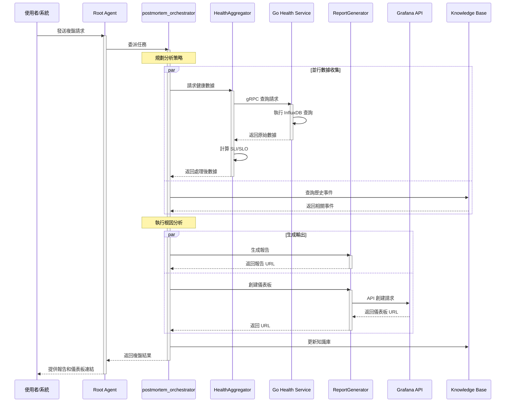

# MVP 實作規格文件 - 事後複盤系統

## 執行摘要

本文件定義了 detectviz-platform MVP 階段的實作規格，聚焦於 **Phase 3: 事後複盤 (Post-Mortem)** 系統的建立。此 MVP 將奠定整個 SRE 生命週期管理平台的基礎，同時在架構上預留向 Phase 1（事前預防）和 Phase 2（事中響應）擴展的空間。

## 1. 系統架構總覽

### 1.1 核心架構原則

- **ADK 原生**：嚴格遵守 Google Agent Development Kit 的模組邊界（Agent/Tool/Memory/Workflow）
- **契約驅動**：所有跨語言介面透過 Protocol Buffers 定義，確保類型安全
- **混合語言架構**：Python 負責 AI Agent 邏輯，Go 負責高性能數據處理
- **漸進式擴展**：MVP 先實現事後複盤，架構支援無縫擴展到完整 SRE 生命週期

### 1.2 MVP 範圍定義

**包含**：
- postmortem_orchestrator (ADK Root Agent) 及其核心工作流程
- ReportGenerator 和 HealthAggregator 基礎實現
- 與 Grafana/InfluxDB 的基本整合
- 契約定義和驗證機制

**不包含**（但預留介面）：
- 自動修復機制
- 實時告警處理
- 複雜的 ML 根因分析

## 2. 目錄結構與模組組織

### 2.1 Python ADK Runtime 結構

```bash
python-adk-runtime/
├── src/detectviz_adk/
│   ├── agents/
│   │   ├── base/
│   │   │   ├── base_agent.py          # ADK Agent 基類
│   │   │   └── orchestrator.py        # 協調器基類
│   │   ├── proactive/               # Phase 1: 事前預防 (未實作)
│   │   │   ├── __init__.py
│   │   │   ├── health_check_agent.py
│   │   │   ├── capacity_planner_agent.py
│   │   │   └── deployment_strategy_agent.py
│   │   ├── reactive/                # Phase 2: 事中響應 (未實作)
│   │   │   ├── __init__.py
│   │   │   ├── alert_triage_agent.py
│   │   │   ├── first_responder_agent.py
│   │   │   └── correlation_agent.py
│   │   └── post_mortem/               # Phase 3: 事後複盤 (MVP)
│   │       ├── __init__.py
│   │       ├── postmortem_orchestrator_agent.py
│   │       └── module.card.json       # Agent 模組卡
│   │       └── knowledge_record_agent.py (待確認)
│   │
│   ├── tools/
│   │   ├── base_tool.py               # 繼承 ADK Tool 介面
│   │   ├── remote_tool.py             # gRPC 橋接 Go 平台
│   │   ├── data/                      # 數據相關工具
│   │   │   ├── __init__.py
│   │   │   ├── health_aggregator.py   # 健康度聚合（將調用 Go 服務）
│   │   │   ├── module.card.json
│   │   │   ├── metric_fetcher.py      # 指標獲取 (待確認) [未實作]
│   │   │   └── event_fetcher.py       # 事件查詢 (待確認) [未實作]
│   │   ├── reporting/                 # 報告生成工具
│   │   │   ├── __init__.py
│   │   │   ├── report_generator.py    # 統一報告生成（支援多格式）
│   │   │   ├── dashboard_builder.py   # Grafana 儀表板構建
│   │   │   └── module.card.json
│   │   └── integration/               # 外部整合工具 (待確認) [未實作]
│   │       ├── __init__.py
│   │       ├── grafana_client.py      # Grafana API 客戶端
│   │       ├── influxdb_client.py     # InfluxDB 客戶端
│   │       └── webhook_service.py     # Webhook 服務
│   └── memory/
│       └── response_history_store.py  # 歷史記錄存儲

```

### 2.2 Go Platform 結構

```bash
go-platform/
├── internal/
│   ├── pluginhost/
│   │   └── plugins/
│   │       └── observability/
│   │           ├── health_aggregator/
│   │           │   ├── plugin.go      # 高性能查詢實現
│   │           │   └── module.card.json
│   │           └── influxdb_client/
│   │               ├── client.go
│   │               └── query_builder.go
│   └── services/
│       └── postmortem/
│           └── grpc_service.go        # gRPC 服務端點
```

## 3. 核心組件詳細設計

### 3.1 postmortem_orchestrator

**職責**：
- 接收並驗證複盤請求
- 協調數據收集和分析流程
- 生成報告和儀表板
- 更新知識庫

**實現策略**：
```python
# ADK Root Agent 實作
postmortem_orchestrator = Agent(
    name="postmortem_orchestrator",
    model="gemini-2.0-flash",
    instruction="""你是事後檢討協調器...""",
    sub_agents=[data_collector_agent, root_cause_analyzer, report_writer]
)
    """
    事後複盤協調器 - MVP 實現
    """
    
    # Agent 生命週期
    async def initialize(self):
        """初始化 Agent 和工具"""
        await self._load_tools()
        await self._connect_to_services()
    
    # 核心執行流程
    async def execute_postmortem(self, request: PostMortemRequest) -> PostMortemResult:
        """
        執行完整的事後複盤流程
        """
        # 1. 驗證請求
        await self._validate_request(request)
        
        # 2. 並行收集數據
        data = await asyncio.gather(
            self._collect_metrics(request),
            self._collect_logs(request),
            self._collect_events(request)
        )
        
        # 3. 執行分析
        analysis = await self._analyze_incident(data)
        
        # 4. 生成輸出
        outputs = await asyncio.gather(
            self._generate_dashboard(analysis),
            self._generate_report(analysis)
        )
        
        # 5. 持久化結果
        await self._persist_results(analysis, outputs)
        
        return PostMortemResult(
            success=True,
            dashboard_url=outputs[0],
            report_url=outputs[1],
            root_cause=analysis.root_cause,
            recommendations=analysis.recommendations
        )
```

### 3.2 HealthAggregator 混合架構

**Python 端（業務邏輯）**：
```python
class HealthAggregator(BaseTool):
    """
    健康度聚合器 - Python 業務邏輯層
    """
    
    def __init__(self):
        self.remote_service = RemoteTool(
            tool_id="health_aggregator",
            grpc_endpoint="localhost:6606"
        )
    
    async def calculate_sli(self, service: str, metrics: Dict) -> float:
        """計算服務級別指標（Python 端業務邏輯）"""
        # 業務規則處理
        error_rate = metrics.get("error_rate", 0)
        latency_p99 = metrics.get("p99_latency", 0)
        
        # SLI 計算公式（可配置）
        sli = (1 - error_rate) * self._latency_score(latency_p99)
        return sli
    
    async def get_aggregated_health(self, request: HealthRequest) -> HealthResponse:
        """獲取聚合健康度（委託 Go 執行查詢）"""
        # Go 端執行高效查詢
        raw_data = await self.remote_service.invoke({
            "action": "query_metrics",
            "query": self._build_query(request)
        })
        
        # Python 端處理業務邏輯
        return self._process_health_data(raw_data)
```

**Go 端（高性能查詢）**：
```go
// go-platform/internal/pluginhost/plugins/observability/health_aggregator/plugin.go

type HealthAggregatorPlugin struct {
    influxClient *influxdb2.Client
    logger       *zap.Logger
}

func (p *HealthAggregatorPlugin) Execute(ctx context.Context, req *ToolInvokeRequest) (*ToolInvokeReply, error) {
    // 高並發批量查詢
    queries := p.buildQueries(req.Payload)
    results := make(chan QueryResult, len(queries))
    
    // 並行執行查詢
    var wg sync.WaitGroup
    for _, q := range queries {
        wg.Add(1)
        go func(query string) {
            defer wg.Done()
            result := p.executeQuery(ctx, query)
            results <- result
        }(q)
    }
    
    // 聚合結果
    wg.Wait()
    close(results)
    
    aggregated := p.aggregateResults(results)
    return &ToolInvokeReply{
        Result: aggregated,
        Status: &status.Status{Code: int32(codes.OK)},
    }, nil
}
```

### 3.3 ReportGenerator 實現

```python
class ReportGenerator(BaseTool):
    """
    統一報告生成器 - 支援多格式輸出
    """
    
    def __init__(self):
        self.templates = self._load_templates()
        self.formatters = {
            "markdown": MarkdownFormatter(),
            "json": JsonFormatter(),
            "html": HtmlFormatter(),
            "pdf": PdfFormatter()
        }
    
    async def generate_postmortem_report(self, 
                                        incident_data: Dict,
                                        analysis: Dict,
                                        format: str = "markdown") -> str:
        """
        生成事後複盤報告
        
        MVP 階段先實現 Markdown 和 JSON 格式
        """
        template = self.templates.get("postmortem")
        
        report_data = {
            "incident_id": incident_data["incident_id"],
            "timeline": self._build_timeline(incident_data),
            "impact_summary": self._summarize_impact(incident_data),
            "root_cause": analysis["root_cause"],
            "contributing_factors": analysis["contributing_factors"],
            "resolution_steps": analysis["resolution_steps"],
            "recommendations": analysis["recommendations"],
            "lessons_learned": analysis["lessons_learned"]
        }
        
        formatter = self.formatters.get(format, self.formatters["markdown"])
        return await formatter.format(template, report_data)
    
    async def create_grafana_dashboard(self,
                                      incident_id: str,
                                      panels: List[Dict]) -> str:
        """
        創建 Grafana 儀表板
        
        使用 Grafana API 動態創建儀表板
        """
        dashboard_json = self._build_dashboard_json(incident_id, panels)
        
        # 調用 Grafana API
        response = await self.grafana_client.create_dashboard(dashboard_json)
        
        return response["url"]
```

## 4. 數據流程與互動序列

### 4.1 MVP 執行流程



## 5. 契約定義與驗證

### 5.1 模組卡定義

**postmortem_orchestrator ADK Agent 模組卡**：
```json
{
  "module_id": "postmortem_orchestrator_agent",
  "version": "1.0.0",
  "role": "agent.coordinator",
  "category": "workflow",
  "name": "Postmortem Orchestrator Agent",
  "description": "協調事後複盤流程，生成分析報告和儀表板",
  "author": "detectviz-team",
  "dependencies": [
    {
      "module_id": "health_aggregator",
      "version": "^1.0.0",
      "required": true
    },
    {
      "module_id": "report_generator",
      "version": "^1.0.0",
      "required": true
    }
  ],
  "capabilities": [
    "incident_analysis",
    "report_generation",
    "dashboard_creation",
    "knowledge_update"
  ],
  "configuration": {
    "model": "gemini-2.0-flash",
    "max_analysis_duration": 300,
    "default_output_formats": ["markdown", "json"]
  },
  "metadata": {
    "tags": ["postmortem", "analysis", "sre"],
    "license": "Apache-2.0"
  }
}
```

**HealthAggregator 模組卡**：
```json
{
  "module_id": "health_aggregator",
  "version": "1.0.0",
  "role": "tool",
  "category": "observability",
  "name": "Health Aggregator",
  "description": "聚合服務健康度數據，計算 SLI/SLO",
  "author": "detectviz-team",
  "dependencies": [
    {
      "module_id": "go_health_service",
      "version": "^1.0.0",
      "required": true,
      "type": "grpc_service"
    }
  ],
  "capabilities": [
    "metric_aggregation",
    "sli_calculation",
    "health_scoring"
  ],
  "configuration": {
    "grpc_endpoint": "localhost:6606",
    "query_timeout": 30,
    "cache_ttl": 300
  }
}
```

### 5.2 gRPC 服務契約擴展

```protobuf
// contracts/proto/detectviz/contracts/v1/postmortem.proto

syntax = "proto3";
package detectviz.contracts.v1;

import "google/protobuf/timestamp.proto";
import "google/protobuf/struct.proto";

// 事後複盤請求
message PostMortemRequest {
  string incident_id = 1;
  string trigger_type = 2;  // manual, alert_resolved, scheduled
  TimeRange time_range = 3;
  repeated string affected_services = 4;
  string severity = 5;  // P0-P4
  Requester requester = 6;
  AnalysisOptions options = 7;
  map<string, string> metadata = 8;
}

message TimeRange {
  google.protobuf.Timestamp start = 1;
  google.protobuf.Timestamp end = 2;
}

message Requester {
  string user_id = 1;
  string team = 2;
  string email = 3;
}

message AnalysisOptions {
  bool include_dependencies = 1;
  string correlation_window = 2;  // e.g., "30m"
  bool generate_dashboard = 3;
  repeated string output_formats = 4;
}

// 事後複盤結果
message PostMortemResult {
  bool success = 1;
  string incident_id = 2;
  string dashboard_url = 3;
  string report_url = 4;
  RootCauseAnalysis analysis = 5;
  repeated string errors = 6;
  google.protobuf.Timestamp completed_at = 7;
}

message RootCauseAnalysis {
  string root_cause = 1;
  repeated string contributing_factors = 2;
  string impact_summary = 3;
  repeated Recommendation recommendations = 4;
  repeated string lessons_learned = 5;
}

message Recommendation {
  string id = 1;
  string description = 2;
  string priority = 3;  // high, medium, low
  string category = 4;  // process, technical, monitoring
}

// 健康數據請求
message HealthDataRequest {
  repeated string services = 1;
  TimeRange time_range = 2;
  repeated string metrics = 3;
  map<string, string> filters = 4;
}

// 健康數據響應
message HealthDataResponse {
  map<string, ServiceHealth> services = 1;
  google.protobuf.Timestamp generated_at = 2;
}

message ServiceHealth {
  string service_name = 1;
  double sli_score = 2;  // 0-100
  map<string, MetricValue> metrics = 3;
  repeated HealthEvent events = 4;
}

message MetricValue {
  double value = 1;
  string unit = 2;
  google.protobuf.Timestamp timestamp = 3;
}

message HealthEvent {
  string type = 1;  // deployment, alert, incident
  string description = 2;
  google.protobuf.Timestamp occurred_at = 3;
}

// gRPC 服務定義
service PostMortemService {
  rpc ExecutePostMortem(PostMortemRequest) returns (PostMortemResult);
  rpc GetHealthData(HealthDataRequest) returns (HealthDataResponse);
  rpc GetIncidentStatus(IncidentStatusRequest) returns (IncidentStatusResponse);
}
```

## 6. 實施計畫與里程碑

### 6.1 Phase 1: 基礎建設（第 1-2 週）

**目標**：建立基本框架和開發環境

**交付項目**：
- 目錄結構建立
- 基礎類別實現（BaseAgent, BaseTool）
- gRPC 契約定義和生成
- 開發環境配置（Docker, 依賴管理）

**驗收標準**：
- Python 和 Go 專案能正常編譯
- gRPC 服務能啟動並響應健康檢查
- 單元測試框架就位

### 6.2 Phase 2: 核心組件開發（第 3-4 週）

**目標**：實現 MVP 核心功能

**交付項目**：
- postmortem_orchestrator 基本實現
- HealthAggregator Python 端實現
- HealthAggregator Go 端查詢服務
- ReportGenerator Markdown 格式支援

**驗收標準**：
- Agent 能接收並處理模擬請求
- HealthAggregator 能執行基本查詢
- 能生成簡單的 Markdown 報告

### 6.3 Phase 3: 整合與測試（第 5-6 週）

**目標**：完成系統整合和端到端測試

**交付項目**：
- Grafana API 整合
- InfluxDB 查詢優化
- 端到端測試案例
- 性能基準測試

**驗收標準**：
- 能創建真實的 Grafana 儀表板
- 查詢性能符合 SLA（< 5 秒）
- 端到端測試覆蓋率 > 80%

### 6.4 Phase 4: 文檔與部署（第 7-8 週）

**目標**：完善文檔並準備生產部署

**交付項目**：
- 操作手冊
- API 文檔
- 部署腳本（Kubernetes Helm Charts）
- 監控和告警配置

**驗收標準**：
- 文檔完整且準確
- 能在 Kubernetes 環境成功部署
- 監控指標正常顯示

## 7. 配置與環境變數

### 7.1 環境變數配置

```bash
# .env.mvp
# ========== Python ADK Runtime ==========
DETECTVIZ_ENV=development
DETECTVIZ_CONFIG_FILE=./configs/mvp.yaml
ADK_MODEL_PROVIDER=gemini
ADK_MODEL_API_KEY=${GEMINI_API_KEY}

# ========== Go Platform ==========
DETECTVIZ__GRPC__LISTEN=:6606
DETECTVIZ__OBSERVABILITY__MODE=lgtm_local
DETECTVIZ__OBSERVABILITY__OTLP__ENDPOINT=localhost:4317

# ========== External Services ==========
INFLUXDB_URL=http://localhost:8086
INFLUXDB_TOKEN=${INFLUXDB_TOKEN}
INFLUXDB_ORG=detectviz
INFLUXDB_BUCKET=metrics

GRAFANA_URL=http://localhost:3000
GRAFANA_API_KEY=${GRAFANA_API_KEY}

# ========== Feature Flags ==========
ENABLE_DASHBOARD_CREATION=true
ENABLE_KNOWLEDGE_UPDATE=true
MAX_PARALLEL_QUERIES=10
```

### 7.2 MVP 配置檔案

```yaml
# configs/mvp.yaml
env: development
service:
  name: detectviz-mvp
  version: 1.0.0

agents:
  postmortem_orchestrator:
    enabled: true
    model: gemini-2.0-flash
    max_execution_time: 300
    retry_policy:
      max_attempts: 3
      backoff_multiplier: 2

tools:
  health_aggregator:
    grpc_endpoint: localhost:6606
    cache:
      enabled: true
      ttl: 300
      max_size: 1000
  
  report_generator:
    output_dir: ./reports
    formats:
      - markdown
      - json
    templates_dir: ./templates

observability:
  mode: lgtm_local
  traces:
    enabled: true
    sampling_ratio: 1.0
  metrics:
    enabled: true
    interval: 60
  logs:
    level: info
    format: json

memory:
  backend: redis
  redis:
    host: localhost
    port: 6379
    db: 0
    ttl: 3600
```

## 8. 測試策略

### 8.1 單元測試範例

```python
# tests/test_postmortem_orchestrator.py

import pytest
from unittest.mock import Mock, AsyncMock
from detectviz_adk import run_postmortem_analysis, PostmortemRunner

@pytest.mark.asyncio
async def test_postmortem_execution():
    """測試事後複盤執行流程"""
    # Arrange
    runner = PostmortemRunner()
    
    request = {
        "incident_id": "incident-20250815-test01",
        "time_range": {
            "start": "2025-08-15T10:00:00Z",
            "end": "2025-08-15T11:00:00Z"
        },
        "affected_services": ["payment-service"]
    }
    
    # Act
    result = await runner.execute_postmortem(request)
    
    # Assert
    assert result["incident_id"] == "incident-20250815-test01"
    assert "session_id" in result
    assert "response" in result

```

### 8.2 整合測試範例

```python
# tests/integration/test_e2e_postmortem.py

import pytest
from detectviz_adk import create_app

@pytest.mark.integration
async def test_end_to_end_postmortem_flow():
    """端到端事後複盤流程測試"""
    # 初始化應用
    app = await create_app("mvp")
    
    # 發送複盤請求
    request = PostMortemRequest(
        incident_id="incident-20250815-e2e",
        trigger_type="manual",
        time_range=TimeRange(
            start="2025-08-15T10:00:00Z",
            end="2025-08-15T11:00:00Z"
        ),
        affected_services=["payment-service", "auth-service"]
    )
    
    # 執行複盤
    result = await app.execute_postmortem(request)
    
    # 驗證結果
    assert result.success
    assert result.dashboard_url
    assert result.report_url
    assert len(result.analysis.recommendations) > 0
```

## 9. 監控與可觀測性

### 9.1 關鍵指標

**業務指標**：
- 複盤請求處理時間（P50/P95/P99）
- 報告生成成功率
- 儀表板創建成功率
- 知識庫更新頻率

**技術指標**：
- gRPC 調用延遲
- InfluxDB 查詢性能
- 記憶體使用率
- CPU 使用率

### 9.2 監控儀表板配置

```json
{
  "dashboard": {
    "title": "Detectviz MVP - PostMortem System",
    "panels": [
      {
        "title": "Request Processing Time",
        "type": "graph",
        "targets": [
          {
            "expr": "histogram_quantile(0.95, postmortem_request_duration_seconds)"
          }
        ]
      },
      {
        "title": "Success Rate",
        "type": "stat",
        "targets": [
          {
            "expr": "rate(postmortem_success_total[5m])"
          }
        ]
      },
      {
        "title": "Active Postmortems",
        "type": "gauge",
        "targets": [
          {
            "expr": "postmortem_active_count"
          }
        ]
      }
    ]
  }
}
```

## 10. 未來擴展計畫

### 10.1 向 Phase 1（事前預防）擴展

**預留介面**：
- HealthCheckAgent 介面定義
- 預防性分析 API
- 容量規劃工具整合點

**實施策略**：
1. 複用 HealthAggregator 進行日常巡檢
2. 基於歷史複盤數據訓練預測模型
3. 自動生成預防措施建議

### 10.2 向 Phase 2（事中響應）擴展

**預留介面**：
- AlertTriageAgent 介面定義
- 實時響應 API
- 自動修復觸發器

**實施策略**：
1. 整合告警系統 Webhook
2. 實現告警關聯分析
3. 建立自動化響應流程

### 10.3 AI 能力增強

**計畫項目**：
- 整合 LLM 進行自然語言根因分析
- 實現智能建議生成
- 支援對話式複盤查詢

## 11. 風險評估與緩解

### 11.1 技術風險

| 風險項目 | 影響程度 | 發生概率 | 緩解措施 |
|---------|---------|---------|---------|
| InfluxDB 查詢性能不足 | 高 | 中 | 實現查詢快取和優化索引 |
| gRPC 連接不穩定 | 中 | 低 | 實現重試機制和熔斷器 |
| Grafana API 變更 | 低 | 低 | 版本鎖定和 API 抽象層 |

### 11.2 業務風險

| 風險項目 | 影響程度 | 發生概率 | 緩解措施 |
|---------|---------|---------|---------|
| 報告準確性不足 | 高 | 中 | 人工審核機制和反饋循環 |
| 系統採用率低 | 中 | 中 | 用戶培訓和漸進推廣 |
| 知識庫污染 | 中 | 低 | 版本控制和審批流程 |

## 12. 總結

本 MVP 實作規格定義了 detectviz-platform 事後複盤系統的完整架構和實施計畫。通過聚焦於 Phase 3（事後複盤），我們能夠：

1. **快速交付價值**：8 週內完成可用的複盤系統
2. **驗證架構設計**：測試 ADK + Go 混合架構的可行性
3. **奠定擴展基礎**：為完整 SRE 生命週期管理預留介面
4. **積累運營經驗**：通過 MVP 了解實際需求和挑戰

下一步行動：
1. 建立開發環境並初始化專案結構
2. 實現基礎框架和契約定義
3. 開始 postmortem_orchestrator (ADK) 的開發
4. 建立 CI/CD 流程

這份規格將作為團隊的開發指南，確保 MVP 的成功交付並為未來擴展奠定堅實基礎。