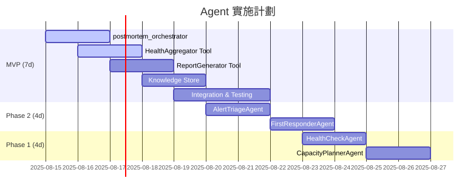

# SRE 全生命週期 Services MAP

> 本文件是 Detectviz Platform 的**架構憲法**，定義了 AI Agent 在 SRE 全生命週期中的職責分工與協作模式。這是所有 Agent 開發的指導藍圖。

## 文件定位

- **目標讀者**：AI 工程師、Agent 開發者、架構師
- **更新頻率**：季度評審，重大架構變更時更新
- **關聯文件**：
  - 技術實現 → [`spec.md`](../spec.md)
  - 開發指南 → [`agent-development-guide.md`](./agent-development-guide.md)
  - MVP 實施 → [`mvp-implementation-spec.md`](#)

## 核心設計理念

### Agent vs Tool 職責劃分

```
Agent (決策大腦)           Tool (執行手臂)
────────────────           ──────────────
WHY - 為什麼做             HOW - 如何做
WHAT - 做什麼             WHERE - 在哪做
WHEN - 何時做             WITH - 用什麼做
```

**黃金準則**：
- **Agent 負責決策**：分析情況、制定策略、協調資源
- **Tool 負責執行**：查詢數據、調用 API、生成報告
- **Agent 不直接碰數據**：所有數據操作必須通過 Tool
- **Tool 不做決策**：只提供能力，不判斷是否應該執行

## SRE 生命週期總覽



## 完整 Services MAP

### Phase 1: 事前預防 (Proactive)

> **使命**：防患於未然，主動識別並消除潛在風險

#### 1.1 資源發現與部署

| 組件 | 類型 | 職責 | 決策/執行內容 |
|-----|------|------|-------------|
| **DeploymentStrategyAgent** | Agent | 部署策略制定 | **決策**：判斷新發現的資源類型，選擇適合的監控策略 |
| ResourceDiscoveryService | Tool | 資源掃描 | **執行**：定期掃描 K8s/Cloud API，返回資源清單 |
| PluginDeploymentService | Tool | 插件部署 | **執行**：根據 Agent 決策，部署指定的監控插件 |
| ConfigManagementService | Tool | 配置管理 | **執行**：應用配置模板，更新監控參數 |

**決策流程範例**：
```python
# DeploymentStrategyAgent 的決策邏輯
async def on_new_resource_discovered(self, resource: Resource):
    # 決策 1: 識別資源類型
    resource_type = self.analyze_resource_type(resource)
    
    # 決策 2: 選擇監控策略
    if resource_type == "database":
        strategy = self.select_database_monitoring_strategy(resource.engine)
    elif resource_type == "api_gateway":
        strategy = self.select_api_monitoring_strategy(resource.protocol)
    
    # 決策 3: 確定插件版本和配置
    plugin_config = self.determine_plugin_config(strategy, resource.scale)
    
    # 執行: 委託 Tool 執行部署
    await self.plugin_deployment_tool.deploy(plugin_config)
```

#### 1.2 日常健康巡檢

| 組件 | 類型 | 職責 | 決策/執行內容 |
|-----|------|------|-------------|
| **HealthCheckAgent** | Agent | 健康評估 | **決策**：判斷服務健康狀態，識別異常模式 |
| HealthAggregator | Tool | 數據聚合 | **執行**：從 InfluxDB 查詢指標，計算 SLI |
| AlertPolicyService | Tool | 閾值管理 | **執行**：讀取告警配置，提供閾值參考 |
| ReportGenerator | Tool | 報告生成 | **執行**：根據模板生成健康報告 |

**決策範例**：
```python
# HealthCheckAgent 的健康評估決策
async def evaluate_service_health(self, service: str):
    # 獲取數據（通過 Tool）
    metrics = await self.health_aggregator.get_metrics(service)
    
    # 決策 1: 評估當前健康度
    health_score = self.calculate_health_score(metrics)
    
    # 決策 2: 趨勢分析
    if self.detect_degradation_trend(metrics.history):
        decision = "PREVENTIVE_ACTION_NEEDED"
    elif health_score < 0.8:
        decision = "INVESTIGATION_REQUIRED"
    else:
        decision = "HEALTHY"
    
    # 決策 3: 確定報告內容
    report_sections = self.determine_report_sections(decision)
    
    # 執行: 生成報告
    await self.report_generator.create(report_sections)
```

#### 1.3 容量規劃

| 組件 | 類型 | 職責 | 決策/執行內容 |
|-----|------|------|-------------|
| **CapacityPlannerAgent** | Agent | 容量決策 | **決策**：預測資源需求，制定擴容計劃 |
| ForecastingEngine | Tool | 預測計算 | **執行**：運行時間序列模型，返回預測結果 |
| ResourceManager | Tool | 資源查詢 | **執行**：獲取當前資源使用情況 |
| ReportGenerator | Tool | 規劃報告 | **執行**：生成容量規劃文檔 |

### Phase 2: 事中響應 (Reactive)

> **使命**：快速響應，精準處理，最小化故障影響

#### 2.1 告警分診

| 組件 | 類型 | 職責 | 決策/執行內容 |
|-----|------|------|-------------|
| **AlertTriageAgent** | Agent | 告警分診 | **決策**：評估告警嚴重性，決定處理優先級 |
| AlertEvaluator | Tool | 告警接收 | **執行**：接收 Webhook，解析告警內容 |
| ResponseHistoryStore | Tool | 歷史查詢 | **執行**：查詢類似告警的處理記錄 |
| EventDispatchService | Tool | 事件分發 | **執行**：根據決策發送通知 |

**關鍵決策邏輯**：
```python
# AlertTriageAgent 的分診決策樹
async def triage_alert(self, alert: Alert):
    # 決策 1: 嚴重性評估
    severity = self.assess_severity(alert)
    
    # 決策 2: 關聯分析
    related_alerts = await self.find_correlated_alerts(alert)
    if related_alerts:
        severity = self.escalate_severity(severity, related_alerts)
    
    # 決策 3: 去重判斷
    if self.is_duplicate(alert, related_alerts):
        return Decision.SUPPRESS
    
    # 決策 4: 路由決策
    if severity >= Severity.P1:
        return Decision.PAGE_ONCALL
    elif severity == Severity.P2:
        return Decision.NOTIFY_TEAM
    else:
        return Decision.LOG_ONLY
```

#### 2.2 自動響應

| 組件 | 類型 | 職責 | 決策/執行內容 |
|-----|------|------|-------------|
| **FirstResponderAgent** | Agent | 響應決策 | **決策**：判斷是否可自動修復，選擇修復策略 |
| **CorrelationAgent** | Agent | 關聯分析 | **決策**：識別根因，關聯相關事件 |
| RPAIntegrator | Tool | 自動化執行 | **執行**：運行修復腳本，執行標準操作 |
| IncidentResolver | Tool | 事件管理 | **執行**：更新事件狀態，記錄處理過程 |

### Phase 3: 事後複盤 (Post-Mortem) - MVP

> **使命**：深度學習，持續改進，避免重蹈覆轍

#### 3.1 複盤分析

| 組件 | 類型 | 職責 | 決策/執行內容 |
|-----|------|------|-------------|
| **postmortem_orchestrator** | ADK Root Agent | 複盤協調 | **決策**：設計分析策略，識別改進點 |
| HealthAggregator | Tool | 數據收集 | **執行**：查詢故障期間的所有相關指標 |
| ReportGenerator | Tool | 報告生成 | **執行**：生成複盤報告和儀表板 |
| ResponseHistoryStore | Tool | 知識存儲 | **執行**：保存複盤結論供未來參考 |

**核心決策流程**：
```python
# postmortem_orchestrator 的複盤決策
async def orchestrate_postmortem(self, incident: Incident):
    # 決策 1: 確定分析範圍
    scope = self.determine_analysis_scope(incident)
    
    # 決策 2: 設計數據收集策略
    data_requirements = self.plan_data_collection(scope)
    
    # 執行: 收集數據
    data = await self.collect_data_via_tools(data_requirements)
    
    # 決策 3: 根因分析
    root_cause = self.analyze_root_cause(data)
    
    # 決策 4: 生成改進建議
    recommendations = self.generate_recommendations(root_cause)
    
    # 決策 5: 知識提取
    lessons = self.extract_lessons_learned(incident, root_cause)
    
    # 執行: 生成輸出
    await self.generate_outputs(incident, root_cause, recommendations)
```

## 共享工具箱 (Shared Tools)

這些工具在多個階段被不同的 Agent 複用，體現了 DRY 原則：

### 核心共享工具

| 工具名稱 | 功能類別 | 使用階段 | 主要能力 |
|---------|---------|---------|---------|
| **HealthAggregator** | 數據查詢 | Phase 1, 2, 3 | InfluxDB 查詢、SLI 計算、健康評分 |
| **ReportGenerator** | 內容生成 | Phase 1, 3 | Markdown/PDF 生成、儀表板創建 |
| **ResponseHistoryStore** | 知識管理 | Phase 2, 3 | 歷史查詢、相似度匹配、知識更新 |
| **EventDispatchService** | 通知管理 | Phase 2 | Slack/Email/PagerDuty 通知 |
| **ConfigManagementService** | 配置管理 | Phase 1 | 配置模板、參數管理 |

### Tool 設計原則

1. **無狀態**：Tool 不保存狀態，每次調用獨立
2. **冪等性**：相同輸入產生相同輸出
3. **原子性**：一個 Tool 只做一件事
4. **可測試**：易於單元測試和模擬

## Agent 協作模式

### 層級結構

```
Root Agent (總指揮)
├── Coordinator Agents (協調層)
│   ├── postmortem_orchestrator
│   └── IncidentCommanderAgent
└── Specialist Agents (專家層)
    ├── HealthCheckAgent
    ├── AlertTriageAgent
    ├── CapacityPlannerAgent
    └── FirstResponderAgent
```

### 協作範例

```python
# Root Agent 的任務委派
class SRERootAgent(Agent):
    async def handle_request(self, request: Request):
        # 決策: 識別請求類型
        request_type = self.identify_request_type(request)
        
        # 決策: 選擇合適的 Agent
        if request_type == "incident":
            delegate_to = self.incident_commander
        elif request_type == "postmortem":
            delegate_to = self.postmortem_orchestrator
        elif request_type == "health_check":
            delegate_to = self.health_checker
        
        # 委派執行
        result = await delegate_to.execute(request)
        
        # 決策: 是否需要進一步行動
        if self.needs_escalation(result):
            await self.escalate(result)
        
        return result
```

## 決策矩陣

### Agent 決策類型分類

| 決策類型 | 描述 | 範例 | 相關 Agent |
|---------|------|------|-----------|
| **診斷型** | 識別問題本質 | 判斷告警是否為誤報 | AlertTriageAgent |
| **預測型** | 預測未來趨勢 | 預測 30 天後的資源使用 | CapacityPlannerAgent |
| **規劃型** | 制定行動計劃 | 設計複盤分析策略 | postmortem_orchestrator |
| **選擇型** | 從選項中選擇 | 選擇自動修復策略 | FirstResponderAgent |
| **優化型** | 尋找最優解 | 優化告警閾值 | HealthCheckAgent |

### 決策權重因子

每個 Agent 在做決策時考慮的因子權重：

```yaml
AlertTriageAgent:
  factors:
    severity: 0.3
    frequency: 0.2
    business_impact: 0.3
    time_of_day: 0.1
    recent_changes: 0.1

postmortem_orchestrator:
  factors:
    incident_duration: 0.2
    affected_users: 0.3
    revenue_impact: 0.3
    repeatability: 0.2
```

## 實施路線圖

### MVP (Phase 3 優先)




## Agent 開發檢查清單

開發新 Agent 時，請確保：

### 設計階段
- [ ] 明確定義 Agent 的決策職責
- [ ] 識別需要的 Tool 能力
- [ ] 設計決策樹或決策矩陣
- [ ] 定義與其他 Agent 的協作介面

### 實作階段
- [ ] Agent 只包含決策邏輯，不直接操作數據
- [ ] 所有數據操作通過 Tool 完成
- [ ] 實現冪等性和錯誤處理
- [ ] 添加決策日誌和可觀測性

### 測試階段
- [ ] 單元測試覆蓋所有決策分支
- [ ] 模擬 Tool 進行整合測試
- [ ] 壓力測試決策性能
- [ ] 驗證與其他 Agent 的協作

## 持續改進機制

### 月度評審

每月評審 Agent 決策質量：
- 決策準確率
- 平均決策時間
- 錯誤決策的影響
- 改進建議實施率

### 季度優化

每季度優化：
- 調整決策權重
- 更新決策規則
- 優化 Agent 協作流程
- 升級 Tool 能力

## 相關文檔

- 技術實現細節 → [`spec.md`](../spec.md)
- Agent 開發指南 → [`agent-development-guide.md`](./agent-development-guide.md)
- MVP 實施規格 → [`mvp-implementation-spec.md`](#)

## 核心價值

這份 Services MAP 確保了：

1. **職責清晰**：Agent 專注決策，Tool 專注執行
2. **可擴展性**：新 Agent 可以輕鬆加入體系
3. **可維護性**：邏輯分離，易於調試和優化
4. **可複用性**：Tool 在多個 Agent 間共享
5. **可測試性**：決策邏輯和執行邏輯分離測試

---

*本文檔是 Detectviz Platform 的架構基石，所有 Agent 開發都應遵循此藍圖。*

*最後更新：2025-08-15*
*版本：1.0.0*