# Tool 擴充指南

## 概覽

本指南提供完整的 Tool 開發策略，包含 Go vs Python 技術選型、具體實作流程、共享機制設計，以及性能監控最佳實務。確保開發者能夠選擇最適合的技術方案並高效實作。

## Go vs Python 技術選型決策指南

### 選型決策矩陣

| 特性/需求 | Go Plugin | Python Local Tool | 推薦權重 |
|-----------|-----------|-------------------|----------|
| **外部系統調用** | ✅✅✅ 高性能併發 | ✅✅ 可行但較重 | **Go 80%** |
| **HTTP/gRPC 客戶端** | ✅✅✅ 原生高效 | ✅✅ 庫豐富 | **Go 75%** |
| **資料庫操作** | ✅✅✅ 併發優勢 | ✅✅ ORM 豐富 | **Go 70%** |
| **AI/ML 處理** | ❌ 生態有限 | ✅✅✅ 豐富生態 | **Python 95%** |
| **數據科學計算** | ❌ 支援較少 | ✅✅✅ NumPy/Pandas | **Python 90%** |
| **複雜業務邏輯** | ✅ 類型安全 | ✅✅✅ 開發效率 | **Python 65%** |
| **安全敏感操作** | ✅✅✅ 記憶體安全 | ✅ 需額外注意 | **Go 85%** |
| **跨語言共享** | ✅✅✅ gRPC 天然 | ❌ 需要包裝 | **Go 90%** |
| **開發速度** | ✅ 編譯語言 | ✅✅✅ 解釋語言 | **Python 70%** |
| **運行性能** | ✅✅✅ 編譯優化 | ✅ 解釋執行 | **Go 80%** |
| **資源消耗** | ✅✅✅ 低記憶體 | ✅ 較高記憶體 | **Go 75%** |

### 決策樹




### 具體選型建議

#### 強烈推薦 Go Plugin
```bash
🎯 外部系統整合類:
- HTTP/HTTPS API 調用
- gRPC 服務調用
- 資料庫 CRUD 操作 (PostgreSQL, MySQL, MongoDB)
- 訊息佇列操作 (RabbitMQ, Kafka)
- 快取系統操作 (Redis, Memcached)

🎯 系統級操作:
- 檔案系統操作
- 網路通訊 (TCP/UDP)
- 系統進程管理
- 服務發現與註冊

🎯 安全相關:
- 加密/解密操作
- 身份認證與授權
- 數位簽章驗證
- 支付處理

🎯 高性能需求:
- 大量併發請求處理
- 實時數據處理
- 低延遲操作
- 資源密集型計算
```

#### 強烈推薦 Python Local Tool  
```bash
🎯 AI/ML 相關:
- 機器學習模型推理
- 深度學習訓練/預測
- 自然語言處理 (NLP)
- 電腦視覺處理
- 語音識別/合成

🎯 數據科學:
- 統計分析計算
- 數據清理與轉換
- 數據視覺化
- 科學計算 (NumPy/SciPy)
- 大數據分析 (Pandas)

🎯 內容處理:
- 文本分析與處理
- 圖像/視頻處理
- 文檔生成 (PDF, Word)
- 網頁抓取與解析
- 格式轉換工具
```

#### 靈活選擇場景
```bash
可選 Go 或 Python:
- JSON/XML 數據處理
- 配置檔案操作
- 日誌分析處理
- 簡單數學計算
- 文字格式化

選擇準則:
- 如需高性能 → Go
- 如需快速開發 → Python  
- 如需跨Agent共享 → Go
- 如需豐富庫支援 → Python
```

## Tool 共享策略與機制

### 全局共享 (推薦模式)

#### 適用場景
- 無狀態的純函數 Tool
- 標準化的外部服務調用
- 通用的工具函數

#### 實作機制
```python
# src/detectviz_adk/tools/tool_registry.py
from typing import Dict, List, Optional
from .base_tool import BaseTool

class ToolRegistry:
    """全局工具註冊表 - 單例模式"""
    
    _instance = None
    _tools: Dict[str, BaseTool] = {}
    
    @classmethod
    def get_instance(cls):
        if cls._instance is None:
            cls._instance = cls()
        return cls._instance
    
    def register_tool(self, name: str, tool: BaseTool, overwrite: bool = False):
        """註冊工具實例"""
        if name in self._tools and not overwrite:
            raise ValueError(f"Tool {name} already registered")
        
        self._tools[name] = tool
        logger.info(f"Tool {name} registered successfully")
    
    def get_tool(self, name: str) -> Optional[BaseTool]:
        """獲取工具實例"""
        return self._tools.get(name)
    
    def get_tools(self, names: List[str]) -> List[BaseTool]:
        """批次獲取工具"""
        return [self.get_tool(name) for name in names if self.get_tool(name)]
    
    def list_tools(self) -> List[str]:
        """列出所有可用工具"""
        return list(self._tools.keys())

# 使用範例
registry = ToolRegistry.get_instance()

# 一次註冊，全域使用
registry.register_tool("http_client", HttpClientTool())
registry.register_tool("database", DatabaseTool())
registry.register_tool("weather_api", WeatherAPIRemoteTool())

# 多個 Agent 共享相同工具實例
customer_agent = Agent(tools=registry.get_tools(["http_client", "database"]))
order_agent = Agent(tools=registry.get_tools(["http_client", "weather_api"]))
analytics_agent = Agent(tools=registry.get_tools(["database"]))
```

### Tool Pool 共享

#### 適用場景  
- 有連接狀態的 Tool (資料庫連接池)
- 資源密集的操作
- 需要限制併發數量

#### 實作機制
```python
# src/detectviz_adk/tools/tool_pool.py
import asyncio
from typing import Callable, Optional

class ToolPool:
    """Tool 連接池管理"""
    
    def __init__(self, tool_factory: Callable, pool_size: int = 5):
        self.tool_factory = tool_factory
        self.pool_size = pool_size
        self.available_tools = asyncio.Queue()
        self.all_tools = []
        self._init_pool()
    
    def _init_pool(self):
        """初始化工具池"""
        for i in range(self.pool_size):
            tool = self.tool_factory()
            self.all_tools.append(tool)
            self.available_tools.put_nowait(tool)
    
    async def acquire(self) -> BaseTool:
        """獲取可用工具"""
        tool = await self.available_tools.get()
        return tool
    
    async def release(self, tool: BaseTool):
        """釋放工具回池中"""
        # 重置工具狀態
        if hasattr(tool, 'reset'):
            await tool.reset()
        await self.available_tools.put(tool)
    
    async def execute_with_pool(self, tool_method: str, *args, **kwargs):
        """使用池中工具執行操作"""
        tool = await self.acquire()
        try:
            method = getattr(tool, tool_method)
            result = await method(*args, **kwargs)
            return result
        finally:
            await self.release(tool)

# 使用範例
db_tool_pool = ToolPool(lambda: DatabaseTool(), pool_size=5)

class PooledDatabaseTool(BaseTool):
    def __init__(self, pool: ToolPool):
        self.pool = pool
        super().__init__(name="pooled_database", description="池化資料庫工具")
    
    async def execute(self, query: str, **kwargs):
        return await self.pool.execute_with_pool('execute_query', query, **kwargs)

# 註冊池化工具
registry = ToolRegistry.get_instance()
registry.register_tool("database", PooledDatabaseTool(db_tool_pool))
```

### 專屬 Tool (不共享)

#### 適用場景
- 有 Agent 專屬狀態的 Tool
- 上下文相關的處理
- 需要個別配置的工具

#### 實作機制
```python
class AgentSpecificTool(BaseTool):
    """Agent 專屬工具"""
    
    def __init__(self, agent_id: str, config: Dict):
        self.agent_id = agent_id
        self.agent_config = config
        self.context_data = {}  # Agent 專屬狀態
        super().__init__(name=f"report_generator_{agent_id}")
    
    async def execute(self, data: Dict, **kwargs):
        # 使用 Agent 專屬配置和狀態
        self.context_data[self.agent_id] = data
        return await self._generate_report(data)

# 每個 Agent 創建專屬實例
agent_a = Agent(
    name="financial_advisor",
    tools=[AgentSpecificTool("financial_advisor", financial_config)]
)
agent_b = Agent(
    name="risk_manager", 
    tools=[AgentSpecificTool("risk_manager", risk_config)]
)
```

## Go Plugin 完整實作指南

### 步驟 1: 使用腳手架生成骨架

```bash
cd go-platform

# 生成 Plugin 骨架
./detectviz plugin new capability.gateway/email_sender

# 自動生成檔案結構:
# internal/pluginhost/plugins/capability.gateway/email_sender/
# ├── plugin.go                # 主要實作邏輯
# ├── plugin_test.go           # 單元測試
# ├── module.card.json         # 模組卡定義
# ├── security.go             # 安全策略 (可選)
# └── README.md               # 使用說明
```

### 步驟 2: 實作 Plugin 主邏輯

**檔案：`internal/pluginhost/plugins/capability.gateway/email_sender/plugin.go`**

```go
package email_sender

import (
    "context"
    "encoding/json"
    "fmt"
    "net/smtp"
    "os"
    "time"
    
    pb "detectviz.com/contracts/gen/go/detectviz/contracts/v1"
    "go.opentelemetry.io/otel"
    "go.opentelemetry.io/otel/attribute"
    "go.opentelemetry.io/otel/codes"
    "go.opentelemetry.io/otel/trace"
    "go.uber.org/zap"
)

// EmailSenderPlugin Email 發送插件
type EmailSenderPlugin struct {
    logger     *zap.Logger
    tracer     trace.Tracer  
    httpClient *http.Client
    smtpConfig SMTPConfig
}

// SMTPConfig SMTP 配置
type SMTPConfig struct {
    Host     string
    Port     string
    Username string
    Password string
    From     string
}

// EmailRequest 請求結構
type EmailRequest struct {
    To      string `json:"to" validate:"required,email"`
    Subject string `json:"subject" validate:"required,max=200"`
    Body    string `json:"body" validate:"required"`
    IsHTML  bool   `json:"is_html"`
    CC      []string `json:"cc,omitempty" validate:"dive,email"`
    BCC     []string `json:"bcc,omitempty" validate:"dive,email"`
}

// EmailResponse 回應結構
type EmailResponse struct {
    MessageID   string    `json:"message_id"`
    Status      string    `json:"status"`
    SentAt      time.Time `json:"sent_at"`
    Recipients  []string  `json:"recipients"`
    DeliveryTime string   `json:"delivery_time"`
}

// New 創建插件實例
func New() *EmailSenderPlugin {
    return &EmailSenderPlugin{
        logger: zap.L().Named("email_sender"),
        tracer: otel.Tracer("email_sender"),
        httpClient: &http.Client{
            Timeout: 30 * time.Second,
        },
        smtpConfig: SMTPConfig{
            Host:     os.Getenv("SMTP_HOST"),
            Port:     os.Getenv("SMTP_PORT"),
            Username: os.Getenv("SMTP_USERNAME"),
            Password: os.Getenv("SMTP_PASSWORD"),
            From:     os.Getenv("SMTP_FROM"),
        },
    }
}

// Invoke 實現插件調用介面
func (p *EmailSenderPlugin) Invoke(ctx context.Context, req *pb.ToolInvokeRequest) (*pb.ToolInvokeReply, error) {
    // 開始分散式追蹤
    ctx, span := p.tracer.Start(ctx, "email_sender.invoke",
        trace.WithAttributes(
            attribute.String("tool.name", req.Name),
            attribute.String("tool.version", req.Version),
        ),
    )
    defer span.End()
    
    startTime := time.Now()
    
    p.logger.Info("Executing email sender",
        zap.String("version", req.Version),
        zap.String("request_id", req.Metadata["request_id"]),
    )
    
    // 解析請求參數
    var emailReq EmailRequest
    if err := json.Unmarshal(req.Args, &emailReq); err != nil {
        span.SetStatus(codes.Error, "failed to parse request")
        return nil, fmt.Errorf("failed to parse email request: %w", err)
    }
    
    // 安全驗證
    if err := p.validateAndSecureRequest(&emailReq); err != nil {
        span.SetStatus(codes.Error, "security validation failed")
        return nil, fmt.Errorf("security validation failed: %w", err)
    }
    
    // 執行 Email 發送
    response, err := p.sendEmail(ctx, &emailReq)
    if err != nil {
        span.SetStatus(codes.Error, "email sending failed")
        return nil, fmt.Errorf("failed to send email: %w", err)
    }
    
    // 計算執行時間
    duration := time.Since(startTime)
    
    // 序列化結果
    resultBytes, err := json.Marshal(response)
    if err != nil {
        return nil, fmt.Errorf("failed to marshal result: %w", err)
    }
    
    // 設置追蹤屬性
    span.SetAttributes(
        attribute.String("email.to", emailReq.To),
        attribute.String("email.subject", emailReq.Subject),
        attribute.Bool("email.is_html", emailReq.IsHTML),
        attribute.String("email.message_id", response.MessageID),
        attribute.String("execution.duration", duration.String()),
    )
    
    p.logger.Info("Email sent successfully",
        zap.String("message_id", response.MessageID),
        zap.String("to", emailReq.To),
        zap.Duration("duration", duration),
    )
    
    return &pb.ToolInvokeReply{
        Success: true,
        Data:    resultBytes,
        Logs: []string{
            fmt.Sprintf("Email sent to %s", emailReq.To),
            fmt.Sprintf("Message ID: %s", response.MessageID),
            fmt.Sprintf("Execution time: %s", duration),
        },
        Metadata: map[string]string{
            "message_id":      response.MessageID,
            "execution_time":  duration.String(),
            "provider":        "smtp",
            "status":          response.Status,
        },
    }, nil
}

// validateAndSecureRequest 安全驗證請求
func (p *EmailSenderPlugin) validateAndSecureRequest(req *EmailRequest) error {
    // Email 地址驗證
    if !isValidEmail(req.To) {
        return fmt.Errorf("invalid recipient email: %s", req.To)
    }
    
    // 內容長度限制
    if len(req.Body) > 50000 { // 50KB 限制
        return fmt.Errorf("email body too large: %d bytes", len(req.Body))
    }
    
    // 主旨長度限制
    if len(req.Subject) > 200 {
        return fmt.Errorf("subject too long: %d characters", len(req.Subject))
    }
    
    // 檢查惡意內容
    if containsSuspiciousContent(req.Body) || containsSuspiciousContent(req.Subject) {
        return fmt.Errorf("suspicious content detected")
    }
    
    // CC/BCC 數量限制
    if len(req.CC)+len(req.BCC) > 50 {
        return fmt.Errorf("too many recipients")
    }
    
    return nil
}

// sendEmail 發送郵件核心邏輯
func (p *EmailSenderPlugin) sendEmail(ctx context.Context, req *EmailRequest) (*EmailResponse, error) {
    ctx, span := p.tracer.Start(ctx, "email_sender.send_email")
    defer span.End()
    
    // 構建收件人列表
    recipients := []string{req.To}
    recipients = append(recipients, req.CC...)
    recipients = append(recipients, req.BCC...)
    
    // 構建郵件內容
    message := p.buildEmailMessage(req)
    
    // 發送郵件
    auth := smtp.PlainAuth("", p.smtpConfig.Username, p.smtpConfig.Password, p.smtpConfig.Host)
    smtpAddr := fmt.Sprintf("%s:%s", p.smtpConfig.Host, p.smtpConfig.Port)
    
    err := smtp.SendMail(smtpAddr, auth, p.smtpConfig.From, recipients, []byte(message))
    if err != nil {
        span.SetStatus(codes.Error, "smtp send failed")
        return nil, fmt.Errorf("SMTP send failed: %w", err)
    }
    
    // 生成回應
    messageID := generateMessageID()
    response := &EmailResponse{
        MessageID:    messageID,
        Status:       "sent",
        SentAt:       time.Now(),
        Recipients:   recipients,
        DeliveryTime: "immediate",
    }
    
    span.SetStatus(codes.Ok, "email sent successfully")
    return response, nil
}

// buildEmailMessage 構建郵件內容
func (p *EmailSenderPlugin) buildEmailMessage(req *EmailRequest) string {
    headers := fmt.Sprintf("From: %s\r\n", p.smtpConfig.From)
    headers += fmt.Sprintf("To: %s\r\n", req.To)
    
    if len(req.CC) > 0 {
        headers += fmt.Sprintf("Cc: %s\r\n", strings.Join(req.CC, ","))
    }
    
    headers += fmt.Sprintf("Subject: %s\r\n", req.Subject)
    
    if req.IsHTML {
        headers += "Content-Type: text/html; charset=UTF-8\r\n"
    } else {
        headers += "Content-Type: text/plain; charset=UTF-8\r\n"
    }
    
    headers += "\r\n"
    
    return headers + req.Body
}

// 工具函數
func isValidEmail(email string) bool {
    // 簡單的 Email 驗證 (生產環境建議使用更嚴格的驗證)
    return strings.Contains(email, "@") && strings.Contains(email, ".")
}

func containsSuspiciousContent(content string) bool {
    suspiciousKeywords := []string{
        "<script>", "javascript:", "data:", "vbscript:",
        "onclick=", "onerror=", "onload=",
    }
    
    contentLower := strings.ToLower(content)
    for _, keyword := range suspiciousKeywords {
        if strings.Contains(contentLower, keyword) {
            return true
        }
    }
    return false
}

func generateMessageID() string {
    return fmt.Sprintf("<%d-%s@detectviz.platform>", 
        time.Now().UnixNano(), 
        generateRandomString(10))
}

func generateRandomString(length int) string {
    const charset = "abcdefghijklmnopqrstuvwxyz0123456789"
    result := make([]byte, length)
    for i := range result {
        result[i] = charset[rand.Intn(len(charset))]
    }
    return string(result)
}

// Close 清理資源
func (p *EmailSenderPlugin) Close() error {
    p.logger.Info("Email sender plugin shutting down")
    return nil
}
```

### 步驟 3: 安全增強模組

**檔案：`internal/pluginhost/plugins/capability.gateway/email_sender/security.go`**

```go
package email_sender

import (
    "fmt"
    "net/url"
    "regexp"
    "strings"
    "time"
)

// SecurityPolicy 安全策略配置
type SecurityPolicy struct {
    MaxEmailsPerMinute    int
    MaxEmailsPerHour      int
    AllowedDomains        []string // 空表示允許所有
    BlockedDomains        []string
    MaxRecipients         int
    MaxBodySize           int
    MaxSubjectLength      int
    RequireAuthentication bool
    AllowHTMLContent      bool
}

// RateLimiter 限流器
type RateLimiter struct {
    requests map[string][]time.Time
    policy   SecurityPolicy
}

var defaultSecurityPolicy = SecurityPolicy{
    MaxEmailsPerMinute:    10,
    MaxEmailsPerHour:      100,
    AllowedDomains:        []string{}, // 允許所有
    BlockedDomains:        []string{"tempmail.org", "10minutemail.com"},
    MaxRecipients:         50,
    MaxBodySize:           51200, // 50KB
    MaxSubjectLength:      200,
    RequireAuthentication: true,
    AllowHTMLContent:      true,
}

// NewRateLimiter 創建限流器
func NewRateLimiter() *RateLimiter {
    return &RateLimiter{
        requests: make(map[string][]time.Time),
        policy:   defaultSecurityPolicy,
    }
}

// CheckRateLimit 檢查限流
func (rl *RateLimiter) CheckRateLimit(clientID string) error {
    now := time.Now()
    
    // 清理過期記錄
    rl.cleanupExpiredRequests(clientID, now)
    
    requests := rl.requests[clientID]
    
    // 檢查每分鐘限制
    minuteCount := 0
    hourCount := 0
    
    for _, reqTime := range requests {
        if now.Sub(reqTime) <= time.Minute {
            minuteCount++
        }
        if now.Sub(reqTime) <= time.Hour {
            hourCount++
        }
    }
    
    if minuteCount >= rl.policy.MaxEmailsPerMinute {
        return fmt.Errorf("rate limit exceeded: %d emails per minute", rl.policy.MaxEmailsPerMinute)
    }
    
    if hourCount >= rl.policy.MaxEmailsPerHour {
        return fmt.Errorf("rate limit exceeded: %d emails per hour", rl.policy.MaxEmailsPerHour)
    }
    
    // 記錄新請求
    rl.requests[clientID] = append(rl.requests[clientID], now)
    
    return nil
}

// cleanupExpiredRequests 清理過期請求記錄
func (rl *RateLimiter) cleanupExpiredRequests(clientID string, now time.Time) {
    requests := rl.requests[clientID]
    validRequests := make([]time.Time, 0)
    
    for _, reqTime := range requests {
        if now.Sub(reqTime) <= time.Hour {
            validRequests = append(validRequests, reqTime)
        }
    }
    
    rl.requests[clientID] = validRequests
}

// ValidateEmailSecurity 驗證郵件安全性
func (p *EmailSenderPlugin) ValidateEmailSecurity(req *EmailRequest, clientID string) error {
    policy := defaultSecurityPolicy
    
    // 檢查收件人數量
    totalRecipients := 1 + len(req.CC) + len(req.BCC)
    if totalRecipients > policy.MaxRecipients {
        return fmt.Errorf("too many recipients: %d (max: %d)", totalRecipients, policy.MaxRecipients)
    }
    
    // 檢查主旨長度
    if len(req.Subject) > policy.MaxSubjectLength {
        return fmt.Errorf("subject too long: %d characters (max: %d)", len(req.Subject), policy.MaxSubjectLength)
    }
    
    // 檢查內容大小
    if len(req.Body) > policy.MaxBodySize {
        return fmt.Errorf("body too large: %d bytes (max: %d)", len(req.Body), policy.MaxBodySize)
    }
    
    // 檢查 HTML 內容
    if req.IsHTML && !policy.AllowHTMLContent {
        return fmt.Errorf("HTML content not allowed")
    }
    
    // 驗證郵件地址
    allEmails := append([]string{req.To}, req.CC...)
    allEmails = append(allEmails, req.BCC...)
    
    for _, email := range allEmails {
        if err := p.validateEmailAddress(email, policy); err != nil {
            return fmt.Errorf("invalid email %s: %w", email, err)
        }
    }
    
    // 檢查惡意內容
    if err := p.scanForMaliciousContent(req); err != nil {
        return fmt.Errorf("security scan failed: %w", err)
    }
    
    return nil
}

// validateEmailAddress 驗證郵件地址
func (p *EmailSenderPlugin) validateEmailAddress(email string, policy SecurityPolicy) error {
    // 基本格式驗證
    emailRegex := regexp.MustCompile(`^[a-zA-Z0-9._%+-]+@[a-zA-Z0-9.-]+\.[a-zA-Z]{2,}$`)
    if !emailRegex.MatchString(email) {
        return fmt.Errorf("invalid email format")
    }
    
    // 提取域名
    parts := strings.Split(email, "@")
    if len(parts) != 2 {
        return fmt.Errorf("invalid email format")
    }
    domain := strings.ToLower(parts[1])
    
    // 檢查黑名單域名
    for _, blockedDomain := range policy.BlockedDomains {
        if domain == strings.ToLower(blockedDomain) {
            return fmt.Errorf("domain %s is blocked", domain)
        }
    }
    
    // 檢查白名單域名 (如果有設置)
    if len(policy.AllowedDomains) > 0 {
        allowed := false
        for _, allowedDomain := range policy.AllowedDomains {
            if domain == strings.ToLower(allowedDomain) {
                allowed = true
                break
            }
        }
        if !allowed {
            return fmt.Errorf("domain %s is not in allowed list", domain)
        }
    }
    
    return nil
}

// scanForMaliciousContent 掃描惡意內容
func (p *EmailSenderPlugin) scanForMaliciousContent(req *EmailRequest) error {
    // 檢查主旨
    if err := p.scanText(req.Subject, "subject"); err != nil {
        return err
    }
    
    // 檢查內容
    if err := p.scanText(req.Body, "body"); err != nil {
        return err
    }
    
    return nil
}

// scanText 掃描文本內容
func (p *EmailSenderPlugin) scanText(text, fieldName string) error {
    // 惡意關鍵字列表
    maliciousKeywords := []string{
        "<script>", "</script>", "javascript:", "data:",
        "vbscript:", "onclick=", "onerror=", "onload=",
        "eval(", "document.cookie", "window.location",
    }
    
    textLower := strings.ToLower(text)
    
    for _, keyword := range maliciousKeywords {
        if strings.Contains(textLower, keyword) {
            return fmt.Errorf("suspicious content detected in %s: %s", fieldName, keyword)
        }
    }
    
    // 檢查過長的 URL
    urlRegex := regexp.MustCompile(`https?://[^\s]+`)
    urls := urlRegex.FindAllString(text, -1)
    
    for _, urlStr := range urls {
        if len(urlStr) > 500 {
            return fmt.Errorf("suspicious long URL detected in %s", fieldName)
        }
        
        // 驗證 URL 格式
        if _, err := url.Parse(urlStr); err != nil {
            return fmt.Errorf("invalid URL format in %s: %s", fieldName, urlStr)
        }
    }
    
    return nil
}
```

### 步驟 4: 完整測試套件

**檔案：`internal/pluginhost/plugins/capability.gateway/email_sender/plugin_test.go`**

```go
package email_sender

import (
    "context"
    "encoding/json"
    "testing"
    "time"
    
    pb "detectviz.com/contracts/gen/go/detectviz/contracts/v1"
    "github.com/stretchr/testify/assert"
    "github.com/stretchr/testify/require"
)

func TestEmailSenderPlugin_Invoke(t *testing.T) {
    plugin := New()
    
    tests := []struct {
        name      string
        request   EmailRequest
        expectErr bool
        errMsg    string
    }{
        {
            name: "valid email request",
            request: EmailRequest{
                To:      "test@example.com",
                Subject: "Test Subject",
                Body:    "Test email body content",
                IsHTML:  false,
            },
            expectErr: false,
        },
        {
            name: "invalid email format",
            request: EmailRequest{
                To:      "invalid-email",
                Subject: "Test Subject",
                Body:    "Test body",
                IsHTML:  false,
            },
            expectErr: true,
            errMsg:    "invalid recipient email",
        },
        {
            name: "empty subject",
            request: EmailRequest{
                To:      "test@example.com",
                Subject: "",
                Body:    "Test body",
                IsHTML:  false,
            },
            expectErr: true,
            errMsg:    "subject too long",
        },
        {
            name: "body too large",
            request: EmailRequest{
                To:      "test@example.com",
                Subject: "Test",
                Body:    strings.Repeat("a", 60000),
                IsHTML:  false,
            },
            expectErr: true,
            errMsg:    "email body too large",
        },
        {
            name: "suspicious content",
            request: EmailRequest{
                To:      "test@example.com",
                Subject: "Test",
                Body:    "Click here: <script>alert('xss')</script>",
                IsHTML:  true,
            },
            expectErr: true,
            errMsg:    "suspicious content detected",
        },
    }
    
    for _, tt := range tests {
        t.Run(tt.name, func(t *testing.T) {
            reqBytes, _ := json.Marshal(tt.request)
            
            invokeReq := &pb.ToolInvokeRequest{
                Name:    "email_sender",
                Version: "1.0.0",
                Args:    reqBytes,
                Metadata: map[string]string{
                    "request_id": "test-123",
                },
            }
            
            resp, err := plugin.Invoke(context.Background(), invokeReq)
            
            if tt.expectErr {
                assert.Error(t, err)
                if tt.errMsg != "" {
                    assert.Contains(t, err.Error(), tt.errMsg)
                }
                assert.Nil(t, resp)
            } else {
                // 注意：實際測試需要有效的 SMTP 配置
                if plugin.smtpConfig.Host != "" {
                    require.NoError(t, err)
                    assert.True(t, resp.Success)
                    
                    var emailResp EmailResponse
                    err = json.Unmarshal(resp.Data, &emailResp)
                    require.NoError(t, err)
                    
                    assert.Equal(t, "sent", emailResp.Status)
                    assert.NotEmpty(t, emailResp.MessageID)
                    assert.Contains(t, emailResp.Recipients, tt.request.To)
                }
            }
        })
    }
}

func TestEmailSenderPlugin_Security(t *testing.T) {
    plugin := New()
    
    // 測試安全驗證
    validReq := &EmailRequest{
        To:      "test@example.com",
        Subject: "Test",
        Body:    "Safe content",
        IsHTML:  false,
    }
    
    err := plugin.validateAndSecureRequest(validReq)
    assert.NoError(t, err)
    
    // 測試惡意內容檢測
    maliciousReq := &EmailRequest{
        To:      "test@example.com",
        Subject: "Test",
        Body:    "<script>alert('xss')</script>",
        IsHTML:  true,
    }
    
    err = plugin.validateAndSecureRequest(maliciousReq)
    assert.Error(t, err)
    assert.Contains(t, err.Error(), "suspicious content")
}

func TestRateLimiter(t *testing.T) {
    limiter := NewRateLimiter()
    clientID := "test-client"
    
    // 測試正常請求
    for i := 0; i < 5; i++ {
        err := limiter.CheckRateLimit(clientID)
        assert.NoError(t, err)
    }
    
    // 測試超過限制
    for i := 0; i < 10; i++ {
        limiter.CheckRateLimit(clientID)
    }
    
    err := limiter.CheckRateLimit(clientID)
    assert.Error(t, err)
    assert.Contains(t, err.Error(), "rate limit exceeded")
}

func BenchmarkEmailSenderPlugin_Invoke(b *testing.B) {
    plugin := New()
    
    req := EmailRequest{
        To:      "benchmark@example.com",
        Subject: "Benchmark Test",
        Body:    "This is a benchmark test email",
        IsHTML:  false,
    }
    
    reqBytes, _ := json.Marshal(req)
    invokeReq := &pb.ToolInvokeRequest{
        Name:    "email_sender",
        Version: "1.0.0",
        Args:    reqBytes,
    }
    
    b.ResetTimer()
    for i := 0; i < b.N; i++ {
        // 只測試驗證邏輯，不實際發送郵件
        err := plugin.validateAndSecureRequest(&req)
        if err != nil {
            b.Fatal(err)
        }
    }
}
```

### 步驟 5: 模組卡與註冊

**檔案：`internal/pluginhost/plugins/capability.gateway/email_sender/module.card.json`**

```json
{
  "name": "email_sender",
  "version": "1.0.0",
  "description": "Send email notifications via SMTP with security controls",
  "language": "go",
  "entrypoint": "plugin.go",
  "role": "plugin.gateway",
  "category": "notification",
  "author": "Platform Team",
  "license": "Apache-2.0",
  "capabilities": [
    {
      "name": "send_email",
      "description": "Send email with comprehensive security validation",
      "parameters": {
        "to": {
          "type": "string",
          "description": "Primary recipient email address",
          "required": true,
          "format": "email",
          "example": "user@example.com"
        },
        "subject": {
          "type": "string",
          "description": "Email subject line",
          "required": true,
          "max_length": 200,
          "example": "Important Notification"
        },
        "body": {
          "type": "string",
          "description": "Email body content",
          "required": true,
          "max_length": 51200,
          "example": "Dear user, this is an important notification..."
        },
        "is_html": {
          "type": "boolean",
          "description": "Whether body contains HTML content",
          "default": false
        },
        "cc": {
          "type": "array",
          "description": "CC recipients",
          "items": {"type": "string", "format": "email"},
          "max_items": 20
        },
        "bcc": {
          "type": "array", 
          "description": "BCC recipients",
          "items": {"type": "string", "format": "email"},
          "max_items": 20
        }
      },
      "returns": {
        "message_id": {"type": "string", "description": "Unique message identifier"},
        "status": {"type": "string", "enum": ["sent", "queued", "failed"]},
        "sent_at": {"type": "string", "format": "iso8601"},
        "recipients": {"type": "array", "items": {"type": "string"}},
        "delivery_time": {"type": "string"}
      }
    }
  ],
  "external_dependencies": [
    {
      "name": "smtp_server",
      "description": "SMTP server for email delivery",
      "required_env": ["SMTP_HOST", "SMTP_PORT", "SMTP_USERNAME", "SMTP_PASSWORD", "SMTP_FROM"]
    }
  ],
  "security": {
    "requires_auth": false,
    "external_calls": true,
    "allowed_protocols": ["smtp", "smtps"],
    "max_payload_size": 51200,
    "rate_limit": {
      "requests_per_minute": 10,
      "requests_per_hour": 100,
      "burst": 5
    },
    "content_validation": {
      "scan_for_malicious": true,
      "html_sanitization": true,
      "url_validation": true
    }
  },
  "resources": {
    "memory_mb": 64,
    "cpu_cores": 0.2,
    "network": true,
    "startup_time_ms": 1000
  },
  "observability": {
    "metrics": [
      "emails_sent_total",
      "emails_failed_total", 
      "email_send_duration_seconds",
      "rate_limit_hits_total"
    ],
    "traces": true,
    "logs": ["info", "warn", "error"],
    "health_checks": ["smtp_connectivity"]
  },
  "configuration": {
    "smtp": {
      "timeout_seconds": 30,
      "retry_attempts": 3,
      "connection_pool_size": 5
    },
    "security": {
      "max_recipients": 50,
      "scan_attachments": false,
      "allowed_domains": [],
      "blocked_domains": ["tempmail.org", "10minutemail.com"]
    }
  }
}
```

**註冊插件：`internal/pluginhost/registry.go`**

```go
package pluginhost

import (
    emailSender "detectviz.com/go-platform/internal/pluginhost/plugins/capability.gateway/email_sender"
)

func (r *Registry) registerBuiltinPlugins() {
    // 註冊 Email 發送插件
    if err := r.RegisterStrict("email_sender", emailSender.New()); err != nil {
        r.logger.Error("Failed to register email_sender plugin", zap.Error(err))
    } else {
        r.logger.Info("Email sender plugin registered successfully")
    }
    
    // 其他插件...
}
```

## Python Local Tool 完整實作指南

### 步驟 1: 生成 Tool 骨架

```bash
cd python-adk-runtime

# 使用範本生成 Tool
python scripts/generate_tool.py \
  --template ai_tool \
  --name sentiment_analyzer \
  --output src/detectviz_adk/tools/builtin/sentiment_analyzer \
  --description "Advanced sentiment analysis using multiple NLP models"

# 自動生成檔案結構:
# src/detectviz_adk/tools/builtin/sentiment_analyzer/
# ├── tool.py                  # 主要實作邏輯
# ├── module.card.json         # 模組卡定義
# ├── test_tool.py            # 測試套件
# ├── requirements.txt        # 專屬依賴
# └── README.md               # 使用說明
```

### 步驟 2: 實作 Tool 主邏輯

**檔案：`src/detectviz_adk/tools/builtin/sentiment_analyzer/tool.py`**

```python
import asyncio
import logging
from typing import Dict, Any, List, Optional, Union
from dataclasses import dataclass, asdict
from datetime import datetime
import numpy as np

# AI/ML 相關庫 (Python 生態優勢)
import nltk
import spacy
from textblob import TextBlob
from vaderSentiment.vaderSentiment import SentimentIntensityAnalyzer
from transformers import pipeline, AutoTokenizer, AutoModelForSequenceClassification
import torch

from detectviz_adk.tools.base_tool import BaseTool
from detectviz_adk.observability import get_current_trace_context, trace_function
from detectviz_adk.utils.validation import validate_input
from detectviz_adk.utils.error_handling import handle_exceptions

logger = logging.getLogger(__name__)

@dataclass
class SentimentRequest:
    """情感分析請求結構"""
    text: str
    models: List[str] = None  # ['textblob', 'vader', 'transformers', 'spacy']
    language: str = 'en'
    confidence_threshold: float = 0.5
    return_raw_scores: bool = False

@dataclass
class SentimentScore:
    """單個模型的情感分數"""
    model: str
    sentiment: str  # 'positive', 'negative', 'neutral'
    confidence: float
    raw_scores: Optional[Dict[str, float]] = None

@dataclass
class SentimentResult:
    """情感分析結果"""
    text: str
    text_length: int
    language: str
    overall_sentiment: str
    overall_confidence: float
    consensus_score: float  # 模型間的一致性分數
    model_results: List[SentimentScore]
    processing_time_ms: float
    timestamp: str

class SentimentAnalyzerTool(BaseTool):
    """高級情感分析工具 - 使用多個 NLP 模型進行綜合分析"""
    
    def __init__(self):
        super().__init__(
            name="sentiment_analyzer",
            description="使用多個 NLP 模型進行高精度情感分析"
        )
        self.models = {}
        self.tokenizers = {}
        self._initialize_models()
    
    def _initialize_models(self):
        """初始化所有 NLP 模型"""
        try:
            # 初始化 VADER 情感分析器
            self.models['vader'] = SentimentIntensityAnalyzer()
            
            # 初始化 spaCy 模型
            try:
                self.models['spacy'] = spacy.load('en_core_web_sm')
            except OSError:
                logger.warning("spaCy English model not found, downloading...")
                spacy.cli.download('en_core_web_sm')
                self.models['spacy'] = spacy.load('en_core_web_sm')
            
            # 初始化 Transformers 模型 (BERT-based)
            model_name = "cardiffnlp/twitter-roberta-base-sentiment-latest"
            try:
                self.tokenizers['transformers'] = AutoTokenizer.from_pretrained(model_name)
                self.models['transformers'] = AutoModelForSequenceClassification.from_pretrained(model_name)
                
                # 創建 pipeline
                self.models['transformers_pipeline'] = pipeline(
                    "sentiment-analysis",
                    model=self.models['transformers'],
                    tokenizer=self.tokenizers['transformers'],
                    device=0 if torch.cuda.is_available() else -1
                )
            except Exception as e:
                logger.warning(f"Failed to load transformers model: {e}")
                self.models['transformers_pipeline'] = None
            
            # 下載必要的 NLTK 資料
            nltk.download('punkt', quiet=True)
            nltk.download('stopwords', quiet=True)
            
            logger.info("Sentiment analyzer models initialized successfully")
            
        except Exception as e:
            logger.error(f"Failed to initialize sentiment models: {e}")
            raise
    
    @validate_input
    @trace_function("sentiment_analyzer.execute")
    @handle_exceptions
    async def execute(self,
                     text: str,
                     models: List[str] = None,
                     language: str = 'en',
                     confidence_threshold: float = 0.5,
                     return_raw_scores: bool = False,
                     **kwargs) -> Dict[str, Any]:
        """執行情感分析
        
        Args:
            text: 要分析的文本
            models: 要使用的模型列表 ['textblob', 'vader', 'transformers', 'spacy']
            language: 文本語言
            confidence_threshold: 置信度閾值
            return_raw_scores: 是否返回原始分數
            
        Returns:
            情感分析結果字典
        """
        start_time = datetime.now()
        trace_context = get_current_trace_context()
        
        # 輸入驗證
        if not text or len(text.strip()) < 3:
            raise ValueError("Text must be at least 3 characters long")
        
        if len(text) > 10000:
            raise ValueError("Text too long (max 10000 characters)")
        
        # 預設使用所有可用模型
        if models is None:
            models = ['textblob', 'vader', 'transformers', 'spacy']
        
        # 過濾不可用的模型
        available_models = [m for m in models if self._is_model_available(m)]
        
        if not available_models:
            raise ValueError("No available models for sentiment analysis")
        
        logger.info(
            "Starting sentiment analysis",
            extra={
                "text_length": len(text),
                "models": available_models,
                "language": language,
                "trace_id": trace_context.get("trace_id")
            }
        )
        
        # 創建請求對象
        request = SentimentRequest(
            text=text,
            models=available_models,
            language=language,
            confidence_threshold=confidence_threshold,
            return_raw_scores=return_raw_scores
        )
        
        # 並行執行所有模型分析
        model_results = await self._analyze_with_all_models(request)
        
        # 計算綜合結果
        overall_sentiment, overall_confidence, consensus_score = self._calculate_consensus(model_results)
        
        # 計算處理時間
        processing_time = (datetime.now() - start_time).total_seconds() * 1000
        
        # 構建結果
        result = SentimentResult(
            text=text,
            text_length=len(text),
            language=language,
            overall_sentiment=overall_sentiment,
            overall_confidence=overall_confidence,
            consensus_score=consensus_score,
            model_results=model_results,
            processing_time_ms=processing_time,
            timestamp=datetime.now().isoformat()
        )
        
        logger.info(
            "Sentiment analysis completed",
            extra={
                "overall_sentiment": overall_sentiment,
                "confidence": overall_confidence,
                "processing_time_ms": processing_time,
                "models_used": len(model_results),
                "trace_id": trace_context.get("trace_id")
            }
        )
        
        return asdict(result)
    
    def _is_model_available(self, model_name: str) -> bool:
        """檢查模型是否可用"""
        if model_name == 'textblob':
            return True  # TextBlob 總是可用
        elif model_name == 'vader':
            return 'vader' in self.models
        elif model_name == 'transformers':
            return self.models.get('transformers_pipeline') is not None
        elif model_name == 'spacy':
            return 'spacy' in self.models
        return False
    
    async def _analyze_with_all_models(self, request: SentimentRequest) -> List[SentimentScore]:
        """使用所有選定模型進行分析"""
        tasks = []
        
        for model_name in request.models:
            if model_name == 'textblob':
                tasks.append(self._analyze_with_textblob(request))
            elif model_name == 'vader':
                tasks.append(self._analyze_with_vader(request))
            elif model_name == 'transformers':
                tasks.append(self._analyze_with_transformers(request))
            elif model_name == 'spacy':
                tasks.append(self._analyze_with_spacy(request))
        
        # 並行執行所有分析
        results = await asyncio.gather(*tasks, return_exceptions=True)
        
        # 過濾成功的結果
        valid_results = []
        for i, result in enumerate(results):
            if isinstance(result, Exception):
                logger.warning(f"Model {request.models[i]} failed: {result}")
            else:
                valid_results.append(result)
        
        return valid_results
    
    async def _analyze_with_textblob(self, request: SentimentRequest) -> SentimentScore:
        """使用 TextBlob 進行情感分析"""
        def _textblob_analysis():
            try:
                blob = TextBlob(request.text)
                polarity = blob.sentiment.polarity  # -1 to 1
                subjectivity = blob.sentiment.subjectivity  # 0 to 1
                
                # 轉換為標準格式
                if polarity > 0.1:
                    sentiment = 'positive'
                    confidence = abs(polarity)
                elif polarity < -0.1:
                    sentiment = 'negative'
                    confidence = abs(polarity)
                else:
                    sentiment = 'neutral'
                    confidence = 1 - abs(polarity)  # 越接近0越中性
                
                raw_scores = {
                    'polarity': polarity,
                    'subjectivity': subjectivity
                } if request.return_raw_scores else None
                
                return SentimentScore(
                    model='textblob',
                    sentiment=sentiment,
                    confidence=float(confidence),
                    raw_scores=raw_scores
                )
            except Exception as e:
                logger.error(f"TextBlob analysis failed: {e}")
                raise
        
        loop = asyncio.get_event_loop()
        return await loop.run_in_executor(None, _textblob_analysis)
    
    async def _analyze_with_vader(self, request: SentimentRequest) -> SentimentScore:
        """使用 VADER 進行情感分析"""
        def _vader_analysis():
            try:
                analyzer = self.models['vader']
                scores = analyzer.polarity_scores(request.text)
                
                # VADER 返回 compound, pos, neu, neg 分數
                compound = scores['compound']
                
                if compound >= 0.05:
                    sentiment = 'positive'
                    confidence = scores['pos']
                elif compound <= -0.05:
                    sentiment = 'negative'
                    confidence = scores['neg']
                else:
                    sentiment = 'neutral'
                    confidence = scores['neu']
                
                raw_scores = scores if request.return_raw_scores else None
                
                return SentimentScore(
                    model='vader',
                    sentiment=sentiment,
                    confidence=float(confidence),
                    raw_scores=raw_scores
                )
            except Exception as e:
                logger.error(f"VADER analysis failed: {e}")
                raise
        
        loop = asyncio.get_event_loop()
        return await loop.run_in_executor(None, _vader_analysis)
    
    async def _analyze_with_transformers(self, request: SentimentRequest) -> SentimentScore:
        """使用 Transformers 模型進行情感分析"""
        def _transformers_analysis():
            try:
                pipeline = self.models['transformers_pipeline']
                if pipeline is None:
                    raise ValueError("Transformers model not available")
                
                # 限制文本長度 (BERT 模型通常有512 token 限制)
                text = request.text[:500]  # 簡單截斷
                
                result = pipeline(text)[0]
                
                # 標準化標籤名稱
                label_mapping = {
                    'POSITIVE': 'positive',
                    'NEGATIVE': 'negative', 
                    'NEUTRAL': 'neutral',
                    'LABEL_0': 'negative',  # RoBERTa 模型
                    'LABEL_1': 'neutral',
                    'LABEL_2': 'positive'
                }
                
                sentiment = label_mapping.get(result['label'], result['label'].lower())
                confidence = result['score']
                
                raw_scores = {
                    'label': result['label'],
                    'score': result['score']
                } if request.return_raw_scores else None
                
                return SentimentScore(
                    model='transformers',
                    sentiment=sentiment,
                    confidence=float(confidence),
                    raw_scores=raw_scores
                )
            except Exception as e:
                logger.error(f"Transformers analysis failed: {e}")
                raise
        
        loop = asyncio.get_event_loop()
        return await loop.run_in_executor(None, _transformers_analysis)
    
    async def _analyze_with_spacy(self, request: SentimentRequest) -> SentimentScore:
        """使用 spaCy 進行情感分析 (基於規則)"""
        def _spacy_analysis():
            try:
                nlp = self.models['spacy']
                doc = nlp(request.text)
                
                # 簡單的基於規則的情感分析
                positive_words = ['good', 'great', 'excellent', 'amazing', 'wonderful', 'fantastic', 'love', 'like']
                negative_words = ['bad', 'terrible', 'awful', 'hate', 'dislike', 'horrible', 'worst', 'stupid']
                
                pos_count = 0
                neg_count = 0
                
                for token in doc:
                    if token.lemma_.lower() in positive_words:
                        pos_count += 1
                    elif token.lemma_.lower() in negative_words:
                        neg_count += 1
                
                total_sentiment_words = pos_count + neg_count
                
                if total_sentiment_words == 0:
                    sentiment = 'neutral'
                    confidence = 0.5
                elif pos_count > neg_count:
                    sentiment = 'positive'
                    confidence = pos_count / total_sentiment_words
                elif neg_count > pos_count:
                    sentiment = 'negative'
                    confidence = neg_count / total_sentiment_words
                else:
                    sentiment = 'neutral'
                    confidence = 0.5
                
                raw_scores = {
                    'positive_words': pos_count,
                    'negative_words': neg_count,
                    'total_words': len(doc)
                } if request.return_raw_scores else None
                
                return SentimentScore(
                    model='spacy',
                    sentiment=sentiment,
                    confidence=float(confidence),
                    raw_scores=raw_scores
                )
            except Exception as e:
                logger.error(f"spaCy analysis failed: {e}")
                raise
        
        loop = asyncio.get_event_loop()
        return await loop.run_in_executor(None, _spacy_analysis)
    
    def _calculate_consensus(self, model_results: List[SentimentScore]) -> tuple[str, float, float]:
        """計算模型間的共識"""
        if not model_results:
            return 'neutral', 0.0, 0.0
        
        # 統計各種情感的票數和平均置信度
        sentiment_votes = {'positive': [], 'negative': [], 'neutral': []}
        
        for result in model_results:
            sentiment_votes[result.sentiment].append(result.confidence)
        
        # 計算加權投票
        sentiment_scores = {}
        for sentiment, confidences in sentiment_votes.items():
            if confidences:
                sentiment_scores[sentiment] = np.mean(confidences) * len(confidences)
            else:
                sentiment_scores[sentiment] = 0.0
        
        # 選擇最高分的情感
        overall_sentiment = max(sentiment_scores, key=sentiment_scores.get)
        overall_confidence = sentiment_scores[overall_sentiment] / len(model_results)
        
        # 計算一致性分數 (所有模型投票給相同情感的比例)
        consensus_votes = len(sentiment_votes[overall_sentiment])
        consensus_score = consensus_votes / len(model_results)
        
        return overall_sentiment, float(overall_confidence), float(consensus_score)
    
    async def get_model_info(self) -> Dict[str, Any]:
        """獲取模型資訊"""
        return {
            "available_models": [name for name in ['textblob', 'vader', 'transformers', 'spacy'] 
                               if self._is_model_available(name)],
            "model_details": {
                "textblob": {"type": "rule_based", "language": "multi"},
                "vader": {"type": "lexicon_based", "language": "en", "social_media_optimized": True},
                "transformers": {"type": "deep_learning", "model": "cardiffnlp/twitter-roberta-base-sentiment-latest"},
                "spacy": {"type": "rule_based", "version": spacy.__version__}
            },
            "capabilities": {
                "languages": ["en"],  # 可擴展到其他語言
                "max_text_length": 10000,
                "parallel_processing": True,
                "confidence_scoring": True
            }
        }

# 創建工具實例
sentiment_analyzer_tool = SentimentAnalyzerTool()
```

### 步驟 3: 測試套件

**檔案：`src/detectviz_adk/tools/builtin/sentiment_analyzer/test_tool.py`**

```python
import pytest
import asyncio
from unittest.mock import patch, MagicMock

from .tool import SentimentAnalyzerTool, sentiment_analyzer_tool, SentimentScore

class TestSentimentAnalyzerTool:
    
    @pytest.fixture
    def tool(self):
        return SentimentAnalyzerTool()
    
    @pytest.mark.asyncio
    async def test_positive_sentiment(self, tool):
        """測試正面情感分析"""
        text = "I love this product! It's amazing and works perfectly."
        
        result = await tool.execute(text=text, models=['textblob', 'vader'])
        
        assert result["overall_sentiment"] == "positive"
        assert result["overall_confidence"] > 0.5
        assert len(result["model_results"]) == 2
        assert result["text_length"] == len(text)
    
    @pytest.mark.asyncio
    async def test_negative_sentiment(self, tool):
        """測試負面情感分析"""
        text = "This is terrible! I hate it and it's completely broken."
        
        result = await tool.execute(text=text, models=['textblob', 'vader'])
        
        assert result["overall_sentiment"] == "negative"
        assert result["overall_confidence"] > 0.5
        assert len(result["model_results"]) == 2
    
    @pytest.mark.asyncio
    async def test_neutral_sentiment(self, tool):
        """測試中性情感分析"""
        text = "The weather is sunny today. Traffic is normal."
        
        result = await tool.execute(text=text, models=['textblob'])
        
        # 中性文本可能會被分類為 neutral 或有輕微傾向
        assert result["overall_sentiment"] in ["neutral", "positive", "negative"]
        assert len(result["model_results"]) >= 1
    
    @pytest.mark.asyncio
    async def test_all_models(self, tool):
        """測試所有可用模型"""
        text = "This is a comprehensive test of sentiment analysis."
        
        result = await tool.execute(
            text=text,
            models=['textblob', 'vader', 'transformers', 'spacy'],
            return_raw_scores=True
        )
        
        # 檢查結果結構
        assert "overall_sentiment" in result
        assert "overall_confidence" in result
        assert "consensus_score" in result
        assert "model_results" in result
        assert "processing_time_ms" in result
        
        # 檢查模型結果
        model_names = [r["model"] for r in result["model_results"]]
        available_models = [name for name in ['textblob', 'vader', 'transformers', 'spacy'] 
                          if tool._is_model_available(name)]
        
        for model in available_models:
            assert model in model_names
        
        # 檢查原始分數
        for model_result in result["model_results"]:
            if result["return_raw_scores"]:
                assert model_result.get("raw_scores") is not None
    
    @pytest.mark.asyncio
    async def test_consensus_calculation(self, tool):
        """測試共識計算"""
        # 模擬一致的模型結果
        model_results = [
            SentimentScore(model='model1', sentiment='positive', confidence=0.8),
            SentimentScore(model='model2', sentiment='positive', confidence=0.7),
            SentimentScore(model='model3', sentiment='negative', confidence=0.6),
        ]
        
        sentiment, confidence, consensus = tool._calculate_consensus(model_results)
        
        assert sentiment in ['positive', 'negative', 'neutral']
        assert 0.0 <= confidence <= 1.0
        assert 0.0 <= consensus <= 1.0
    
    @pytest.mark.asyncio
    async def test_input_validation(self, tool):
        """測試輸入驗證"""
        # 空文本
        with pytest.raises(ValueError, match="at least 3 characters"):
            await tool.execute(text="")
        
        # 文本太短
        with pytest.raises(ValueError, match="at least 3 characters"):
            await tool.execute(text="hi")
        
        # 文本太長
        long_text = "a" * 10001
        with pytest.raises(ValueError, match="Text too long"):
            await tool.execute(text=long_text)
    
    @pytest.mark.asyncio
    async def test_model_availability(self, tool):
        """測試模型可用性檢查"""
        # 測試已知可用的模型
        assert tool._is_model_available('textblob') == True
        assert tool._is_model_available('vader') == True
        
        # 測試不存在的模型
        assert tool._is_model_available('nonexistent_model') == False
    
    @pytest.mark.asyncio
    async def test_error_handling(self, tool):
        """測試錯誤處理"""
        # 模擬模型失敗
        with patch.object(tool, '_analyze_with_textblob', side_effect=Exception("Model error")):
            result = await tool.execute(
                text="Test text for error handling",
                models=['textblob', 'vader']  # 包含會失敗和成功的模型
            )
            
            # 應該至少有一個模型成功
            assert len(result["model_results"]) >= 1
            
            # 檢查是否有 vader 結果 (未失敗的模型)
            model_names = [r["model"] for r in result["model_results"]]
            assert 'vader' in model_names
            assert 'textblob' not in model_names  # 失敗的模型應該不在結果中
    
    @pytest.mark.asyncio
    async def test_concurrent_analysis(self, tool):
        """測試並發分析性能"""
        texts = [
            "This is a positive statement.",
            "This is a negative statement.",
            "This is a neutral statement."
        ]
        
        # 並發執行多個分析
        tasks = [tool.execute(text=text, models=['textblob', 'vader']) for text in texts]
        results = await asyncio.gather(*tasks)
        
        # 所有分析都應該成功
        assert len(results) == 3
        for result in results:
            assert "overall_sentiment" in result
            assert "model_results" in result
            assert len(result["model_results"]) >= 1
    
    @pytest.mark.asyncio
    async def test_get_model_info(self, tool):
        """測試模型資訊獲取"""
        info = await tool.get_model_info()
        
        assert "available_models" in info
        assert "model_details" in info
        assert "capabilities" in info
        
        # 檢查可用模型
        available_models = info["available_models"]
        assert isinstance(available_models, list)
        assert 'textblob' in available_models
        assert 'vader' in available_models
    
    @pytest.mark.asyncio
    async def test_multilingual_text(self, tool):
        """測試多語言文本處理"""
        # 英文文本
        english_text = "This is a great product!"
        result_en = await tool.execute(text=english_text, language='en')
        
        # 應該能處理英文
        assert result_en["overall_sentiment"] == "positive"
        
        # 中文文本 (某些模型可能支援)
        chinese_text = "這個產品很棒！"
        try:
            result_zh = await tool.execute(text=chinese_text, language='zh')
            # 如果支援中文，檢查結果
            assert "overall_sentiment" in result_zh
        except Exception:
            # 如果不支援中文，跳過測試
            pass

# 整合測試
@pytest.mark.integration  
class TestSentimentAnalyzerIntegration:
    
    @pytest.mark.asyncio
    async def test_tool_registry_integration(self):
        """測試與工具註冊表的整合"""
        from detectviz_adk.tools import ToolRegistry
        
        registry = ToolRegistry.get_instance()
        
        # 註冊工具
        registry.register_tool("sentiment_analyzer", sentiment_analyzer_tool)
        
        # 獲取並使用工具
        tool = registry.get_tool("sentiment_analyzer")
        assert tool is not None
        
        result = await tool.execute(
            text="Integration test for sentiment analyzer",
            models=['textblob', 'vader']
        )
        
        assert "overall_sentiment" in result
        assert result["overall_sentiment"] in ["positive", "negative", "neutral"]
    
    @pytest.mark.asyncio
    async def test_performance_benchmark(self):
        """測試性能基準"""
        tool = sentiment_analyzer_tool
        
        # 測試不同長度的文本
        short_text = "Great!"
        medium_text = "This product is really amazing and I love using it every day."
        long_text = "This is a very long text. " * 50
        
        import time
        
        # 測試短文本
        start_time = time.time()
        result_short = await tool.execute(text=short_text, models=['textblob'])
        short_duration = time.time() - start_time
        
        # 測試中等文本
        start_time = time.time()
        result_medium = await tool.execute(text=medium_text, models=['textblob', 'vader'])
        medium_duration = time.time() - start_time
        
        # 測試長文本
        start_time = time.time()
        result_long = await tool.execute(text=long_text, models=['textblob'])
        long_duration = time.time() - start_time
        
        # 性能斷言 (合理的執行時間)
        assert short_duration < 1.0  # 短文本應該在1秒內完成
        assert medium_duration < 3.0  # 中等文本應該在3秒內完成
        assert long_duration < 5.0   # 長文本應該在5秒內完成
        
        # 檢查結果有效性
        assert all("overall_sentiment" in result for result in [result_short, result_medium, result_long])

# 性能測試
@pytest.mark.performance
class TestSentimentAnalyzerPerformance:
    
    @pytest.mark.asyncio
    async def test_batch_processing_performance(self):
        """測試批量處理性能"""
        tool = sentiment_analyzer_tool
        
        # 創建測試文本批次
        texts = [
            f"This is test text number {i} for sentiment analysis."
            for i in range(10)
        ]
        
        import time
        
        # 順序處理
        start_time = time.time()
        sequential_results = []
        for text in texts:
            result = await tool.execute(text=text, models=['textblob'])
            sequential_results.append(result)
        sequential_duration = time.time() - start_time
        
        # 並行處理
        start_time = time.time()
        concurrent_tasks = [tool.execute(text=text, models=['textblob']) for text in texts]
        concurrent_results = await asyncio.gather(*concurrent_tasks)
        concurrent_duration = time.time() - start_time
        
        # 並行處理應該更快
        assert concurrent_duration < sequential_duration
        
        # 結果應該一致
        assert len(sequential_results) == len(concurrent_results) == len(texts)
        
        print(f"Sequential: {sequential_duration:.2f}s, Concurrent: {concurrent_duration:.2f}s")
        print(f"Speedup: {sequential_duration/concurrent_duration:.2f}x")
```

### 步驟 4: 模組卡與依賴管理

**檔案：`src/detectviz_adk/tools/builtin/sentiment_analyzer/module.card.json`**

```json
{
  "name": "sentiment_analyzer",
  "version": "1.0.0",
  "description": "Advanced sentiment analysis using multiple NLP models for high accuracy",
  "language": "python",
  "entrypoint": "tool.py",
  "role": "tool",
  "category": "nlp",
  "sub_category": "sentiment_analysis",
  "author": "AI Team",
  "license": "Apache-2.0",
  "capabilities": [
    {
      "name": "analyze_sentiment",
      "description": "Multi-model sentiment analysis with consensus scoring",
      "parameters": {
        "text": {
          "type": "string",
          "description": "Text to analyze for sentiment",
          "required": true,
          "min_length": 3,
          "max_length": 10000,
          "example": "I love this product! It works perfectly."
        },
        "models": {
          "type": "array",
          "description": "NLP models to use for analysis",
          "items": {
            "type": "string",
            "enum": ["textblob", "vader", "transformers", "spacy"]
          },
          "default": ["textblob", "vader", "transformers", "spacy"],
          "example": ["textblob", "vader"]
        },
        "language": {
          "type": "string",
          "description": "Text language code",
          "enum": ["en", "es", "fr", "de", "zh"],
          "default": "en"
        },
        "confidence_threshold": {
          "type": "number",
          "description": "Minimum confidence threshold for results",
          "minimum": 0.0,
          "maximum": 1.0,
          "default": 0.5
        },
        "return_raw_scores": {
          "type": "boolean",
          "description": "Include raw model scores in response",
          "default": false
        }
      },
      "returns": {
        "text": {"type": "string"},
        "text_length": {"type": "integer"},
        "language": {"type": "string"},
        "overall_sentiment": {
          "type": "string",
          "enum": ["positive", "negative", "neutral"],
          "description": "Consensus sentiment across all models"
        },
        "overall_confidence": {
          "type": "number",
          "minimum": 0.0,
          "maximum": 1.0,
          "description": "Weighted average confidence score"
        },
        "consensus_score": {
          "type": "number",
          "minimum": 0.0,
          "maximum": 1.0,
          "description": "Agreement level between models"
        },
        "model_results": {
          "type": "array",
          "items": {
            "type": "object",
            "properties": {
              "model": {"type": "string"},
              "sentiment": {"type": "string"},
              "confidence": {"type": "number"},
              "raw_scores": {"type": "object"}
            }
          }
        },
        "processing_time_ms": {"type": "number"},
        "timestamp": {"type": "string", "format": "iso8601"}
      }
    },
    {
      "name": "get_model_info",
      "description": "Get information about available models and capabilities",
      "parameters": {},
      "returns": {
        "available_models": {"type": "array", "items": {"type": "string"}},
        "model_details": {"type": "object"},
        "capabilities": {"type": "object"}
      }
    }
  ],
  "dependencies": [
    {
      "name": "nltk",
      "version": ">=3.8",
      "purpose": "Natural language processing toolkit"
    },
    {
      "name": "spacy",
      "version": ">=3.7",
      "purpose": "Industrial-strength NLP library"
    },
    {
      "name": "textblob",
      "version": ">=0.17",
      "purpose": "Simple API for diving into common NLP tasks"
    },
    {
      "name": "vaderSentiment",
      "version": ">=3.3",
      "purpose": "Social media text sentiment analysis"
    },
    {
      "name": "transformers",
      "version": ">=4.30",
      "purpose": "State-of-the-art machine learning for PyTorch, TensorFlow, and JAX"
    },
    {
      "name": "torch",
      "version": ">=2.0",
      "purpose": "PyTorch deep learning framework"
    },
    {
      "name": "numpy",
      "version": ">=1.24",
      "purpose": "Scientific computing library"
    }
  ],
  "system_requirements": {
    "python_version": ">=3.8",
    "spacy_models": ["en_core_web_sm"],
    "nltk_data": ["punkt", "stopwords"],
    "transformers_models": ["cardiffnlp/twitter-roberta-base-sentiment-latest"],
    "optional_gpu": true
  },
  "resources": {
    "memory_mb": 1024,
    "cpu_cores": 2.0,
    "gpu_memory_mb": 512,
    "startup_time_ms": 10000,
    "disk_space_mb": 2048
  },
  "performance": {
    "avg_response_time_ms": 200,
    "max_concurrent_requests": 10,
    "throughput_requests_per_second": 50,
    "accuracy_benchmarks": {
      "imdb_dataset": 0.89,
      "stanford_sentiment": 0.85,
      "twitter_sentiment": 0.82
    }
  },
  "observability": {
    "metrics": [
      "sentiment_analysis_duration_seconds",
      "sentiment_analysis_requests_total",
      "sentiment_model_usage_total",
      "sentiment_confidence_distribution"
    ],
    "traces": true,
    "logs": ["info", "warn", "error", "debug"],
    "health_checks": ["model_availability", "memory_usage"]
  },
  "security": {
    "input_validation": true,
    "text_length_limits": true,
    "content_filtering": false,
    "pii_detection": false
  },
  "testing": {
    "unit_test_coverage": 95,
    "integration_tests": true,
    "performance_tests": true,
    "benchmark_datasets": ["imdb", "stanford_sentiment_treebank"]
  }
}
```

### 步驟 5: 工具註冊與部署

**註冊到全局註冊表：**
```python
# src/detectviz_adk/tools/registry.py
from .builtin.sentiment_analyzer.tool import sentiment_analyzer_tool

class ToolRegistry:
    def _register_builtin_tools(self):
        # Python AI/ML 工具
        self.register_tool("sentiment_analyzer", sentiment_analyzer_tool)
        
        # 其他工具...
```

**在 Agent 中使用：**
```python
# agents/content_moderator/agent.py
from detectviz_adk.agents import Agent
from detectviz_adk.tools import ToolRegistry

registry = ToolRegistry.get_instance()

content_moderator_agent = Agent(
    model="gemini-2.5-flash",
    name="content_moderator",
    instruction="""
    你是內容審核專員，使用 sentiment_analyzer 工具分析用戶內容：
    
    1. 檢測情感傾向 (正面/負面/中性)
    2. 評估情感強度和置信度
    3. 識別潛在的負面內容
    4. 提供審核建議
    
    當需要情感分析時，調用 sentiment_analyzer 工具。
    """,
    tools=[
        registry.get_tool("sentiment_analyzer"),  # Python NLP 工具
        registry.get_tool("text_classifier"),     # 其他分類工具
    ]
)
```

## Go vs Python Tool 效能比較與監控

### 統一監控設置

```python
# src/detectviz_adk/tools/monitoring.py
from prometheus_client import Histogram, Counter, Gauge
from typing import Dict, Any
import time
import functools

# 工具執行時間監控 (分 Go/Python)
tool_execution_time = Histogram(
    'detectviz_tool_execution_seconds',
    'Tool execution time in seconds',
    ['tool_name', 'tool_type', 'status', 'language']
)

# 工具調用計數
tool_calls_total = Counter(
    'detectviz_tool_calls_total',
    'Total tool calls',
    ['tool_name', 'tool_type', 'agent_name', 'language']
)

# 工具並發數
active_tool_executions = Gauge(
    'detectviz_active_tool_executions',
    'Current number of active tool executions',
    ['tool_type', 'language']
)

# 工具錯誤率
tool_error_rate = Counter(
    'detectviz_tool_errors_total',
    'Total tool execution errors',
    ['tool_name', 'tool_type', 'error_type', 'language']
)

def monitor_tool_execution(language: str = "python"):
    """工具執行監控裝飾器"""
    def decorator(func):
        @functools.wraps(func)
        async def wrapper(self, *args, **kwargs):
            tool_name = getattr(self, 'name', 'unknown')
            tool_type = 'remote' if 'RemoteTool' in str(type(self)) else 'local'
            
            # 記錄開始執行
            active_tool_executions.labels(tool_type=tool_type, language=language).inc()
            start_time = time.time()
            status = 'success'
            error_type = None
            
            try:
                result = await func(self, *args, **kwargs)
                return result
            except Exception as e:
                status = 'error'
                error_type = type(e).__name__
                
                # 記錄錯誤
                tool_error_rate.labels(
                    tool_name=tool_name,
                    tool_type=tool_type,
                    error_type=error_type,
                    language=language
                ).inc()
                raise
            finally:
                # 記錄執行完成
                duration = time.time() - start_time
                active_tool_executions.labels(tool_type=tool_type, language=language).dec()
                
                # 記錄執行時間
                tool_execution_time.labels(
                    tool_name=tool_name,
                    tool_type=tool_type,
                    status=status,
                    language=language
                ).observe(duration)
                
                # 記錄調用次數
                tool_calls_total.labels(
                    tool_name=tool_name,
                    tool_type=tool_type,
                    agent_name=kwargs.get('agent_name', 'unknown'),
                    language=language
                ).inc()
        
        return wrapper
    return decorator

# 使用範例
class MonitoredPythonTool(BaseTool):
    @monitor_tool_execution(language="python")
    async def execute(self, *args, **kwargs):
        # 實際執行邏輯
        pass

class MonitoredRemoteTool(RemoteTool):
    @monitor_tool_execution(language="go")
    async def execute(self, *args, **kwargs):
        # gRPC 調用 Go Plugin
        pass
```

### Grafana 效能比較儀表板

```json
{
  "dashboard": {
    "title": "Tool Performance Comparison: Go vs Python",
    "panels": [
      {
        "title": "Tool Execution Time Comparison",
        "type": "graph",
        "targets": [
          {
            "expr": "histogram_quantile(0.95, rate(detectviz_tool_execution_seconds_bucket{language=\"go\"}[5m]))",
            "legendFormat": "Go Tools (95th percentile)"
          },
          {
            "expr": "histogram_quantile(0.95, rate(detectviz_tool_execution_seconds_bucket{language=\"python\"}[5m]))",
            "legendFormat": "Python Tools (95th percentile)"
          }
        ]
      },
      {
        "title": "Tool Calls Rate by Language",
        "type": "graph",
        "targets": [
          {
            "expr": "rate(detectviz_tool_calls_total{language=\"go\"}[5m])",
            "legendFormat": "Go Tools"
          },
          {
            "expr": "rate(detectviz_tool_calls_total{language=\"python\"}[5m])",
            "legendFormat": "Python Tools"
          }
        ]
      },
      {
        "title": "Tool Error Rate Comparison",
        "type": "graph",
        "targets": [
          {
            "expr": "rate(detectviz_tool_errors_total{language=\"go\"}[5m]) / rate(detectviz_tool_calls_total{language=\"go\"}[5m])",
            "legendFormat": "Go Tools Error Rate"
          },
          {
            "expr": "rate(detectviz_tool_errors_total{language=\"python\"}[5m]) / rate(detectviz_tool_calls_total{language=\"python\"}[5m])",
            "legendFormat": "Python Tools Error Rate"
          }
        ]
      },
      {
        "title": "Active Tool Executions",
        "type": "graph",
        "targets": [
          {
            "expr": "detectviz_active_tool_executions{language=\"go\"}",
            "legendFormat": "Go Tools"
          },
          {
            "expr": "detectviz_active_tool_executions{language=\"python\"}",
            "legendFormat": "Python Tools"
          }
        ]
      },
      {
        "title": "Top Performing Tools by Type",
        "type": "table",
        "targets": [
          {
            "expr": "topk(10, avg(rate(detectviz_tool_execution_seconds_sum[5m])) by (tool_name, language))",
            "format": "table"
          }
        ]
      }
    ]
  }
}
```

## 開發最佳實務總結

### 1. **技術選型指導原則**
- 外部系統調用 + 高性能需求 → **Go Plugin**
- AI/ML 處理 + 快速開發 → **Python Local Tool**  
- 跨 Agent 共享 + 安全敏感 → **Go Plugin**
- 複雜業務邏輯 + 豐富庫支援 → **Python Local Tool**

### 2. **共享策略**
- 無狀態工具 → **全局共享 (Tool Registry)**
- 有連接狀態 → **Pool 共享**
- Agent 專屬邏輯 → **獨立實例**

### 3. **性能優化**
- Go Plugin: 利用 goroutine 併發優勢
- Python Tool: 使用 asyncio 和 executor 進行 I/O 與 CPU 任務分離
- 合理設置資源限制和超時時間

### 4. **安全考量**
- Go Plugin: 內建安全邊界和資源監控
- Python Tool: 輸入驗證和異常處理
- 統一的權限管理和審計日誌

### 5. **可觀測性**
- 統一的監控指標和追蹤
- 語言特定的性能基準
- 完整的錯誤分析和告警

這套完整的 Tool 開發指南確保了技術選型的科學性、實作流程的標準化，以及運維監控的完整性。