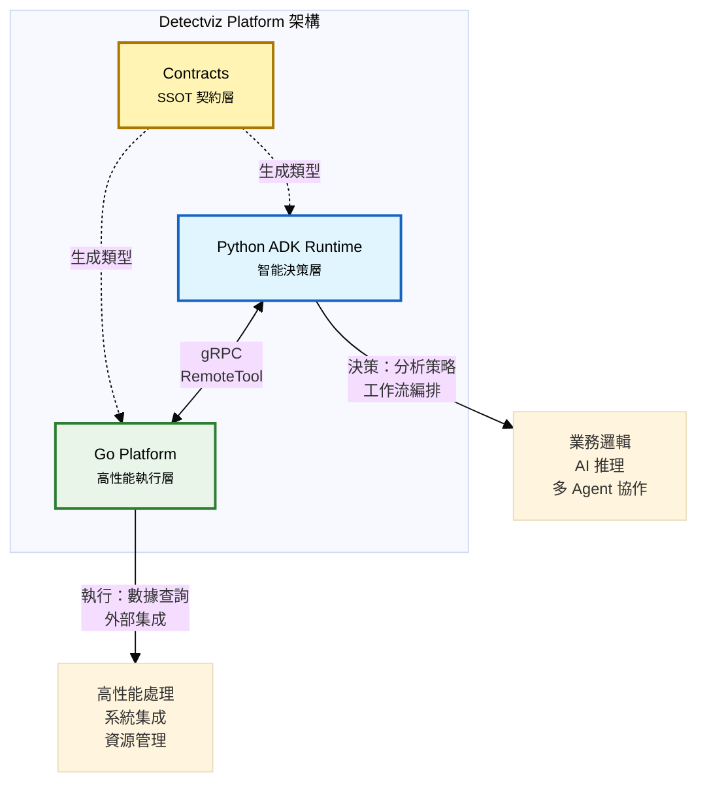
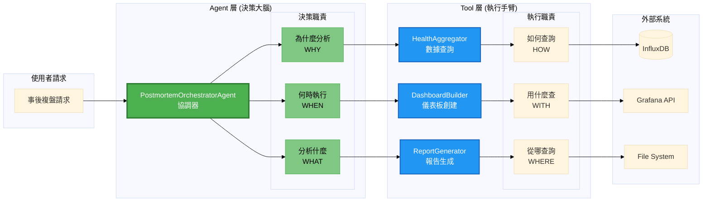
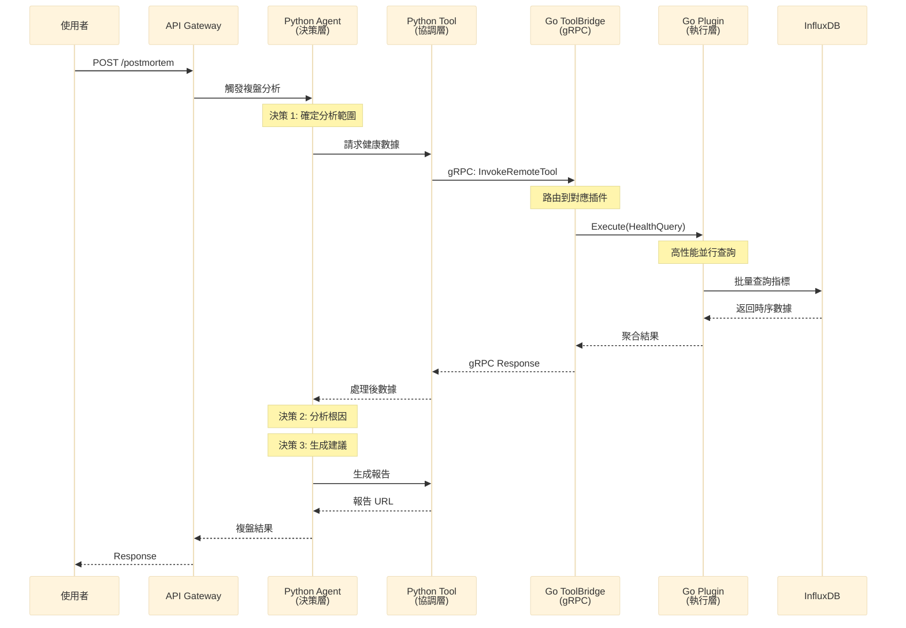

# python-adk-runtime（ADK Runtime）

以 **Google Agent Development Kit（ADK）** 為核心的 Python 執行環境。此 Runtime 嚴格遵循 ADK 模組邊界，並與 `go-platform` 透過 **gRPC ToolBridge** 解耦互通。

---

## 平台定位：智能決策層

本 Runtime 在 detectviz-platform 架構中扮演 **智能決策層** 角色：



### 核心設計原則
- **ADK 原生開發**：嚴格遵循 Agent／Workflow／MemoryBank／Tools／Capabilities 模組邊界
- **決策與執行分離**：透過 **RemoteTool** 以 gRPC 呼叫 `go-platform` 插件，避免跨語言耦合
- **多 Agent 協作**：支援 A2A 通訊、共享記憶體 bank 抽換、版本化與依賴描述（Module Card）
- **契約驅動**：以 **SSOT（contracts）** 為唯一事實來源，proto／schema／samples 必須先於 `contracts/` 更新

### 與 Go Platform 的關係
- **Python 端**：專注業務邏輯、決策制定、AI 推理、工作流編排
- **Go 端**：負責高性能查詢、數據處理、外部系統集成、資源管理
- **解耦通訊**：透過 gRPC 實現類型安全的跨語言調用，支援獨立部署和擴展

### Agent vs Tool 職責分離圖



---

## MVP 功能：Phase 3 事後複盤系統

### PostmortemOrchestratorAgent（核心 Agent）

**職責範圍**：
- **決策制定**：分析事故複盤請求，制定數據收集和分析策略
- **工作流編排**：協調多個 Tool 完成複雜的複盤流程
- **知識整合**：結合歷史經驗和當前數據，生成有洞察力的分析報告
- **學習優化**：從複盤過程中學習，持續改進分析質量

**核心方法**：
```python
class PostmortemOrchestratorAgent(BaseAgent):
    async def conduct_postmortem(self, request: PostMortemRequest) -> PostMortemResult:
        """
        執行完整的事後複盤流程
        1. 決策：分析請求並制定數據收集策略
        2. 執行：調用 HealthAggregator 收集數據  
        3. 決策：分析數據並識別根因
        4. 執行：生成結構化報告
        5. 存儲：將知識保存到歷史庫
        """
        
    async def analyze_incident_timeline(self, time_range, services) -> Timeline:
        """分析事故時間線，識別關鍵事件"""
        
    async def identify_root_causes(self, health_data, events) -> List[RootCause]:
        """基於數據和事件識別可能的根因"""
        
    async def generate_recommendations(self, analysis) -> List[Recommendation]:
        """生成改進建議和預防措施"""
```

### 核心 Tools 功能表

| Tool | 類型 | 職責 | 實現位置 |
|------|------|------|----------|
| **HealthAggregator** | RemoteTool | 從 InfluxDB 查詢指標數據，多維度健康分析 | Go Plugin |
| **ReportGenerator** | RemoteTool | 根據模板生成 Markdown/JSON 報告 | Go Plugin |
| **EventCollector** | RemoteTool | 從日誌和事件系統收集相關事件 | Go Plugin |
| **KnowledgeRetriever** | Local Tool | 從歷史庫檢索相似事故經驗 | Python |
| **TimelineAnalyzer** | Capability | 分析時間序列數據，識別異常模式 | Python |
| **RootCauseEngine** | Capability | 基於規則和 ML 的根因分析引擎 | Python |

### 目錄結構（MVP 專用）

```
python-adk-runtime/
├── src/detectviz_adk/
│   ├── config/
│   │   └── loader.py                    # 統一設定載入
│   ├── agents/                          # 🎯 MVP: Agent 實作
│   │   ├── base/
│   │   │   ├── __init__.py
│   │   │   ├── base_agent.py           # BaseAgent 基礎類別
│   │   │   └── workflows.py            # 工作流基礎組件
│   │   └── post_mortem/                # 🎯 MVP: 事後複盤 Agent
│   │       ├── __init__.py
│   │       ├── postmortem_orchestrator_agent.py  # 主要 Agent
│   │       ├── timeline_analyzer.py    # 時間線分析組件
│   │       ├── root_cause_engine.py    # 根因分析引擎
│   │       ├── module.card.json        # Agent 模組卡
│   │       └── tests/
│   │           ├── test_postmortem_orchestrator.py
│   │           └── test_integration.py
│   ├── tools/                          # 工具抽象層
│   │   ├── remote_tool.py              # RemoteTool gRPC 客戶端
│   │   ├── data/                       # 🎯 MVP: 數據相關工具
│   │   │   ├── __init__.py
│   │   │   ├── health_aggregator.py    # HealthAggregator 包裝器
│   │   │   └── event_collector.py      # EventCollector 包裝器
│   │   ├── reporting/                  # 🎯 MVP: 報告相關工具
│   │   │   ├── __init__.py
│   │   │   ├── report_generator.py     # ReportGenerator 包裝器
│   │   │   └── template_manager.py     # 報告模板管理
│   │   └── knowledge/                  # 🎯 MVP: 知識相關工具
│   │       ├── __init__.py
│   │       ├── knowledge_retriever.py  # 知識檢索工具
│   │       └── similarity_engine.py    # 相似性分析
│   ├── capabilities/                   # 🎯 MVP: 能力組件
│   │   ├── __init__.py
│   │   ├── analysis/
│   │   │   ├── timeline_analyzer.py    # 時間線分析能力
│   │   │   ├── pattern_detector.py     # 模式檢測能力
│   │   │   └── anomaly_detector.py     # 異常檢測能力
│   │   └── reasoning/
│   │       ├── root_cause_engine.py    # 根因推理能力
│   │       └── recommendation_engine.py # 建議生成能力
│   ├── memory/                         # 記憶體管理
│   │   ├── __init__.py
│   │   ├── stores/                     # 🎯 MVP: 知識存儲
│   │   │   ├── __init__.py
│   │   │   ├── response_history_store.py # 響應歷史存儲
│   │   │   ├── knowledge_graph_store.py  # 知識圖存儲
│   │   │   └── file_store.py           # 文件存儲實現
│   │   └── interfaces/
│   │       └── memory_interface.py     # 記憶體介面定義
│   └── services/                       # gRPC 服務實作
│       ├── __init__.py
│       └── postmortem_service.py       # 事後複盤服務端點
├── templates/                          # ADK 樣板
│   └── postmortem/                     # 🎯 MVP: 複盤相關樣板
│       ├── report_templates/
│       │   ├── standard_postmortem.md
│       │   ├── executive_summary.md
│       │   └── technical_details.md
│       └── workflow_templates/
└── requirements.txt                    # 依賴管理
```

---

## 與 contracts 的對齊
- 模組卡 Schema：`contracts/schemas/module.card.schema.json`
  - `role` 範例：`agent.coordinator`、`agent.tool_exec`、`tool`、`capability`、`memory.backend`、`plugin.gateway`、`observability.module` 等
  - `category` 參考：`workflow`、`a2a`、`llm`、`retriever`、`capability`、`memory.backend`、`gateway` 等
- gRPC 生成碼：`contracts/gen/python/detectviz/contracts/v1`
- 組態樣本（SSOT 實例）：`contracts/samples/config.yaml`

> 原則：任何跨語言協議或分類調整，先改 `contracts/`，再同步此專案與 `go-platform`。

---

## 安裝與需求
- Python 3.11+
- 建議使用 `uv` 或 `poetry` 管理依賴
- 需要可讀取 `contracts/`（便於載入 Schema 與 gRPC 生成碼）

```bash
# 以 uv 為例
uv venv
uv pip install -e .

# 產生 gRPC 生成碼（於 repo 根目錄）
cd contracts
make gen
```

---

## 設定載入（統一搜尋順序）
**優先序（高 → 低）**：
1. 函式參數或 CLI：`--config /path/to/config.yaml`
2. 環境變數：`DETECTVIZ_CONFIG_FILE=/path/to/config.yaml`
3. 工作目錄：`./config.yaml`
4. 團隊覆蓋：`./contracts/config.yaml`
5. SSOT 樣本兜底：`./contracts/samples/config.yaml`

Python 與 Go 採用同一套鍵位與環境覆蓋規範（部分鍵位）：
- `DETECTVIZ_ENV` → `env`
- `DETECTVIZ__OBSERVABILITY__MODE` → `observability.mode`
- `DETECTVIZ__OBSERVABILITY__OTLP__{PROTOCOL,ENDPOINT,INSECURE,HEADERS}`
- `DETECTVIZ__OBSERVABILITY__RESOURCE__{SERVICE_NAME,SERVICE_VERSION,ENVIRONMENT}`
- `DETECTVIZ__OBSERVABILITY__SAMPLING__RATIO`
- `DETECTVIZ__PLUGIN__{PATHS,REGISTRY}`
- `DETECTVIZ__MEMORY__{BACKEND,DSN,DEFAULT_TTL_SECONDS}`

> Python 端多數觀測輸出委由 `go-platform`+Alloy 完成；此處主要傳遞 OTel Span Context。

---

## 開發指南：決策與執行分離

### 核心原則：Agent 專注決策，Tool 專注執行

**正確的設計模式**：
```python
# ✅ 正確：Agent 做決策，Tool 做執行
class PostmortemOrchestratorAgent(BaseAgent):
    async def conduct_postmortem(self, request: PostMortemRequest):
        # 🎯 決策：分析需要收集什麼數據
        if request.severity == "HIGH":
            metrics = ["cpu", "memory", "disk", "network", "errors"]
            time_window = "2h"  # 高嚴重度事故看更長時間
        else:
            metrics = ["cpu", "memory", "errors"] 
            time_window = "30m"
            
        # ✅ 執行：通過 RemoteTool 調用 Go 端
        health_data = await self.health_aggregator.invoke({
            "metrics": metrics,
            "time_range": request.time_range,
            "time_window": time_window
        })
        
        # 🎯 決策：分析數據並制定報告策略
        if self._detect_cascade_failure(health_data):
            report_type = "cascade_analysis"
        elif self._detect_resource_exhaustion(health_data):
            report_type = "resource_analysis" 
        else:
            report_type = "standard_analysis"
            
        # ✅ 執行：生成報告
        report = await self.report_generator.invoke({
            "type": report_type,
            "data": health_data,
            "template": f"{report_type}_template.md"
        })
        
        return report
```

**錯誤的設計模式**：
```python
# ❌ 錯誤：Agent 直接執行技術操作
class PostmortemOrchestratorAgent(BaseAgent):
    async def conduct_postmortem(self, request):
        # ❌ 不應該直接查詢數據庫
        influx_client = InfluxDBClient(url=influx_url, token=token)
        query = f"""
        from(bucket: "metrics")
        |> range(start: {request.start_time})
        |> filter(fn: (r) => r._measurement == "cpu")
        """
        result = influx_client.query(query)  # 錯誤：直接執行
        
        # ❌ 不應該直接生成文件
        with open(f"report-{request.id}.md", "w") as f:  # 錯誤：直接文件操作
            f.write("# Postmortem Report...")
```

### RemoteTool 使用方法

**基本使用**：
```python
from detectviz_adk.tools.remote_tool import RemoteTool

class PostmortemOrchestratorAgent(BaseAgent):
    def __init__(self):
        super().__init__()
        # 初始化 RemoteTool 連接
        self.health_aggregator = RemoteTool(
            tool_id="observability.health_aggregator",
            tool_version="0.1.0",
            timeout_seconds=10
        )
        self.report_generator = RemoteTool(
            tool_id="reporting.report_generator",
            tool_version="0.1.0", 
            timeout_seconds=20
        )
    
    async def _collect_health_metrics(self, request):
        """決策：確定收集策略，執行：調用 Go 工具"""
        try:
            result = await self.health_aggregator.invoke({
                "time_range": {
                    "start": request.time_range.start,
                    "end": request.time_range.end
                },
                "services": request.affected_services,
                "metrics": self._determine_required_metrics(request),  # 決策
                "aggregation": self._determine_aggregation_level(request)  # 決策
            })
            return result
        except Exception as e:
            self.logger.error(f"Health data collection failed: {e}")
            raise PostmortemError(f"Unable to collect health data: {e}")
```

**錯誤處理和重試**：
```python
async def _robust_tool_call(self, tool: RemoteTool, params: dict, max_retries: int = 3):
    """帶重試機制的 RemoteTool 調用"""
    for attempt in range(max_retries):
        try:
            return await tool.invoke(params)
        except ToolTimeoutError:
            if attempt == max_retries - 1:
                raise
            await asyncio.sleep(2 ** attempt)  # 指數退避
        except ToolUnavailableError:
            # 工具不可用，嘗試降級處理
            return await self._fallback_processing(params)
```

### 混合架構數據流圖



### 模組卡創建指南

**MVP Agent 模組卡範例**：
```json
{
  "name": "detectviz.agents.postmortem_orchestrator",
  "version": "0.1.0",
  "description": "事後複盤協調器，負責分析事故並生成複盤報告",
  "role": "agent.coordinator", 
  "category": "sre.postmortem",
  "language": "python",
  "entrypoint": "postmortem_orchestrator_agent.py",
  "requires": [
    {
      "name": "observability.health_aggregator",
      "version": ">=0.1.0"
    },
    {
      "name": "reporting.report_generator", 
      "version": ">=0.1.0"
    }
  ],
  "contracts": {
    "min_proto": "v1.0.0"
  },
  "resources": {
    "memory_mb": 512,
    "cpu_cores": 1,
    "storage_mb": 1024
  },
  "config": {
    "schema_uri": "contracts/schemas/postmortem-agent-config.schema.json"
  },
  "observability": {
    "tags": {
      "service": "detectviz-postmortem",
      "component": "agent",
      "phase": "phase3"
    }
  }
}
```

### 連線與安全
- 端點：`DETECTVIZ_TOOLBRIDGE_ADDR`（預設 127.0.0.1:5002）
- 明文：`DETECTVIZ_TOOLBRIDGE_INSECURE=true`
- TLS／mTLS：`DETECTVIZ_TOOLBRIDGE_TLS_{CERT,KEY,CA}`
- OTel：若安裝 OpenTelemetry，`RemoteTool` 會嘗試自動注入 `traceparent`／`tracestate`

---

## Tools 與 Capabilities 的區分
- **Tools**：對外部系統的具體操作介面（HTTP／gRPC／DB／Shell 等）。`RemoteTool` 可橋接到 Go 插件。
- **Capabilities**：可複用的能力單元（模型、檢索、規則、策略、資料連接等），不直接握外部副作用。

此分離帶來：
- 能力可重用與測試更單純（無 I/O 依賴）。
- 工具權限最小化與審計清晰（外部操作集中於 Tools）。

---

## 樣板與擴增流程
1. 於 `templates/` 選擇樣板（`agent.coordinator`／`agent.tool_exec`／`tool`／`capability`／`workflow`）。
2. 複製至對應子目錄並填寫 `module.card.json`：
   - `name`、`version`（SemVer）、`role`、`category`
   - `requires`（依賴名稱／版本規則）、`contracts.min_proto`
3. 以 `contracts/tools/validate_module_card.py` 驗證模組卡。
4. 在 Agent 中以 RemoteTool 或 ADK 原生工具拼裝工作流；必要時設定 MemoryBank 命名空間與存取策略。

---

## 記憶體（MemoryBank）
- 抽象介面支援 In-Memory、Redis、向量庫（Weaviate／Chroma／Milvus）或雲端（Vertex）。
- 允許多個 root_agent 共用 sub_agent 與工具：以命名空間與授權策略控管讀寫與可見性。
- MemoryBank 後端替換不影響上層 Agent／Workflow（遵循 ADK 的 Memory 介面）。

---

## 觀測（Observability）
- Python 端主要傳遞 OTel Trace Context 至 ToolBridge；
- Logs／Metrics／Profiling 由 Go 端與 Alloy 匯聚上送 Grafana Cloud，可從 Logs Drilldown 至 Traces／Profiles。

---

## 實用工具

### 測試策略與 Mock 方法

**單元測試**：
```python
# tests/test_postmortem_orchestrator.py
import pytest
from unittest.mock import AsyncMock, MagicMock
from detectviz_adk.agents.post_mortem.postmortem_orchestrator_agent import PostmortemOrchestratorAgent

class TestPostmortemOrchestratorAgent:
    @pytest.fixture
    async def agent(self):
        agent = PostmortemOrchestratorAgent()
        # Mock RemoteTool 避免實際 gRPC 調用
        agent.health_aggregator = AsyncMock()
        agent.report_generator = AsyncMock()
        return agent
    
    async def test_conduct_postmortem_high_severity(self, agent):
        """測試高嚴重度事故的處理邏輯"""
        # 準備測試數據
        request = PostMortemRequest(
            incident_id="INC-001",
            severity="HIGH",
            time_range=TimeRange(start="2024-01-01T10:00:00Z", end="2024-01-01T12:00:00Z"),
            affected_services=["api", "db"]
        )
        
        # Mock 返回數據
        agent.health_aggregator.invoke.return_value = {
            "metrics": {"cpu": [90, 95, 85], "memory": [80, 85, 75]},
            "anomalies": ["cpu_spike", "memory_leak"]
        }
        
        agent.report_generator.invoke.return_value = {
            "report_path": "/tmp/report.md",
            "summary": "Root cause: CPU spike caused by memory leak"
        }
        
        # 執行測試
        result = await agent.conduct_postmortem(request)
        
        # 驗證決策邏輯
        assert agent.health_aggregator.invoke.called
        call_args = agent.health_aggregator.invoke.call_args[0][0]
        assert "cpu" in call_args["metrics"]
        assert "memory" in call_args["metrics"] 
        assert "network" in call_args["metrics"]  # 高嚴重度應包含更多指標
        
        # 驗證結果
        assert result["report_path"] is not None
        assert "cpu_spike" in result["summary"]
```

**集成測試**：
```python
# tests/test_integration.py
import pytest
import docker
from detectviz_adk.agents.post_mortem.postmortem_orchestrator_agent import PostmortemOrchestratorAgent

@pytest.mark.integration
class TestPostmortemIntegration:
    @pytest.fixture(scope="class")
    async def test_environment(self):
        """啟動測試環境：Go Platform + InfluxDB + Grafana"""
        client = docker.from_env()
        
        # 啟動測試容器
        containers = []
        try:
            # InfluxDB
            influx = client.containers.run(
                "influxdb:2.7",
                environment={"DOCKER_INFLUXDB_INIT_MODE": "setup"},
                ports={"8086/tcp": 8086},
                detach=True
            )
            containers.append(influx)
            
            # Go Platform
            go_platform = client.containers.run(
                "detectviz-go-platform:test",
                ports={"5002/tcp": 5002},
                detach=True
            )
            containers.append(go_platform)
            
            # 等待服務啟動
            await asyncio.sleep(10)
            
            yield
            
        finally:
            # 清理容器
            for container in containers:
                container.stop()
                container.remove()
    
    async def test_end_to_end_postmortem(self, test_environment):
        """端到端測試：從請求到報告生成"""
        agent = PostmortemOrchestratorAgent()
        
        request = PostMortemRequest(
            incident_id="E2E-001",
            severity="MEDIUM",
            time_range=TimeRange(
                start="2024-01-01T10:00:00Z", 
                end="2024-01-01T11:00:00Z"
            ),
            affected_services=["test-service"]
        )
        
        result = await agent.conduct_postmortem(request)
        
        # 驗證完整流程
        assert result["status"] == "completed"
        assert result["report_path"].endswith(".md")
        assert os.path.exists(result["report_path"])
        
        # 驗證報告內容
        with open(result["report_path"]) as f:
            content = f.read()
            assert "# Postmortem Report" in content
            assert "E2E-001" in content
            assert "Root Cause Analysis" in content
```

### 故障排查指南

**常見問題與解決方案**：

1. **ToolBridge 連接失敗**：
   ```bash
   # 檢查 Go Platform 是否啟動
   curl -s http://127.0.0.1:8081/readyz
   
   # 檢查 gRPC 端口
   telnet 127.0.0.1 5002
   
   # 檢查環境變數
   echo $DETECTVIZ_TOOLBRIDGE_ADDR
   ```

2. **RemoteTool 超時**：
   ```python
   # 增加超時時間
   self.health_aggregator = RemoteTool(
       tool_id="observability.health_aggregator",
       timeout_seconds=30  # 從 10 增加到 30
   )
   
   # 添加重試邏輯
   async def _resilient_invoke(self, tool, params):
       for i in range(3):
           try:
               return await tool.invoke(params)
           except TimeoutError:
               if i == 2:  # 最後一次嘗試
                   raise
               await asyncio.sleep(2 ** i)
   ```

3. **記憶體不足**：
   ```python
   # 檢查記憶體使用
   import psutil
   
   def check_memory():
       memory = psutil.virtual_memory()
       if memory.percent > 90:
           self.logger.warning(f"Memory usage high: {memory.percent}%")
           # 清理快取
           self._clear_cache()
   ```

4. **模組卡驗證失敗**：
   ```bash
   # 驗證模組卡格式
   cd contracts
   python tools/validate_module_card.py ../python-adk-runtime/src/detectviz_adk/agents/post_mortem/module.card.json
   
   # 檢查依賴版本
   pip list | grep detectviz
   ```

### 代碼生成器使用

**自動生成 Agent 骨架**：
```bash
# 使用樣板創建新 Agent
cd python-adk-runtime
python -m detectviz_adk.tools.scaffold generate agent \
  --name "incident_analyzer" \
  --category "sre.analysis" \
  --output "./src/detectviz_adk/agents/analysis/"

# 生成 RemoteTool 包裝器
python -m detectviz_adk.tools.scaffold generate tool \
  --name "log_analyzer" \
  --type "remote" \
  --go-plugin "observability.log_analyzer"
```

**自動生成測試**：
```bash
# 生成測試檔案
python -m detectviz_adk.tools.test_generator \
  --agent-path "./src/detectviz_adk/agents/post_mortem/postmortem_orchestrator_agent.py" \
  --output "./tests/"
```

## 執行與測試（端到端）

### 本地開發環境
1. **啟動依賴服務**：
   ```bash
   # 啟動 Go Platform
   cd ../go-platform
   go run ./cmd/detectviz plugin serve --config ../config.yaml
   
   # 確認服務健康
   curl -s http://127.0.0.1:8081/readyz
   ```

2. **啟動 Python Agent**：
   ```bash
   cd python-adk-runtime
   
   # 設置環境
   export DETECTVIZ_TOOLBRIDGE_ADDR="127.0.0.1:5002"
   export DETECTVIZ_TOOLBRIDGE_INSECURE="true"
   
   # 運行 Agent
   python -m detectviz_adk.agents.post_mortem.postmortem_orchestrator_agent
   ```

3. **執行測試**：
   ```bash
   # 單元測試
   pytest tests/unit/ -v
   
   # 集成測試
   pytest tests/integration/ -v --tb=short
   
   # 端到端測試
   pytest tests/e2e/ -v -s
   ```

### 生產環境驗證
1. **健康檢查**：於 Grafana 檢視 Logs／Traces／Profiles；確認 Drilldown 正常
2. **性能監控**：檢查 Agent 響應時間、記憶體使用、錯誤率
3. **功能驗證**：執行真實事故複盤案例，驗證報告質量

---

## 安全準則
- 禁止在程式碼或樣板中硬編密鑰／Token；請使用環境變數或 Secret。
- 外部服務憑證優先透過 Go 插件或 Alloy 端管理；Python 僅持有必要資訊（例如 ToolBridge 位址）。

---

## API 參考

### 主要類別 API 文檔

#### PostmortemOrchestratorAgent

**類別簽名**：
```python
class PostmortemOrchestratorAgent(BaseAgent):
    """事後複盤協調器 - MVP 核心 Agent"""
```

**主要方法**：

| 方法 | 參數 | 返回值 | 說明 |
|------|------|--------|------|
| `conduct_postmortem()` | `request: PostMortemRequest` | `PostMortemResult` | 執行完整事後複盤流程 |
| `analyze_incident_timeline()` | `time_range: TimeRange, services: List[str]` | `Timeline` | 分析事故時間線 |
| `identify_root_causes()` | `health_data: dict, events: List[Event]` | `List[RootCause]` | 識別根因 |
| `generate_recommendations()` | `analysis: AnalysisResult` | `List[Recommendation]` | 生成改進建議 |

**參數說明**：
- `PostMortemRequest`: 事後複盤請求，包含事故ID、時間範圍、影響服務、嚴重程度
- `PostMortemResult`: 複盤結果，包含報告路徑、摘要、根因、建議
- `TimeRange`: 時間範圍對象，包含開始和結束時間
- `RootCause`: 根因對象，包含原因描述、證據、可信度
- `Recommendation`: 改進建議，包含建議內容、優先級、預期效果

**異常處理**：
- `PostmortemError`: 複盤過程中的業務邏輯錯誤
- `ToolTimeoutError`: 工具調用超時
- `ToolUnavailableError`: 工具不可用
- `DataCollectionError`: 數據收集失敗

#### RemoteTool

**類別簽名**：
```python
class RemoteTool:
    """遠端工具客戶端，透過 gRPC 調用 Go 端插件"""
    
    def __init__(self, tool_id: str, tool_version: str = "latest", 
                 timeout_seconds: int = 30, **kwargs):
        """
        初始化 RemoteTool
        
        Args:
            tool_id: 工具標識符，如 "observability.health_aggregator"
            tool_version: 工具版本，預設 "latest" 
            timeout_seconds: 調用超時時間（秒）
            **kwargs: 其他連接參數
        """
```

**主要方法**：

| 方法 | 參數 | 返回值 | 說明 |
|------|------|--------|------|
| `invoke()` | `params: dict` | `dict` | 調用遠端工具 |
| `health_check()` | 無 | `bool` | 檢查工具健康狀態 |
| `get_schema()` | 無 | `dict` | 獲取工具參數 schema |

**使用範例**：
```python
# 初始化
health_aggregator = RemoteTool(
    tool_id="observability.health_aggregator",
    tool_version="0.1.0",
    timeout_seconds=10
)

# 調用
result = await health_aggregator.invoke({
    "time_range": {"start": "2024-01-01T10:00:00Z", "end": "2024-01-01T11:00:00Z"},
    "services": ["api", "db"],
    "metrics": ["cpu", "memory", "errors"]
})
```

#### ResponseHistoryStore

**類別簽名**：
```python
class ResponseHistoryStore:
    """響應歷史存儲，管理事後複盤知識庫"""
```

**主要方法**：

| 方法 | 參數 | 返回值 | 說明 |
|------|------|--------|------|
| `store_postmortem()` | `postmortem: PostMortemResult` | `str` | 存儲複盤結果，返回 ID |
| `search_similar()` | `query: SearchQuery` | `List[PostMortemResult]` | 搜索相似事故 |
| `get_by_id()` | `postmortem_id: str` | `PostMortemResult` | 根據 ID 獲取複盤結果 |
| `get_statistics()` | `time_range: TimeRange` | `Statistics` | 獲取統計信息 |

### 配置參數

**Agent 配置**：
```python
# 環境變數配置
DETECTVIZ_TOOLBRIDGE_ADDR = "127.0.0.1:5002"  # ToolBridge 地址
DETECTVIZ_TOOLBRIDGE_INSECURE = "true"         # 是否使用非安全連接
DETECTVIZ_AGENT_LOG_LEVEL = "INFO"             # 日誌級別
DETECTVIZ_AGENT_MAX_MEMORY_MB = "512"          # 最大記憶體使用
DETECTVIZ_KNOWLEDGE_STORE_PATH = "./data/knowledge.db"  # 知識庫路徑
```

**性能調優**：
```python
# Agent 初始化參數
agent = PostmortemOrchestratorAgent(
    max_concurrent_requests=10,    # 最大並發請求數
    cache_ttl_seconds=300,         # 快取 TTL
    enable_metrics=True,           # 啟用指標收集
    enable_tracing=True            # 啟用鏈路追蹤
)
```

## 常見問題
- 無法呼叫 ToolBridge：確認 `go-platform` 已啟動且 `DETECTVIZ_TOOLBRIDGE_ADDR` 正確。
- Proto 生成碼缺失：於 `contracts/` 執行 `make gen`，並確保 Python 可匯入 `contracts/gen/python/...`。
- Drilldown 失敗：確認是否正確傳遞 `traceparent`／`tracestate` 至 RemoteTool。
- 記憶體使用過高：檢查是否有記憶體洩漏，考慮減少快取大小或啟用垃圾回收。
- Agent 啟動慢：檢查 RemoteTool 連接是否正常，考慮增加連接池大小。

---

## 參考
- `../spec.md`（整體平台規格）
- `../contracts/`（SSOT：proto／schema／samples）
- `../go-platform/`（ToolBridge 與觀測初始化）

---

## 維護指南
- 請參考：`python-adk-runtime/llm.txt`（AI 維護規範與提交前檢查清單）
