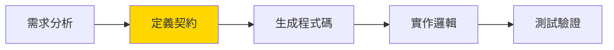

# AGENT.md - Detectviz Platform 開發規範與架構原則

> 本文件是 Detectviz Platform 的開發憲法，定義了所有開發者必須遵循的架構原則、開發規範和協作準則。

## 📖 文件定位

- **目標讀者**: 所有參與 Detectviz Platform 開發的工程師
- **文件性質**: 強制性規範文件（MUST follow）
- **更新頻率**: 重大架構變更時更新，需團隊評審
- **相關文件**:
  - 具體任務 → [`TODO.md`](./TODO.md)
  - 架構設計 → [`docs/sre-services-map.md`](./docs/sre-services-map.md)
  - 技術規格 → [`spec.md`](./spec.md)

## 🏛️ 核心架構原則

### 1. Agent vs Tool 職責分離（黃金準則）

這是整個平台最重要的設計原則，**絕對不可違反**：

```
Agent (決策大腦)           Tool (執行手臂)
────────────────           ──────────────
WHY - 為什麼做             HOW - 如何做
WHAT - 做什麼             WHERE - 在哪做
WHEN - 何時做             WITH - 用什麼做
```

#### ✅ 正確範例

```python
# Agent: 負責決策
class IncidentAnalyzerAgent:
    async def analyze(self, incident):
        # 決策 1: 判斷需要收集哪些指標
        metrics_needed = self.determine_metrics(incident.type)
        
        # 決策 2: 確定時間範圍
        time_range = self.calculate_time_range(incident.start, incident.end)
        
        # 決策 3: 選擇分析策略
        strategy = self.select_analysis_strategy(incident.severity)
        
        # 執行: 委託 Tool 執行具體操作
        metrics = await self.metrics_tool.query(metrics_needed, time_range)
        analysis = await self.analyzer_tool.analyze(metrics, strategy)
        
        # 決策 4: 根據分析結果決定下一步
        if self.needs_deeper_analysis(analysis):
            return await self.deep_analyze(analysis)
        
        return analysis

# Tool: 負責執行
class MetricsQueryTool:
    async def query(self, metrics: List[str], time_range: TimeRange):
        # 純執行: 不做任何決策，只執行查詢
        results = await self.prometheus_client.query_range(
            metrics=metrics,
            start=time_range.start,
            end=time_range.end
        )
        return self.format_results(results)
```

#### ❌ 錯誤範例

```python
# 錯誤: Agent 直接操作數據
class BadAgent:
    async def analyze(self, incident):
        # ❌ Agent 不應直接查詢數據庫
        metrics = await self.prometheus_client.query("...")
        
        # ❌ Agent 不應直接調用外部 API
        response = await requests.get("https://api.example.com/...")
        
        # ❌ Agent 不應直接生成文件
        with open("report.md", "w") as f:
            f.write(report_content)

# 錯誤: Tool 包含決策邏輯
class BadTool:
    async def query_and_analyze(self, incident):
        # ❌ Tool 不應判斷要查詢什麼
        if incident.severity == "high":
            metrics = ["cpu", "memory", "disk"]
        else:
            metrics = ["cpu"]
        
        # ❌ Tool 不應決定分析策略
        if len(metrics) > 2:
            strategy = "complex"
        else:
            strategy = "simple"
```

### 2. 混合架構決策原則

#### 語言選擇標準

| 使用場景 | 選擇語言 | 原因 |
|---------|---------|------|
| AI 決策邏輯 | Python | ADK 原生支援，生態豐富 |
| 高性能查詢 | Go | 並發性能優異，資源效率高 |
| 批量數據處理 | Go | 內存管理精確，GC 可控 |
| 機器學習推理 | Python | ML 框架成熟，社群活躍 |
| 系統整合 | Go | 靜態類型，編譯時檢查 |
| 快速原型 | Python | 開發效率高，迭代快速 |

#### 跨語言通訊規範

**必須使用 gRPC**：
- 所有跨語言調用必須通過 gRPC
- 使用 Protocol Buffers 定義介面
- 版本控制嚴格遵循語義化版本

```protobuf
// contracts/proto/detectviz/bridge/v1/metrics.proto
service MetricsService {
    rpc Query(QueryRequest) returns (QueryResponse);
    rpc BatchQuery(BatchQueryRequest) returns (BatchQueryResponse);
}
```

### 3. 契約優先開發（Contract-First）

#### 開發流程



**強制規則**：
1. **任何** API 變更必須先更新 `.proto` 文件
2. **禁止** 手動修改生成的程式碼
3. **必須** 使用 `buf` 進行 lint 和 breaking change 檢查

```bash
# 正確的工作流程
cd contracts
buf lint                    # 檢查 proto 規範
buf breaking --against ./.git#branch=main  # 檢查破壞性變更
buf generate                # 生成程式碼
```

### 4. 可觀測性優先（Observability-First）

#### 四大支柱

每個組件必須提供：

1. **Logs（日誌）**
   - 結構化日誌（JSON 格式）
   - 包含 trace_id 和 span_id
   - 適當的日誌級別

2. **Traces（追蹤）**
   - 所有 RPC 調用必須有 span
   - 關鍵業務邏輯添加 span
   - 正確的 parent-child 關係

3. **Metrics（指標）**
   - RED 方法：Rate, Errors, Duration
   - USE 方法：Utilization, Saturation, Errors
   - 自定義業務指標

4. **Profiles（性能分析）**
   - CPU profiling
   - Memory profiling
   - Goroutine profiling (Go)

```go
// Go 範例
func (h *HealthAggregator) Query(ctx context.Context, req *QueryRequest) (*QueryResponse, error) {
    // 創建 span
    ctx, span := tracer.Start(ctx, "HealthAggregator.Query")
    defer span.End()
    
    // 記錄指標
    timer := prometheus.NewTimer(queryDuration.WithLabelValues("health_aggregator"))
    defer timer.ObserveDuration()
    
    // 結構化日誌
    logger := log.WithContext(ctx).WithFields(log.Fields{
        "service": req.ServiceName,
        "metrics": req.Metrics,
    })
    logger.Info("Starting health query")
    
    // 業務邏輯...
}
```

## 🛠️ 開發規範

### 1. 程式碼組織結構

#### Go 專案結構
```
go-platform/
├── cmd/                    # 應用程式入口
├── internal/               # 私有應用程式碼
│   ├── metrics/           # MetricsProvider 抽象層
│   │   ├── provider.go    # 介面定義
│   │   ├── prometheus/    # Prometheus 實作
│   │   └── factory.go     # Provider 工廠
│   ├── pluginhost/        # 插件系統
│   │   └── plugins/       # 插件實作
│   └── observability/     # 可觀測性
├── pkg/                    # 公共庫
├── contracts/              # 生成的契約程式碼
└── tests/                  # 測試文件
```

#### Python 專案結構
```
python-adk-runtime/
├── src/
│   └── detectviz_adk/
│       ├── agents/         # Agent 實作
│       │   ├── postmortem/
│       │   └── base/
│       ├── tools/          # Tool 實作
│       │   ├── remote/     # RemoteTool
│       │   └── local/      # 本地 Tool
│       ├── memory/         # 狀態管理
│       └── utils/          # 工具函數
├── templates/              # 報告模板
└── tests/                  # 測試文件
```

### 2. 命名規範

#### 文件命名
- Go 文件：`snake_case.go`
- Python 文件：`snake_case.py`
- Proto 文件：`snake_case.proto`
- 配置文件：`kebab-case.yaml`

#### 程式碼命名

**Go**:
```go
// 套件名：小寫單詞
package metrics

// 介面：首字母大寫 + "er" 結尾
type MetricsProvider interface {}

// 結構體：首字母大寫
type PrometheusClient struct {}

// 函數：首字母大寫（公開）或小寫（私有）
func QueryMetrics() {}
func parseResponse() {}
```

**Python**:
```python
# 類別：PascalCase
class PostmortemOrchestrator:
    pass

# 函數：snake_case
def analyze_incident():
    pass

# 常數：UPPER_SNAKE_CASE
MAX_RETRY_COUNT = 3

# 私有成員：前綴下劃線
class Agent:
    def __init__(self):
        self._internal_state = {}
```

### 3. 錯誤處理規範

#### Go 錯誤處理

```go
// 使用 errors.Wrap 提供上下文
import "github.com/pkg/errors"

func QueryMetrics(ctx context.Context) (*Result, error) {
    result, err := prometheus.Query(ctx, query)
    if err != nil {
        return nil, errors.Wrap(err, "failed to query prometheus")
    }
    
    // 自定義錯誤類型
    if result.Empty() {
        return nil, ErrNoDataFound{
            Query:     query,
            TimeRange: timeRange,
        }
    }
    
    return result, nil
}

// 錯誤類型定義
type ErrNoDataFound struct {
    Query     string
    TimeRange TimeRange
}

func (e ErrNoDataFound) Error() string {
    return fmt.Sprintf("no data found for query %s in range %v", e.Query, e.TimeRange)
}
```

#### Python 錯誤處理

```python
# 使用自定義異常
class MetricsQueryError(Exception):
    """指標查詢異常"""
    pass

class NoDataFoundError(MetricsQueryError):
    """無數據異常"""
    pass

async def query_metrics(service: str, metrics: List[str]) -> Dict:
    try:
        result = await prometheus_client.query(service, metrics)
    except TimeoutError as e:
        logger.error(f"Query timeout for {service}: {e}")
        raise MetricsQueryError(f"Query timeout: {e}") from e
    except Exception as e:
        logger.error(f"Unexpected error querying {service}: {e}")
        raise
    
    if not result:
        raise NoDataFoundError(f"No data found for {service}")
    
    return result
```

### 4. 測試規範

#### 測試覆蓋要求

| 組件類型 | 最低覆蓋率 | 重點測試項目 |
|---------|-----------|------------|
| Agent | 95% | 決策邏輯、狀態轉換 |
| Tool | 90% | 執行邏輯、錯誤處理 |
| Provider | 90% | 介面實作、邊界條件 |
| API | 85% | 請求驗證、響應格式 |

#### 測試金字塔

```
        /\
       /  \  E2E Tests (10%)
      /    \  - 完整工作流程
     /      \ - 跨系統整合
    /--------\
   /          \ Integration Tests (30%)
  /            \ - API 測試
 /              \ - 數據庫整合
/________________\
    Unit Tests (60%)
    - 業務邏輯
    - 工具函數
    - 錯誤處理
```

#### 測試範例

**Go 單元測試**:
```go
func TestPrometheusProvider_Query(t *testing.T) {
    tests := []struct {
        name    string
        query   MetricQuery
        want    *QueryResult
        wantErr bool
    }{
        {
            name: "successful query",
            query: MetricQuery{
                Metric: "cpu_usage",
                Labels: map[string]string{"service": "api"},
            },
            want: &QueryResult{
                Values: []Value{{Time: 1234, Value: 0.8}},
            },
            wantErr: false,
        },
        {
            name: "empty result",
            query: MetricQuery{
                Metric: "non_existent",
            },
            want:    nil,
            wantErr: true,
        },
    }
    
    for _, tt := range tests {
        t.Run(tt.name, func(t *testing.T) {
            provider := NewMockProvider()
            got, err := provider.Query(context.Background(), tt.query)
            
            if (err != nil) != tt.wantErr {
                t.Errorf("Query() error = %v, wantErr %v", err, tt.wantErr)
            }
            
            if !reflect.DeepEqual(got, tt.want) {
                t.Errorf("Query() = %v, want %v", got, tt.want)
            }
        })
    }
}
```

**Python 單元測試**:
```python
import pytest
from unittest.mock import AsyncMock, patch

class TestPostmortemOrchestrator:
    @pytest.mark.asyncio
    async def test_analyze_incident_success(self):
        # Arrange
        orchestrator = PostmortemOrchestrator()
        mock_metrics_tool = AsyncMock()
        mock_metrics_tool.query.return_value = {
            "cpu": [0.8, 0.9, 0.95],
            "memory": [0.6, 0.7, 0.75]
        }
        orchestrator.metrics_tool = mock_metrics_tool
        
        # Act
        result = await orchestrator.analyze_incident({
            "id": "INC-001",
            "service": "api-gateway"
        })
        
        # Assert
        assert result.root_cause is not None
        assert len(result.recommendations) >= 3
        mock_metrics_tool.query.assert_called_once()
    
    @pytest.mark.asyncio
    async def test_analyze_incident_no_data(self):
        # Arrange
        orchestrator = PostmortemOrchestrator()
        mock_metrics_tool = AsyncMock()
        mock_metrics_tool.query.side_effect = NoDataFoundError()
        orchestrator.metrics_tool = mock_metrics_tool
        
        # Act & Assert
        with pytest.raises(AnalysisError):
            await orchestrator.analyze_incident({"id": "INC-002"})
```

### 5. 文檔規範

#### 程式碼註釋

**Go**:
```go
// MetricsProvider defines the interface for querying metrics from various sources.
// Implementations should handle caching, retries, and error recovery.
type MetricsProvider interface {
    // Query executes a single metric query and returns the result.
    // It returns an error if the query fails or times out.
    Query(ctx context.Context, query MetricQuery) (*QueryResult, error)
    
    // BatchQuery executes multiple queries in parallel for efficiency.
    // Failed queries will have their corresponding error in the result slice.
    BatchQuery(ctx context.Context, queries []MetricQuery) ([]*QueryResult, error)
}
```

**Python**:
```python
class PostmortemOrchestrator:
    """協調事後複盤分析流程的主要 Agent。
    
    負責：
    1. 協調數據收集
    2. 委派分析任務
    3. 生成最終報告
    
    Attributes:
        data_collector: 數據收集 Agent
        root_cause_analyzer: 根因分析 Agent
        report_writer: 報告生成 Agent
    """
    
    async def analyze_incident(
        self,
        incident: Dict[str, Any],
        options: Optional[AnalysisOptions] = None
    ) -> PostmortemReport:
        """分析事故並生成複盤報告。
        
        Args:
            incident: 事故信息，包含 id, service_name, time_range 等
            options: 可選的分析參數，如分析深度、報告格式等
            
        Returns:
            PostmortemReport: 包含完整分析結果的報告對象
            
        Raises:
            DataCollectionError: 數據收集失敗
            AnalysisError: 分析過程出錯
            ReportGenerationError: 報告生成失敗
        """
```

#### README 文檔

每個主要模組必須包含 README.md：

```markdown
# Module Name

## 概述
簡要描述模組功能和設計理念

## 架構
- 主要組件說明
- 數據流程圖
- 依賴關係

## 使用方式
- 配置說明
- API 範例
- 最佳實踐

## 開發指南
- 環境設置
- 測試方法
- 貢獻流程
```

## 🔧 工具鏈規範

### 1. 必需工具

| 工具 | 版本 | 用途 |
|-----|------|------|
| Go | >= 1.21 | Go 開發 |
| Python | >= 3.11 | Python 開發 |
| buf | latest | Protocol Buffers 管理 |
| golangci-lint | >= 1.54 | Go 代碼檢查 |
| black | latest | Python 格式化 |
| pytest | >= 7.0 | Python 測試 |
| make | - | 構建自動化 |

### 2. 開發環境設置

```bash
# 1. 安裝工具鏈
make install-tools

# 2. 設置 pre-commit hooks
pre-commit install

# 3. 驗證環境
make verify-env
```

### 3. Makefile 命令

```makefile
# 常用命令
make build          # 構建所有組件
make test           # 運行所有測試
make lint           # 代碼檢查
make fmt            # 代碼格式化
make proto          # 生成 Protocol Buffers
make docker         # 構建 Docker 鏡像
make e2e            # 運行端到端測試
```

## 📊 性能規範

### 1. 性能基準

| 操作 | P50 | P95 | P99 |
|-----|-----|-----|-----|
| 指標查詢 | < 100ms | < 500ms | < 1s |
| 報告生成 | < 2s | < 5s | < 10s |
| Agent 決策 | < 50ms | < 200ms | < 500ms |
| Tool 執行 | < 200ms | < 1s | < 3s |

### 2. 資源限制

```yaml
# Go 服務資源限制
resources:
  limits:
    cpu: "2"
    memory: "2Gi"
  requests:
    cpu: "500m"
    memory: "512Mi"

# Python 服務資源限制
resources:
  limits:
    cpu: "1"
    memory: "1Gi"
  requests:
    cpu: "200m"
    memory: "256Mi"
```

### 3. 並發控制

```go
// Go 並發限制
type RateLimiter struct {
    semaphore chan struct{}
}

func NewRateLimiter(maxConcurrent int) *RateLimiter {
    return &RateLimiter{
        semaphore: make(chan struct{}, maxConcurrent),
    }
}

func (r *RateLimiter) Execute(fn func() error) error {
    r.semaphore <- struct{}{}
    defer func() { <-r.semaphore }()
    return fn()
}
```

## 🔒 安全規範

### 1. 認證與授權

- 所有 API 必須實作認證
- 使用 JWT 或 OAuth 2.0
- 實作 RBAC 權限控制

### 2. 數據保護

- 敏感數據必須加密存儲
- 使用 TLS 1.3 進行傳輸
- 實作數據脫敏機制

### 3. 安全檢查清單

- [ ] 無硬編碼密碼或密鑰
- [ ] 輸入驗證和清理
- [ ] SQL 注入防護
- [ ] XSS 防護
- [ ] CSRF 防護
- [ ] 安全標頭配置

## 📝 Git 工作流程

### 1. 分支策略

```
main
  ├── develop
  │     ├── feature/xxx
  │     ├── feature/yyy
  │     └── bugfix/zzz
  └── release/v1.0.0
```

### 2. Commit 規範

```bash
# 格式：<type>(<scope>): <subject>

feat(agent): add postmortem orchestrator
fix(metrics): resolve prometheus timeout issue
docs(readme): update installation guide
test(e2e): add incident analysis test
refactor(provider): extract metrics interface
```

**Type 類型**：
- `feat`: 新功能
- `fix`: 錯誤修復
- `docs`: 文檔更新
- `test`: 測試相關
- `refactor`: 重構
- `perf`: 性能優化
- `chore`: 雜項

### 3. Pull Request 規範

**PR 標題**：遵循 commit 規範

**PR 描述模板**：
```markdown
## 變更說明
簡要描述這個 PR 的目的

## 變更類型
- [ ] 錯誤修復
- [ ] 新功能
- [ ] 破壞性變更
- [ ] 文檔更新

## 測試清單
- [ ] 單元測試通過
- [ ] 整合測試通過
- [ ] 手動測試完成

## 相關 Issue
Closes #123
```

## 🚨 違規處理

### 嚴重違規（必須立即修正）

1. **違反 Agent/Tool 職責分離**
   - 後果：架構腐化，難以維護
   - 處理：Code Review 強制打回

2. **跳過契約直接修改**
   - 後果：介面不一致，整合失敗
   - 處理：CI/CD 自動阻擋

3. **無測試提交**
   - 後果：品質下降，回歸錯誤
   - 處理：禁止合併到主分支

### 一般違規（限期改正）

1. **命名不規範**
   - 限期：下個 Sprint 修正
   - 工具：Linter 自動檢查

2. **文檔不完整**
   - 限期：功能上線前補充
   - 審查：文檔評審會議

3. **性能未達標**
   - 限期：發布前優化
   - 監控：性能測試報告

## 📚 學習資源

### 必讀文檔
1. [Google ADK 官方文檔](https://github.com/google/adk-python)
2. [Prometheus 最佳實踐](https://prometheus.io/docs/practices/)
3. [gRPC 設計指南](https://grpc.io/docs/guides/)
4. [Go 程式碼審查指南](https://github.com/golang/go/wiki/CodeReviewComments)

### 推薦書籍
1. 《Site Reliability Engineering》- Google SRE
2. 《Designing Data-Intensive Applications》- Martin Kleppmann
3. 《Clean Architecture》- Robert C. Martin

### 內部培訓
- 每週四：架構評審會議
- 每月第一週：技術分享會
- 季度：架構演進討論

## 🔄 持續改進

### 月度檢查項目
- [ ] 架構原則遵循度
- [ ] 測試覆蓋率趨勢
- [ ] 性能指標達成率
- [ ] 技術債務評估

### 季度優化目標
- Q1: 基礎架構穩定性
- Q2: 開發效率提升
- Q3: 性能優化
- Q4: 技術債務清理

## ❓ FAQ

**Q: 什麼時候可以打破 Agent/Tool 分離原則？**
A: 永遠不可以。如果覺得需要打破，說明設計有問題，需要重新思考。

**Q: 如何判斷一個功能應該在 Go 還是 Python 實作？**
A: 參考混合架構決策原則。簡單原則：決策用 Python，執行用 Go。

**Q: 測試覆蓋率達不到要求怎麼辦？**
A: 不允許合併。必須補充測試或申請架構評審會議討論。

**Q: 發現歷史代碼違反規範怎麼辦？**
A: 記錄到 TECH_DEBT.md，排入重構計劃。

---

**本文檔是強制性規範，所有開發者必須遵守。**
**違反規範將影響程式碼審查和績效評估。**

*最後更新: 2025-08-17*
*版本: 2.0.0*
*審核: Architecture Team*