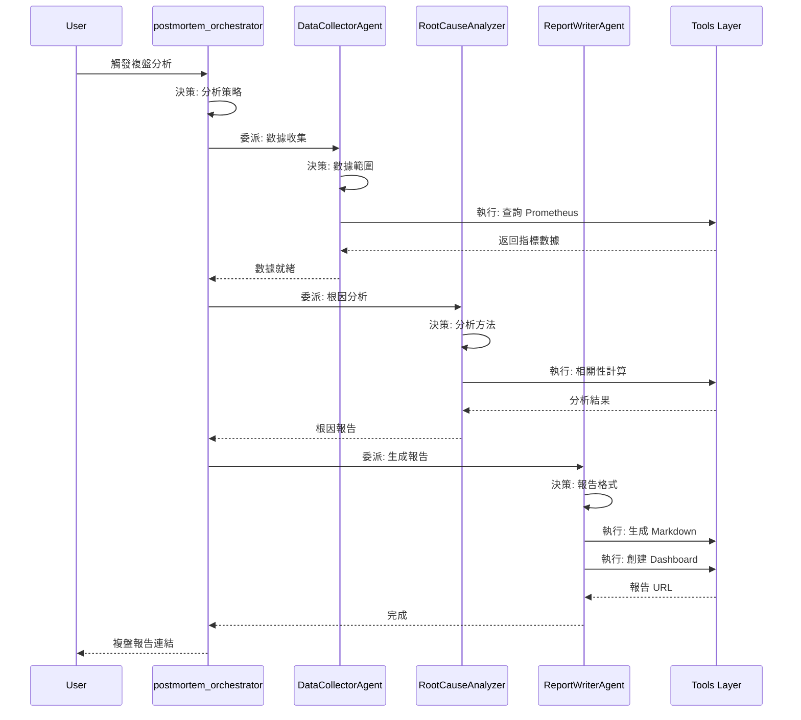
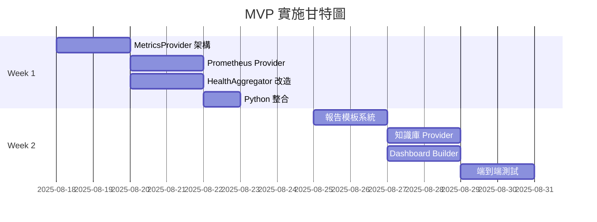
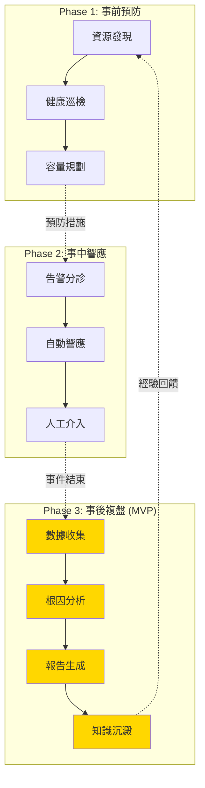

        'evidence': f"Request rate increased {metrics['request_rate_change']}x"
            })
        
        return sorted(root_causes, key=lambda x: x['confidence'], reverse=True)
```

#### 3.3 報告生成與知識沉澱

| 組件 | 類型 | 職責 | 決策/執行內容 | MVP 狀態 |
|-----|------|------|-------------|----------|
| **ReportWriterAgent** | Agent | 報告決策 | **決策**：確定報告格式、內容和發送對象 | ✅ 實作中 |
| ReportGenerator | Tool | 報告生成 | **執行**：根據模板生成 Markdown/PDF 報告 | ✅ Week 1 |
| DashboardBuilder | Tool | Dashboard 創建 | **執行**：通過 Grafana API 創建儀表板 | ✅ Week 2 |
| KnowledgeStore | Tool | 知識存儲 | **執行**：將事件和教訓存入知識庫 | ✅ Week 2 |

**Grafana Dashboard 自動生成**：
```python
# DashboardBuilder 與 Grafana 整合
class DashboardBuilder:
    async def create_postmortem_dashboard(
        self, 
        incident: Incident,
        metrics: List[str]
    ) -> str:
        """通過 Grafana API 創建事後複盤儀表板"""
        
        dashboard_json = {
            "dashboard": {
                "title": f"Postmortem: {incident.id}",
                "tags": ["postmortem", "automated", incident.service],
                "timezone": "browser",
                "panels": self._generate_panels(metrics, incident.time_range),
                "time": {
                    "from": incident.start_time.isoformat(),
                    "to": incident.end_time.isoformat()
                }
            },
            "overwrite": False
        }
        
        # 調用 Grafana API
        response = await self.grafana_client.create_dashboard(dashboard_json)
        return response['url']
    
    def _generate_panels(self, metrics: List[str], time_range: TimeRange):
        """生成 Grafana Panel 配置"""
        panels = []
        for i, metric in enumerate(metrics):
            panels.append({
                "id": i + 1,
                "title": metric.replace("_", " ").title(),
                "type": "graph",
                "targets": [{
                    "expr": f'{metric}{{service=~"$service"}}',
                    "refId": "A"
                }],
                "gridPos": {"h": 8, "w": 12, "x": (i % 2) * 12, "y": (i // 2) * 8}
            })
        return panels
```

## Agent 協作模式

### 層級結構

```
Root Agent (總指揮)
├── Coordinator Agents (協調層)
│   ├── postmortem_orchestrator (MVP 核心)
│   └── IncidentCommanderAgent
└── Specialist Agents (專家層)
    ├── DataCollectorAgent
    ├── RootCauseAnalyzer
    ├── ReportWriterAgent
    └── HealthCheckAgent
```

### MVP Agent 協作流程



## 決策矩陣

### Agent 決策類型分類

| 決策類型 | 描述 | 範例 | 相關 Agent |
|---------|------|------|-----------|
| **診斷型** | 識別問題本質 | 判斷是系統問題還是應用問題 | RootCauseAnalyzer |
| **策略型** | 制定行動計劃 | 決定數據收集範圍和粒度 | DataCollectorAgent |
| **優先級型** | 資源分配決策 | 確定分析深度和時間投入 | postmortem_orchestrator |
| **格式型** | 輸出形式決策 | 選擇報告格式和 Dashboard 類型 | ReportWriterAgent |
| **時序型** | 時間相關決策 | 確定分析時間窗口 | DataCollectorAgent |

### 決策權重因子（MVP 簡化版）

```yaml
RootCauseAnalyzer:
  factors:
    metric_anomaly: 0.4      # 指標異常程度
    time_correlation: 0.3    # 時間相關性
    service_dependency: 0.2  # 服務依賴關係
    historical_pattern: 0.1  # 歷史模式匹配

DataCollectorAgent:
  factors:
    incident_severity: 0.4   # 事件嚴重性
    affected_services: 0.3   # 影響服務數量
    time_duration: 0.2       # 持續時間
    data_availability: 0.1   # 數據可用性
```

## 實施路線圖

### MVP 實施計畫（2週）



### 後續階段規劃

**Phase 1 (Q1 2025)**：
- AlertTriageAgent 實作
- 自動修復能力
- 預測性維護

**Phase 2 (Q2 2025)**：
- 容量規劃自動化
- 成本優化建議
- 多雲支援
- **Mimir 整合評估**（若數據量超過閾值）

**Phase 3 (Q3 2025)**：
- **Mimir 長期存儲實作**（如需要）
- 歷史數據分析強化
- ML 模型訓練（基於長期數據）
- 多租戶支援

## Agent 開發檢查清單

開發新 Agent 時，請確保：

### 設計階段
- [ ] 明確定義 Agent 的決策職責
- [ ] 識別需要的 Tool 能力
- [ ] 設計決策樹或決策矩陣
- [ ] 定義與其他 Agent 的協作介面

### 實作階段
- [ ] Agent 只包含決策邏輯，不直接操作數據
- [ ] 所有數據操作通過 Tool 完成
- [ ] 使用 MetricsProvider 抽象層查詢指標
- [ ] 實現狀態管理（Session State）
- [ ] 添加決策日誌和可觀測性

### 測試階段
- [ ] 單元測試覆蓋所有決策分支
- [ ] 使用 MemoryProvider 進行測試
- [ ] 模擬 Tool 失敗場景
- [ ] 驗證與其他 Agent 的協作

## 工具層規範

### MetricsProvider 實作要求

```go
// 所有 Provider 必須實現的介面
type MetricsProvider interface {
    Query(ctx context.Context, query MetricQuery) (*QueryResult, error)
    BatchQuery(ctx context.Context, queries []MetricQuery) ([]*QueryResult, error)
    GetAggregation(ctx context.Context, opts AggregationOptions) (*AggregationResult, error)
    HealthCheck(ctx context.Context) error
}

// Provider 工廠模式
func NewMetricsProvider(config Config) (MetricsProvider, error) {
    switch config.Type {
    case "prometheus":
        return NewPrometheusProvider(config.Prometheus)
    case "mimir":
        // 未來實作
        return nil, fmt.Errorf("mimir provider not yet implemented")
    case "memory":
        return NewMemoryProvider()
    default:
        return nil, fmt.Errorf("unsupported provider type: %s", config.Type)
    }
}

// 未來：智能路由 Provider
type RoutingProvider struct {
    shortTerm MetricsProvider  // Prometheus
    longTerm  MetricsProvider  // Mimir (future)
    cutoff    time.Duration    // 30 days
}

func (r *RoutingProvider) Query(ctx context.Context, query MetricQuery) (*QueryResult, error) {
    if time.Since(query.TimeRange.Start) <= r.cutoff {
        return r.shortTerm.Query(ctx, query)
    }
    if r.longTerm != nil {
        return r.longTerm.Query(ctx, query)
    }
    return nil, fmt.Errorf("long-term storage not available")
}
```

### Grafana 整合規範

所有與 Grafana 的整合必須：
1. 使用官方 API Client
2. 支援 API Key 認證
3. 實現重試機制
4. 記錄操作審計日誌

```python
# Grafana Client 封裝
class GrafanaClient:
    def __init__(self, url: str, api_key: str):
        self.url = url
        self.headers = {"Authorization": f"Bearer {api_key}"}
        self.session = aiohttp.ClientSession()
    
    async def create_dashboard(self, dashboard_json: dict) -> dict:
        """創建 Dashboard，返回 URL"""
        
    async def create_alert_rule(self, rule: dict) -> dict:
        """創建告警規則"""
        
    async def query_metrics(self, query: str, time_range: TimeRange) -> list:
        """通過 Grafana 查詢 Prometheus 指標"""
```

## 持續改進機制

### 月度評審項目

- [ ] Agent 決策準確率分析
- [ ] Tool 執行效率評估
- [ ] 告警規則有效性檢查
- [ ] Dashboard 使用率統計

### 季度優化目標

- Q4 2024: MVP 交付，基礎功能驗證
- Q1 2025: 性能優化，擴展 Provider
- Q2 2025: 智能化提升，評估 Mimir 需求
- Q3 2025: 平台化，多租戶支援，Mimir 整合（如需要）
- Q4 2025: 長期數據分析，預測模型優化

## 相關文檔

- 開發規範 → [`AGENT.md`](../AGENT.md)
- 實作任務 → [`TODO.md`](../TODO.md)
- 技術規格 → [`spec.md`](../spec.md)
- Agent 開發指南 → [`docs/agent-development-guide.md`](./agent-development-guide.md)

## 核心價值

這份 Services MAP 確保了：

1. **職責清晰**：Agent 專注決策，Tool 專注執行
2. **架構統一**：Prometheus + Grafana 作為監控標準
3. **擴展性強**：MetricsProvider 支援多種數據源
4. **未來就緒**：預留 Mimir 長期存儲架構
5. **可維護性**：邏輯分離，易於調試和優化
6. **雲原生**：符合 CNCF 標準和最佳實踐

---

*本文檔是 Detectviz Platform 的架構基石，所有 Agent 開發都應遵循此藍圖。*

*最後更新：2025-08-17*
*版本：2.0.0*# SRE 全生命週期 Services MAP

> 本文件是 Detectviz Platform 的**架構憲法**，定義了 AI Agent 在 SRE 全生命週期中的職責分工與協作模式。這是所有 Agent 開發的指導藍圖。

## 文件定位

- **目標讀者**：AI 工程師、Agent 開發者、架構師
- **更新頻率**：季度評審，重大架構變更時更新
- **關聯文件**：
  - 開發規範 → [`AGENT.md`](../AGENT.md)
  - 實作任務 → [`TODO.md`](../TODO.md)
  - 技術規格 → [`spec.md`](../spec.md)

## 核心設計理念

### Agent vs Tool 職責劃分

```
Agent (決策大腦)           Tool (執行手臂)
────────────────           ──────────────
WHY - 為什麼做             HOW - 如何做
WHAT - 做什麼             WHERE - 在哪做
WHEN - 何時做             WITH - 用什麼做
```

**黃金準則**：
- **Agent 負責決策**：分析情況、制定策略、協調資源
- **Tool 負責執行**：查詢數據、調用 API、生成報告
- **Agent 不直接碰數據**：所有數據操作必須通過 Tool
- **Tool 不做決策**：只提供能力，不判斷是否應該執行

## SRE 生命週期總覽



## 技術架構更新

### 監控數據源架構變更

#### 原架構（InfluxDB）
```yaml
已棄用:
  數據源: InfluxDB + Telegraf
  原因: 資源消耗大，學習曲線陡峭
  狀態: 保留介面，暫不實作
```

#### 當前架構（Prometheus + Grafana）
```yaml
生產環境:
  指標收集: Prometheus (短期存儲，保留 15-30 天)
  告警管理: Grafana Alerting
  視覺化: Grafana Dashboards
  
優勢: 
  - 雲原生標準配置
  - 統一的監控平台
  - 告警規則視覺化管理
  - 豐富的 Dashboard 模板
  
資料流程:
  Prometheus (指標收集) 
    ↓
  Grafana (查詢/告警/視覺化)
    ↓
  Detectviz Platform (Webhook 接收)
```

#### 未來架構（長期存儲規劃）
```yaml
規劃中 (暫不實作):
  長期存儲: Grafana Mimir
  
設計考量:
  - 水平擴展能力
  - 多租戶支援
  - 與 Prometheus 完全相容
  - 成本效益優化
  - 支援數年的歷史數據查詢
  
預期架構:
  Prometheus (即時查詢，1-30天)
    ↓ Remote Write
  Mimir (長期存儲，30天-3年)
    ↓
  Grafana (統一查詢介面)
  
實施時機:
  - 當數據量超過單機 Prometheus 容量
  - 需要跨團隊/跨專案的指標隔離
  - 需要超過 30 天的歷史數據分析
```

#### 抽象層設計
```yaml
MetricsProvider 介面:
  當前實作:
    - PrometheusProvider (主要，短期查詢)
    - MemoryProvider (測試用)
    
  預留實作:
    - MimirProvider (長期查詢，未來實作)
    - InfluxDBProvider (相容性，暫不實作)
    
查詢路由策略 (未來):
  - < 30 天: 使用 PrometheusProvider
  - > 30 天: 使用 MimirProvider
  - 自動路由，對上層透明
```

### MetricsProvider 架構

```go
// 統一的指標查詢介面
type MetricsProvider interface {
    // 基本查詢
    Query(ctx context.Context, query MetricQuery) (*QueryResult, error)
    
    // 批量查詢（並行優化）
    BatchQuery(ctx context.Context, queries []MetricQuery) ([]*QueryResult, error)
    
    // 聚合查詢
    GetAggregation(ctx context.Context, opts AggregationOptions) (*AggregationResult, error)
    
    // 健康檢查
    HealthCheck(ctx context.Context) error
}

// 未來支援 Mimir 的擴展介面
type LongTermMetricsProvider interface {
    MetricsProvider
    
    // 長期數據查詢（支援更大時間範圍）
    QueryHistorical(ctx context.Context, query HistoricalQuery) (*HistoricalResult, error)
    
    // 降採樣查詢（優化長期數據查詢性能）
    QueryDownsampled(ctx context.Context, query DownsampledQuery) (*QueryResult, error)
    
    // 多租戶查詢（Mimir 特性）
    QueryTenant(ctx context.Context, tenantID string, query MetricQuery) (*QueryResult, error)
}

// Provider 工廠（支援未來擴展）
type ProviderConfig struct {
    Type string // "prometheus", "mimir", "memory"
    
    // 查詢路由策略
    QueryRouter struct {
        ShortTermDays int // 短期查詢天數閾值，預設 30
        LongTermProvider string // 長期查詢 provider
    }
}
```

## 完整 Services MAP

### Phase 1: 事前預防 (Proactive)

> **使命**：防患於未然，主動識別並消除潛在風險

#### 1.1 資源發現與部署

| 組件 | 類型 | 職責 | 決策/執行內容 |
|-----|------|------|-------------|
| **DeploymentStrategyAgent** | Agent | 部署策略制定 | **決策**：判斷新發現的資源類型，選擇適合的監控策略 |
| ResourceDiscoveryService | Tool | 資源掃描 | **執行**：定期掃描 K8s/Cloud API，返回資源清單 |
| PrometheusExporterDeployer | Tool | Exporter 部署 | **執行**：根據 Agent 決策，部署適當的 Prometheus Exporter |
| ConfigManagementService | Tool | 配置管理 | **執行**：更新 Prometheus 配置，重載 scrape targets |

**決策流程範例**：
```python
# DeploymentStrategyAgent 的決策邏輯
async def on_new_resource_discovered(self, resource: Resource):
    # 決策 1: 識別資源類型
    resource_type = self.analyze_resource_type(resource)
    
    # 決策 2: 選擇監控策略
    if resource_type == "database":
        exporter = self.select_database_exporter(resource.engine)
    elif resource_type == "kubernetes_service":
        exporter = "kube-state-metrics"
    
    # 決策 3: 確定 scrape 配置
    scrape_config = self.determine_scrape_config(exporter, resource.scale)
    
    # 執行: 委託 Tool 執行部署
    await self.exporter_deployer_tool.deploy(exporter, scrape_config)
```

#### 1.2 日常健康巡檢

| 組件 | 類型 | 職責 | 決策/執行內容 | 更新內容 |
|-----|------|------|-------------|---------|
| **HealthCheckAgent** | Agent | 健康評估 | **決策**：判斷服務健康狀態，識別異常模式 | - |
| HealthAggregator | Tool | 數據聚合 | **執行**：從 Prometheus 查詢指標，計算 SLI | ✅ 改用 Prometheus |
| AlertPolicyService | Tool | 閾值管理 | **執行**：通過 Grafana API 管理告警規則 | ✅ Grafana 統一管理 |
| ReportGenerator | Tool | 報告生成 | **執行**：根據模板生成健康報告 | - |

**Prometheus 查詢範例**：
```python
# HealthAggregator 使用 MetricsProvider
async def get_service_health(self, service: str, time_range: TimeRange):
    # 通過 MetricsProvider 抽象層查詢
    provider = self.metrics_provider  # PrometheusProvider 實例
    
    # 構建查詢
    queries = [
        MetricQuery(
            metric="up",
            labels={"job": service},
            time_range=time_range,
            aggregation="avg"
        ),
        MetricQuery(
            metric="http_request_duration_seconds",
            labels={"service": service},
            time_range=time_range,
            aggregation="quantile_95"
        )
    ]
    
    # 批量查詢
    results = await provider.BatchQuery(queries)
    return self.calculate_health_score(results)
```

#### 1.3 容量規劃

| 組件 | 類型 | 職責 | 決策/執行內容 | 更新內容 |
|-----|------|------|-------------|---------|
| **CapacityPlannerAgent** | Agent | 容量決策 | **決策**：預測資源需求，制定擴容計劃 | - |
| ForecastingEngine | Tool | 預測計算 | **執行**：基於歷史數據運行預測模型 | ✅ 未來使用 Mimir |
| ResourceManager | Tool | 資源查詢 | **執行**：從 Prometheus + Node Exporter 獲取資源使用 | ✅ 改用 Prometheus |
| TrendAnalyzer | Tool | 趨勢分析 | **執行**：分析長期趨勢（未來從 Mimir 查詢） | 🔄 規劃中 |
| ReportGenerator | Tool | 規劃報告 | **執行**：生成容量規劃文檔 | - |

**長期數據分析（Mimir 規劃）**：
```python
# 未來實作：智能查詢路由
class SmartMetricsProvider:
    def __init__(self):
        self.prometheus = PrometheusProvider()
        self.mimir = None  # MimirProvider() - 未來實作
        self.cutoff_days = 30
    
    async def query(self, query: MetricQuery) -> QueryResult:
        # 計算查詢時間範圍
        days_back = (datetime.now() - query.start_time).days
        
        if days_back <= self.cutoff_days:
            # 近期數據：使用 Prometheus（快速）
            return await self.prometheus.query(query)
        elif self.mimir:
            # 歷史數據：使用 Mimir（大容量）
            return await self.mimir.query_historical(query)
        else:
            # Mimir 未啟用時的降級處理
            raise NotImplementedError("Historical queries require Mimir")
```

### Phase 2: 事中響應 (Reactive)

> **使命**：快速響應，精準處理，最小化故障影響

#### 2.1 告警分診

| 組件 | 類型 | 職責 | 決策/執行內容 | 更新內容 |
|-----|------|------|-------------|---------|
| **AlertTriageAgent** | Agent | 告警分診 | **決策**：評估告警嚴重性，決定處理優先級 | - |
| AlertReceiver | Tool | 告警接收 | **執行**：接收 Grafana Alert Webhook | ✅ Grafana Alerting |
| ResponseHistoryStore | Tool | 歷史查詢 | **執行**：查詢類似告警的處理記錄 | - |
| EventDispatchService | Tool | 事件分發 | **執行**：根據決策發送通知 | - |

**Grafana Alerting 整合**：
```yaml
# Grafana Alert Contact Point 配置
apiVersion: 1
contactPoints:
  - name: detectviz-webhook
    receivers:
      - uid: detectviz-receiver
        type: webhook
        settings:
          url: http://detectviz-platform:8080/alerts
          httpMethod: POST
          
# Grafana Alert Rule 範例（通過 API 或 UI 管理）
alert: HighCPUUsage
expr: avg(rate(cpu_usage[5m])) > 0.9
for: 5m
annotations:
  summary: "High CPU usage detected"
  description: "CPU usage is above 90% for {{ $labels.service }}"
labels:
  severity: warning
  team: platform
```

#### 2.2 自動響應

| 組件 | 類型 | 職責 | 決策/執行內容 |
|-----|------|------|-------------|
| **FirstResponderAgent** | Agent | 響應決策 | **決策**：判斷是否可自動修復，選擇修復策略 |
| RemediationExecutor | Tool | 修復執行 | **執行**：執行具體的修復動作（重啟、擴容等）|
| ValidationService | Tool | 驗證服務 | **執行**：驗證修復效果，收集結果數據 |
| NotificationService | Tool | 通知服務 | **執行**：發送修復狀態通知 |

### Phase 3: 事後複盤 (MVP 重點)

> **使命**：深度分析，持續改進，知識沉澱

#### 3.1 數據收集與聚合

| 組件 | 類型 | 職責 | 決策/執行內容 | MVP 狀態 |
|-----|------|------|-------------|----------|
| **DataCollectorAgent** | Agent | 收集策略 | **決策**：確定需要收集的數據範圍和類型 | ✅ 實作中 |
| HealthAggregator | Tool | 指標聚合 | **執行**：從 Prometheus 批量查詢和聚合指標 | ✅ Week 1 |
| LogCollector | Tool | 日誌收集 | **執行**：從 Loki 查詢相關日誌 | ⏸️ Phase 2 |
| EventFetcher | Tool | 事件獲取 | **執行**：獲取 K8s Events、部署記錄等 | ⏸️ Phase 2 |

**MVP 實作重點**：
```python
# DataCollectorAgent 決策邏輯
class DataCollectorAgent:
    async def collect_incident_data(self, incident: Incident):
        # 決策 1: 確定時間窗口
        time_window = self.calculate_time_window(
            start=incident.start_time - timedelta(hours=1),
            end=incident.end_time + timedelta(minutes=30)
        )
        
        # 決策 2: 選擇相關指標
        metrics_to_collect = self.select_relevant_metrics(
            service=incident.service,
            alert_type=incident.alert_type
        )
        
        # 決策 3: 確定數據粒度
        granularity = self.determine_granularity(
            duration=incident.duration,
            severity=incident.severity
        )
        
        # 執行: 通過 Tool 收集數據
        metrics_data = await self.health_aggregator.collect(
            metrics=metrics_to_collect,
            time_window=time_window,
            step=granularity
        )
        
        # 保存到 Session State
        await self.state_manager.save_metrics(metrics_data)
```

#### 3.2 根因分析

| 組件 | 類型 | 職責 | 決策/執行內容 | MVP 狀態 |
|-----|------|------|-------------|----------|
| **RootCauseAnalyzer** | Agent | 分析決策 | **決策**：識別異常模式，推斷因果關係 | ✅ 實作中 |
| CorrelationEngine | Tool | 相關性計算 | **執行**：計算指標間的相關係數 | ✅ Week 1 |
| AnomalyDetector | Tool | 異常檢測 | **執行**：運行異常檢測算法 | ⏸️ 簡化版 |
| DependencyMapper | Tool | 依賴分析 | **執行**：分析服務依賴關係 | ⏸️ Phase 2 |

**MVP 簡化分析**：
```python
# RootCauseAnalyzer 基於規則的分析
class RootCauseAnalyzer:
    async def analyze(self, metrics: Dict[str, Any]):
        root_causes = []
        
        # 規則 1: CPU 瓶頸
        if metrics['cpu_usage_avg'] > 0.9:
            root_causes.append({
                'type': 'resource_bottleneck',
                'component': 'cpu',
                'confidence': 0.9,
                'evidence': f"CPU usage: {metrics['cpu_usage_avg']*100:.1f}%"
            })
        
        # 規則 2: 記憶體洩漏
        if self.detect_memory_leak_pattern(metrics['memory_usage']):
            root_causes.append({
                'type': 'memory_leak',
                'confidence': 0.8,
                'evidence': "Continuous memory growth detected"
            })
        
        # 規則 3: 流量激增
        if metrics['request_rate_change'] > 2.0:
            root_causes.append({
                'type': 'traffic_spike',
                'confidence': 0.85,
                'evidence': f"